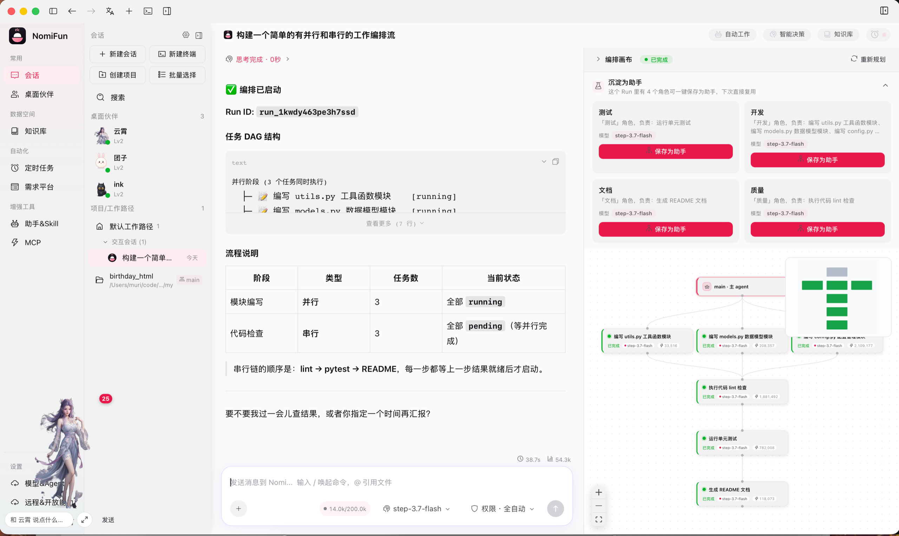
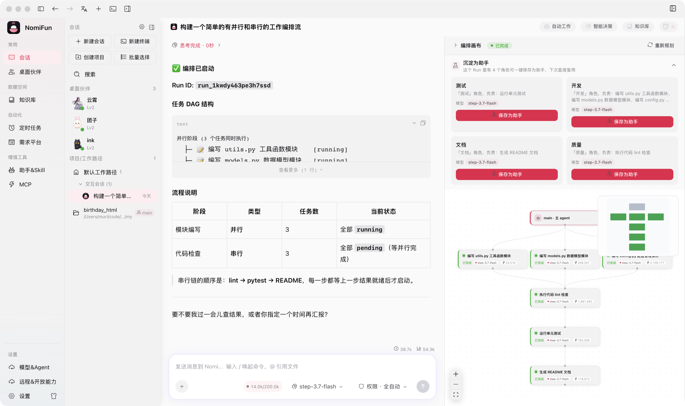
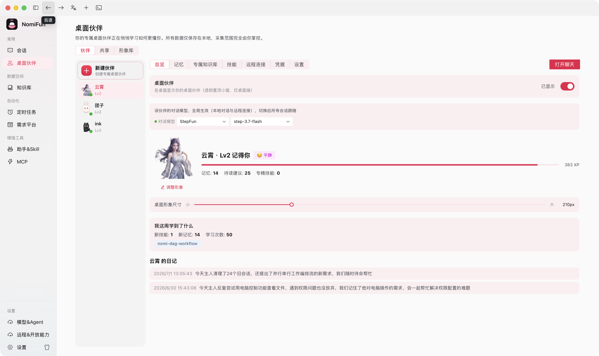
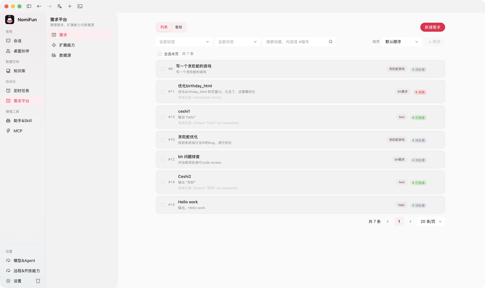
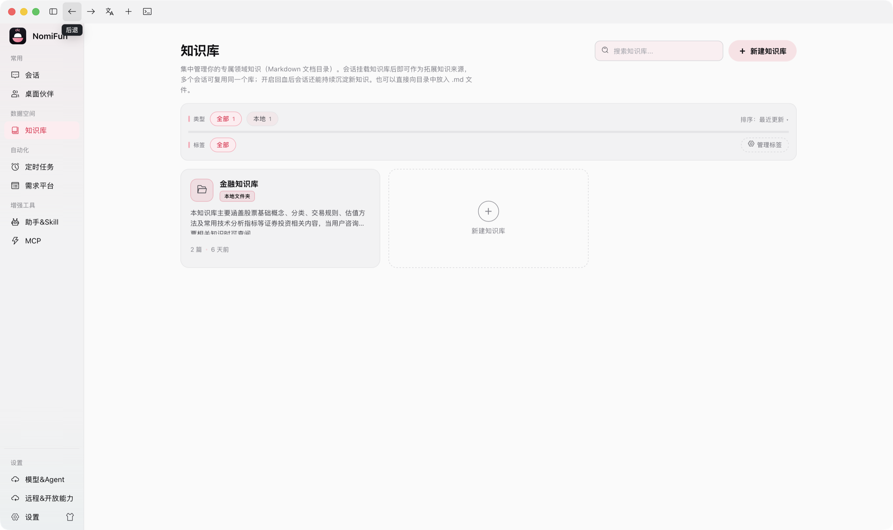
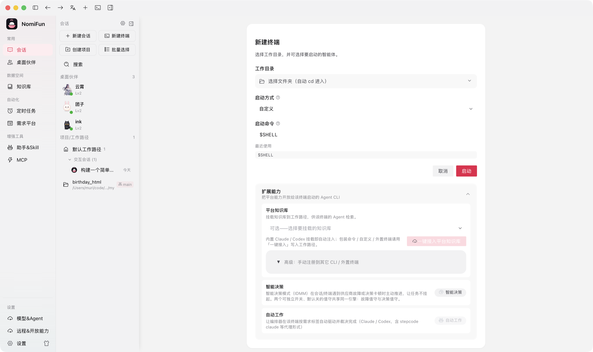
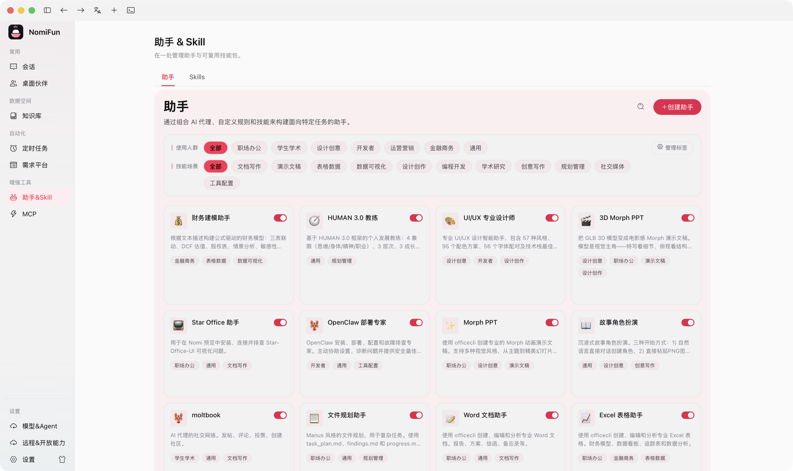
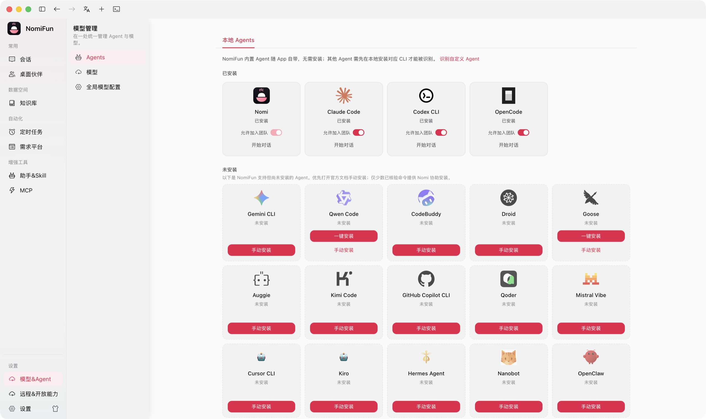

<a name="top"></a>

<div align="center">

<a href="https://www.nomifun.com">
  
</a>

<h3>A no-holds-barred, fully open-source, <em>local-first</em> super AI workstation.</h3>

<p>
  Rich, inventive capabilities and serious productivity gains —<br/>
  with <b>all your data staying on your own machine</b>. Safe for individuals and enterprises, free to commercialize, open to audit.
</p>

<p>
  <a href="LICENSE"></a>
  
  
  <a href="https://www.nomifun.com"></a>
</p>

<p>
  
  
  
  <a href="https://github.com/nomifun/nomifun-tauri/stargazers"></a>
</p>

<p>
  <b>English</b>&nbsp;·&nbsp;<a href="README.zh-CN.md">简体中文</a>
</p>

<p>
  <a href="https://www.nomifun.com">🌐 Website</a>&nbsp;·&nbsp;
  <a href="docs/README.md">📖 Docs</a>&nbsp;·&nbsp;
  <a href="#-getting-started">🚀 Get started</a>&nbsp;·&nbsp;
  <a href="https://github.com/nomifun/nomifun-tauri/releases">📦 Releases</a>&nbsp;·&nbsp;
  <a href="https://pan.baidu.com/s/5GPonoJNrwJ7GciBSDgXLaA">China mirror</a>&nbsp;·&nbsp;
  <a href="./RELEASING.zh-CN.md">发版手册</a>&nbsp;·&nbsp;
  <a href="#-contact--community">💬 Community</a>
</p>

</div>

---

> [!IMPORTANT]
> **Public-interest open-source and data-risk notice**: NomiFun is a public-interest open-source project. The maintainers do not assume responsibility for user data loss, corruption, or unrecoverable damage during iteration. Back up your data before upgrades, migrations, experimental features, or real production use.

---

**NomiFun** is everything you imagine an AI workstation to be — and it runs on your terms. One React frontend and one Rust backend give you an evolving desktop companion, an unattended automation platform, a unified knowledge base, native computer- and browser-use, and an open capability bus that any agent can drive. No cloud account. No telemetry. No subscription. Your data never leaves your machine except for the LLM calls **you** configure.

> The product name is **NomiFun**. Lowercase `nomifun` is used only for code identifiers, crate names, environment variables, and repository paths.

---

## ✨ Why NomiFun

|  | |
|---|---|
| 🔓 **Open & local** | Source fully open, no reservations. Data lives on your machine and is never sent out on its own. Free for personal **and** commercial use. Open to audit. |
| 🐾 **Evolving companions** | The most complete companion-growth system we know of — it learns how you work and gets better over time. Not just a buddy, a genuine productivity partner. |
| 🤖 **Unattended automation** | Manage requirements, then just give the order. AutoWork + IDMM keep your sessions alive and working reliably while you're away. |
| 🌐 **Open capability ecosystem** | Everything is here, everything connects, everything cooperates — and *any* agent can borrow NomiFun's powers over MCP / REST. |
| 🧩 **Config once, use anywhere** | Unified management of knowledge bases, skills, agents, MCP servers, and models — defined once, reused across every surface. |
| 🖥️ **Truly native** | In-process, self-built **computer use** and **browser use** as native tools — more capable, faster, and cheaper on tokens. |
| 🚀 **Built for productivity** | Designed from real needs, with a lot of inventive capabilities. And many delightful features are still on the way. |

---

## 🔒 Local-first, by design

Data security is not a setting in NomiFun — it is the architecture.

- **All data is local.** NomiFun never proactively sends your data anywhere. The **only** outbound network calls are the LLM requests you explicitly configure to your chosen model provider. There is no other third-party service integration phoning home.
- **Safe for anyone who cares about data.** Individuals and enterprises with strict data-handling requirements can use it with confidence. The code is **fully open and open to audit**.
- **We cut features to keep this promise.** To guarantee your data stays yours, we deliberately dropped several advanced, genuinely fun feature designs. Everything here is in service of letting users — and developers — relax.
- **No ads. No commercialization. No membership tiers.** We promise to *never* charge for any feature of this project. The only thing that costs money is your LLM provider's tokens, which is outside our control. (If finding/serving models is painful, [reach out](#-contact--community) — we're happy to help build a unified model gateway.)

See [`SECURITY.md`](SECURITY.md) for the deployment threat model and responsible-disclosure policy.

---

## 🖼️ A look inside

<div align="center">

<p>
  🎬 <b>Demo videos:</b>
  China:
  <a href="https://www.douyin.com/user/self?from_tab_name=main&modal_id=7657100052061523209">Douyin</a>
  ·
  <a href="https://www.bilibili.com/video/BV1kwKZ6UE5X/">Bilibili</a>
  &nbsp;|&nbsp;
  International:
  <a href="https://youtu.be/AsEToBDFR9s">YouTube</a>
  ·
  <a href="https://x.com/colir0/status/2072001821640437776?s=20">X</a>
</p>

<p>
  
  <br/><sub><b>Work orchestration: conversation, reusable roles, and DAG canvas</b></sub>
</p>

<table>
  <tr>
    <td width="50%"><br/><sub><b>Desktop companions · memory and growth</b></sub></td>
    <td width="50%"><br/><sub><b>Requirements platform · AutoWork entry</b></sub></td>
  </tr>
  <tr>
    <td width="50%"><br/><sub><b>Knowledge base · local domain context</b></sub></td>
    <td width="50%"><br/><sub><b>Terminal · capabilities for Agent CLI</b></sub></td>
  </tr>
  <tr>
    <td width="50%"><br/><sub><b>Assistants & Skills · scenario capability library</b></sub></td>
    <td width="50%"><br/><sub><b>Models & Agents · unified management and setup</b></sub></td>
  </tr>
</table>

<sub>Captured from the live NomiFun desktop app on 2026-07-01 and kept at 2560px wide. See <a href="docs/images/SCREENSHOTS.md">the screenshot manifest</a> for the full set and capture method.</sub>

</div>

---

## 🚀 Feature highlights

### 🐾 Desktop Companion — it grows with you

> Guide: [`docs/guides/companions.md`](docs/guides/companions.md)

The companion you talk to every day quietly becomes the assistant who *gets* you.

- **Make it yours.** Upload a custom companion figure (DIY), or pick from an independent figure library decoupled from any single companion.
- **One brain, many faces.** Run multiple companions that share a common memory hub, while each keeps its own **private** memory and can mount different domain knowledge bases. Teach *one* companion well, then have it teach the others.
- **Chat with them where you already work.** Companion chats now live in the main **Sessions** UI under a dedicated desktop-companion group, while `/nomi` stays focused on companion management.
- **It learns you (opt-in, on by default after a one-time consent).** A background learner distills your usage into durable memories; a deterministic evolution engine mines your recurring multi-step tool sequences into **draft skills** it proposes for your review. Memory is fully **visible and editable**.
- **Skills that spread.** Companions generate their own skills, discuss them with you, and can **gift** a skill to another companion (the recipient gets a copy) — opt-in shared learning across your roster.
- **A super gateway, not just a buddy.** Each companion is a complete, independent individual that can connect to multiple IM channels. From anywhere with a network and a chat app, message your companion to drive your computer for you. Each companion can fully operate the desktop's capabilities.

### 🧠 Conversation-native orchestration

Start from a normal conversation, then let NomiFun expand the job into a live DAG when the task deserves it.

- **Conversation first.** Launch multi-agent work from the same chat you are already using, then open the orchestration rail / floating canvas without leaving that conversation.
- **Per-node preflight control.** Before a worker starts, override its model and add a preset brief; settled nodes can be rerun with the same pre-configuration.
- **Review before execution.** Interactive runs stop at plan-ready and surface an in-conversation approval banner, so you can adjust the DAG before work begins.
- **Project real worker transcripts.** Click any node to read that worker's actual conversation in the main content area, then jump back to `main` to keep steering the lead agent.

### 🤖 Unattended automation — Requirements + AutoWork + IDMM

> Guides: [`autowork-requirements.md`](docs/guides/autowork-requirements.md) · [`intelligent-decision.md`](docs/guides/intelligent-decision.md)

You give the orders; NomiFun reliably does the work.

- **Requirement platform** — a CRUD store with ordered rotation, a board/kanban, tags, and per-item claim.
- **AutoWork** — claims pending requirements, drives a turn, rotates to the next, and renews leases while a turn is in flight. Targets can be **conversation agents *or* terminal PTYs**.
- **IDMM (Intelligent Decision-Making)** — per-session supervision that keeps agents alive through provider faults and decision stalls, with a no-LLM rule tier and a sidecar backup-model tier, stacking on top of AutoWork.
- **Notify out** — completion notifications to **Lark/Feishu** custom bots, **Slack**, and HTTP webhooks.

### 📚 Unified Knowledge Base

> Guide: [`docs/guides/mcp-and-skills.md`](docs/guides/mcp-and-skills.md)

Pull the knowledge scattered across your system into one managed, trackable place.

- **Centralized management & tracking** — create, mount, and track consumers across conversations, terminals, and companions.
- **Safe write-back** — a code-enforced, per-surface write policy. By default, writes are **staged into a review inbox** with unified-diff preview and merge/discard — so agents never scribble into the wrong place.
- **Real-time URL snapshot** — turn any web page into a knowledge source (SSRF-guarded fetch, HTML→Markdown), in *snapshot* (persisted, re-fetchable) or *live* mode.
- **Scoped retrieval** — agents call a `knowledge_search` tool whose scope is decided server-side and cannot be widened.

### 🖥️ Native Computer Use & Browser Use *(desktop build)*

> Guide: [`docs/guides/computer-browser-use.md`](docs/guides/computer-browser-use.md)

Self-built, **in-process Rust** — no Playwright, no Node, no third-party automation daemon. More capable, faster, and far cheaper on tokens, with fine-grained control and fully open source for you to extend.

- **Computer use** — accessibility tree + Set-of-Marks overlay + OCR, steering the model to act on real UI elements instead of guessing pixels. macOS (AXUIElement + Vision OCR) and Windows (UI Automation) are complete; Linux (AT-SPI2) is partial.
- **Browser use** — an in-process Chromium CDP engine with ARIA observation, an egress **firewall** with out-of-band approval, and an origin-bound secret vault so credentials never reach the LLM.
- **Modes that match the job** — desktop builds default to silent browser runs in the bundled Chromium, but you can switch to your own system Chrome / Edge when site compatibility matters.
- **One-click login reuse** — open a visible "Log into my browser" window once, then later silent agent runs reuse that authenticated state from a shared profile with encrypted backup.
- **Approval with visual context** — silent-mode high-risk browser approvals can include a current-page screenshot, so you do not have to approve blindly from text alone.
- **Guarded by design** — every action carries a danger × surface approval matrix; irreversible actions wait for explicit confirmation.

> ℹ️ Computer/browser control ship with the **desktop app**. The headless web/server host omits them by design.

### 🌐 Open capability bus — MCP + REST

> Guides: [`remote-capability-api.md`](docs/guides/remote-capability-api.md) · [`remote-capability-api-examples.md`](docs/guides/remote-capability-api-examples.md)

Every capability NomiFun has is exposed through a single, typed capability registry — **~20 domains and 150+ tools** — so you can wire NomiFun into anything.

- **MCP front door** at `/mcp` (authenticated, Streamable-HTTP). Point **Claude Code, Cursor, or your own agent** at it and they operate NomiFun exactly as the desktop companion does.
- **REST + OpenAPI** at `/v1/tools`, with streaming and an auto-generated `/v1/openapi.json`.
- Adding a capability to the bus makes it appear on MCP **and** REST automatically — no drift.

### 🧩 Bring your own agents — or use the built-in one

> Guide: [`docs/guides/model-routing.md`](docs/guides/model-routing.md)

- **Built-in `nomi` agent** — no extra install. Works with **26+ model providers/presets** (OpenAI, Anthropic, Gemini + Vertex AI, AWS Bedrock, DeepSeek, OpenRouter, Moonshot/Kimi, Qwen/Dashscope, Zhipu/GLM, MiniMax, SiliconFlow, xAI, Volcengine/Doubao, and more) across **4 wire protocols**, plus the **New API** aggregator gateway.
- **~19 external agents over ACP** — connect Claude Code, Codex, Gemini, Qwen, Kimi, Cursor, Copilot, Goose, OpenCode, Droid, and more, and NomiFun feeds them models *and* its native capabilities (computer/browser/knowledge/gateway) over injected MCP bridges.
- **Everywhere** — the native capabilities are available to the built-in agent, to ACP agents, in the chat UI, **and** in the terminal.
- **Graceful multimodal fallback** — if a selected provider/model rejects image input, NomiFun strips the images, retries in the same conversation, and leaves an inline notice instead of killing the session.
- **Per-model context tuning** — override context-window limits per model when an upstream platform reports bad defaults or hides them, improving routing and long-context budgeting.

### 🔌 Model providers: quick setup links

NomiFun does not lock you into a single model vendor. Pick providers by region, price, quota, model capability, and data policy, then paste the API key into NomiFun's **Models & Agents** page. These are third-party services; pricing, regional availability, rate limits, and data-handling terms are controlled by each provider.

| Provider | Start here | Good to evaluate |
|---|---|---|
|  **StepFun** | [Platform](https://platform.stepfun.ai/) | Step models for Chinese, agentic, and cost-conscious workloads |
|  **Kimi / Moonshot AI** | [API keys](https://platform.kimi.ai/console/api-keys) | Long context, Chinese writing, coding, and general tasks |
|  **GLM / Zhipu BigModel** | [API keys](https://open.bigmodel.cn/usercenter/apikeys) | GLM models, general reasoning, coding, and enterprise integration |
|  **Doubao / Volcengine Ark** | [API keys](https://console.volcengine.com/ark/region:ark+cn-beijing/apiKey) | Doubao models and China-region cloud/enterprise workflows |
|  **Qwen / Alibaba Cloud Model Studio** | [API keys](https://bailian.console.aliyun.com/?tab=model#/api-key) | Qwen models, DashScope, and Alibaba Cloud workflows |
|  **MiniMax / MinMax** | [API keys](https://platform.minimax.io/user-center/basic-information/interface-key) | MiniMax models, long-form text, multimodal, and voice capabilities |
|  **MiMo / Xiaomi** | [Website](https://mimo.mi.com/) | MiMo models and Xiaomi ecosystem capabilities |
|  **DeepSeek** | [API keys](https://platform.deepseek.com/api_keys) | Reasoning, coding, and high value-for-money model calls |
|  **OpenRouter** | [API keys](https://openrouter.ai/keys) | Multi-model aggregation, unified billing, fallback routing, and comparison |
|  **Claude / Anthropic** | [API keys](https://platform.claude.com/settings/keys) | Claude models, long-form work, coding, and the Claude Code ecosystem |
|  **GPT / OpenAI** | [GPT models](https://platform.openai.com/docs/models) · [API keys](https://platform.openai.com/api-keys) | GPT models, OpenAI API, agent workflows, coding, and general-purpose tasks |
|  **Gemini / Google AI** | [API keys](https://aistudio.google.com/app/apikey) | Gemini models, multimodal work, very long context, and Google AI Studio |

### 💻 Terminal mode

> Guide: [`docs/guides/terminal.md`](docs/guides/terminal.md)

Run agent CLIs inside in-app PTY sessions (or the standalone `nomi` CLI). NomiFun injects native capabilities — knowledge search, requirement completion, and lifecycle hooks — into known CLIs through their *own* native config, so you keep full fidelity and OAuth.

### 📱 WebUI remote control — scan, and you're in

> Guide: [`docs/guides/webui-remote-access.md`](docs/guides/webui-remote-access.md)

No social platform required. One-tap **QR pairing** connects your phone or tablet to your computer over the LAN (one-time token, realtime over WebSocket) so you can drive your workstation remotely from the couch.

### ⚙️ Config once, use anywhere

Central hubs for **Knowledge**, **Assistants & Skills**, **MCP**, **Models**, and **Open Capabilities** — define them once, then select per conversation, terminal, channel, or companion. One source of truth, reused everywhere.

### 💬 11 IM channels

> Guide: [`docs/guides/channels.md`](docs/guides/channels.md)

Bind a companion to any of these and drive it from where you already chat:

`Telegram` · `Lark / 飞书` · `DingTalk / 钉钉` · `WeChat / 微信` · `Discord` · `Slack` · `Matrix` · `Mattermost` · `Twitch` · `Nostr` · `QQ Bot`

---

## 🏗️ Architecture

One React frontend, one Rust backend, **two host modes** — and the same backend runs in-process in both.

| | `nomifun-desktop` | `nomifun-web` |
|---|---|---|
| **Shell** | Tauri 2 desktop app | Standalone axum server |
| **Backend** | Embedded in-process, private loopback port | Same backend, in-process |
| **Auth** | Local-trust token injected into the webview | Login required by default |
| **Serves** | Native desktop UI + tray + companion windows | API + `/ws` + built SPA on one port |
| **Computer / browser use** | ✅ Included | ❌ Headless (omitted) |

There is no Electron shell, no Node web host, and no prebuilt backend handoff.

<details>
<summary><b>Repository map</b></summary>

```text
apps/
  desktop/      Tauri 2 shell and desktop-only commands
  web/          standalone web host for API + SPA
crates/
  agent/        15 nomi-* crates: engine, providers, tools, MCP, skills, memory,
                browser/computer use, and the standalone nomi CLI
  backend/      29 nomifun-* crates: app composition, auth, database, sessions,
                MCP, knowledge, requirements, terminal, companion, gateway, etc.
  shared/       2 cross-layer crates: nomifun-net and nomi-redact
ui/             React 19 + Vite SPA shared by desktop and web
docs/           technical docs, user/operator guides, architecture notes
packaging/      Linux deployment support for the web host
```

Start with [`docs/architecture/overview.md`](docs/architecture/overview.md) for the full system map. The Cargo workspace is defined in [`Cargo.toml`](Cargo.toml).

</details>

---

## 🚀 Getting started

> 📦 **Installers**: use [GitHub Releases](https://github.com/nomifun/nomifun-tauri/releases) first. Mainland China users can use the [Baidu Netdisk mirror](https://pan.baidu.com/s/5GPonoJNrwJ7GciBSDgXLaA) (shared as `nomifun`). You can also install from source or run the server with Docker.

**Prerequisites**

- [Rust](https://rustup.rs) — stable toolchain, edition 2024
- [Bun](https://bun.sh) ≥ 1.3.13
- Recommended on PATH for full agent tooling: `node` / `npm` / `npx`, `git`, `ripgrep`

**Desktop app (from source)**

```bash
git clone https://github.com/nomifun/nomifun-tauri.git
cd nomifun-tauri
bun install

bun run dev      # develop with hot reload
bun run build    # build a desktop bundle for your OS
```

**Web server (self-host)**

```bash
bun run build:ui && bun run serve:web
# serves API + SPA on http://127.0.0.1:8787 (login required)
```

**Docker (self-host the server)**

```bash
docker compose up -d --build
# then open http://<server-ip>:8787  —  pair with the bundled Caddyfile for TLS
```

See [`docs/getting-started/installation.md`](docs/getting-started/installation.md) and [`docs/guides/web-server-deployment.md`](docs/guides/web-server-deployment.md) for details.

---

## 🛠️ Development

```bash
bun install        # install dependencies (one-time)
bun run dev        # desktop app development (hot reload)
bun run dev:web    # web host + Vite development
bun run build:ui   # build the SPA
bun run check      # frontend typecheck + i18n + theme + script-registry gate
bun run test       # Rust tests (use test:fast for nextest)
```

Prefer the scripted entry points over plain `cargo`/`vite` — they include build-dir pruning and consistency checks. New to the codebase? Read [`CONTRIBUTING.md`](CONTRIBUTING.md) and [`docs/contributing/development.md`](docs/contributing/development.md).

### 📦 Desktop packaging

Each OS has its own command, and **a package can only be built on its matching OS** —
macOS bundles must be signed/notarized on macOS, Windows installers built on Windows,
Linux packages on Linux. There is no cross-OS build. All artifacts are collected into
`dist/desktop/`.

Common argument shape for all three:

```
bun run build:<os> [arch ...] [--signed] [-- <args passed straight to `tauri build`>]
```

- **arch** — zero or more architectures. Omit to use the per-OS default below.
- **`--signed`** — sign (and, on macOS, notarize). Requires local signing config; see each OS.
- **`-- …`** — everything after `--` is forwarded verbatim to `tauri build`
  (e.g. `-- --bundles nsis`). `build:mac` and `build:win` also forward unknown `--xxx`
  options directly. For updater builds, layer on the committed overlay as a **file path**:
  `bun run build:<os> --config apps/desktop/tauri.updater.conf.json` — pass the file, not
  inline JSON, because Windows PowerShell 5.1 strips the quotes from `--config '{...}'`.

**macOS — `build:mac`** (produces `.dmg`; default arch: `universal`)

| Goal | Command |
| --- | --- |
| Universal (Intel + Apple Silicon, one fat package) | `bun run build:mac` |
| Universal, signed + notarized | `bun run build:mac --signed` |
| Apple Silicon only | `bun run build:mac arm` |
| Intel only | `bun run build:mac intel` |
| Intel only, signed + notarized | `bun run build:mac --signed intel` |
| All three separately (ARM + Intel + Universal) | `bun run build:mac arm intel universal` |

Arch aliases: `arm`/`aarch64`/`silicon`, `intel`/`x64`/`x86_64`, `universal`/`all-arch`.
Signing reads `apps/desktop/signing/.env.signing` (gitignored); missing → it errors with setup hints.

**Windows — `build:win`** (produces a single NSIS `.exe`; default arch: the host's, usually `x64`)

| Goal | Command |
| --- | --- |
| Current arch | `bun run build:win` |
| x64 only | `bun run build:win x64` |
| ARM64 only | `bun run build:win arm64` |
| Both | `bun run build:win x64 arm64` |
| Signed (Authenticode) | `bun run build:win --signed` |

Arch aliases: `x64`/`x86_64`, `arm64`/`aarch64`/`arm`. `--signed` reads the cert thumbprint from
`WINDOWS_CERTIFICATE_THUMBPRINT` (no “notarization” concept on Windows).

**Linux — `build:linux`** (produces `.deb` / `.AppImage` / `.rpm`; default arch: the host's)

| Goal | Command |
| --- | --- |
| Current arch | `bun run build:linux` |
| x64 only | `bun run build:linux x64` |
| ARM64 only | `bun run build:linux arm64` |
| Both | `bun run build:linux x64 arm64` |

Arch aliases: `x64`/`x86_64`, `arm64`/`aarch64`/`arm`. Linux has no signing/notarization step.
⚠️ Cross-arch (e.g. building arm64 on an x64 host) needs the target's sysroot/toolchain and often
fails on the webkit2gtk link — build on the target architecture's machine/container instead.

> `bun run build` stays as the simple "just build for whatever OS I'm on" shortcut; the
> `build:<os>` commands above add explicit arch selection, signing, and `dist/desktop/` collection.

<details>
<summary><b>Full script catalog</b></summary>

<!-- BEGIN GENERATED SCRIPTS (bun run help --readme) -->

| 脚本 | 说明 |
| --- | --- |
| **开发（热重载）** | |
| `bun run dev` | 启动桌面应用开发（tauri dev，热重载） |
| `bun run dev:web` | 启动 Web 全栈开发（后端 API + 前端 vite） |
| `bun run dev:ui` | 仅启动前端开发服务器（纯 vite，无后端） |
| **构建（出制品）** | |
| `bun run build` | 为当前操作系统打桌面安装包 |
| `bun run build:win` | 打 Windows 安装包（NSIS），汇总到 dist/desktop/ |
| `bun run build:mac` | 打 macOS 安装包（.dmg），汇总到 dist/desktop/ |
| `bun run build:linux` | 打 Linux 安装包（.deb/.AppImage/.rpm），汇总到 dist/desktop/ |
| `bun run build:signed` | 打桌面包并签名+公证（仅 macOS） |
| `bun run build:updater` | 打桌面包并产出自更新 .sig 制品 |
| `bun run make:latest` | 扫描本机更新产物，生成/合并自动更新清单 latest.json |
| `bun run release:mac` | 一键 macOS 发版：自动判定追加/首发；首发用 -Version 打版本号 + -NotesFile/-Notes 建 Release；-DryRun 只预检 |
| `bun run release:win` | 一键 Windows 发版：自动判定追加/首发；首发用 -Version 打版本号 + -NotesFile/-Notes 建 Release；-DryRun 只预检 |
| `bun run build:ui` | 前端生产构建 → ui/dist |
| **运行（组装好的应用）** | |
| `bun run serve:web` | 启动 Web 服务器，托管已构建的前端 |
| **测试** | |
| `bun run test` | 运行全部 Rust 测试（含 doctest） |
| `bun run test:fast` | 用 nextest 快速跑 Rust 测试（日常） |
| **静态检查 / 门禁** | |
| `bun run check` | 聚合静态门禁：typecheck + i18n + 主题契约 + 脚本登记 |
| `bun run typecheck` | 前端 TypeScript 类型检查（tsc --noEmit） |
| `bun run check:i18n` | 校验 i18n 类型与 locale 键是否一致 |
| `bun run check:theme` | 校验预设 CSS 主题契约 |
| **格式化** | |
| `bun run fmt` | 格式化 Rust 代码（cargo fmt） |
| `bun run fmt:check` | 校验 Rust 代码格式（cargo fmt --check） |
| **代码生成** | |
| `bun run gen:i18n` | 由 locale 重新生成 i18n 类型声明 |
| **维护 / 工具** | |
| `bun run clean` | 深度回收构建空间（debug 产物 + flycheck + 旧安装包） |
| `bun run seed:dev` | 用生产数据目录播种 dev 数据目录 |
| `bun run bump` | 统一改版本号：根 Cargo.toml(真源) + package.json + ui + Cargo.lock，可选 --tag 提交并打 tag |
| `bun run help` | 打印脚本目录（--check 校验登记 / --readme 生成 README 表） |

<!-- END GENERATED SCRIPTS -->

</details>

---

## 📖 Documentation

- [`docs/README.md`](docs/README.md) — documentation index
- [`docs/getting-started/`](docs/getting-started) — installation and first run
- [`docs/guides/`](docs/guides) — user & operator guides (companions, channels, AutoWork, knowledge, computer/browser use, terminal, remote API, …)
- [`docs/architecture/`](docs/architecture) — technical architecture
- [`docs/reference/`](docs/reference) — configuration, API overview, FAQ, troubleshooting

Docs are bilingual: every page has an English `*.md` and a Simplified-Chinese `*.zh.md` sibling.

---

## 🗺️ Coming soon

NomiFun is **pre-1.0** and built part-time, so there's a lot still in flight. On the horizon: prebuilt installers, inbound issue-tracker / requirement sources, more knowledge connectors (Feishu, and beyond), official desktop binaries — plus a few surprises we're genuinely excited about. **Stay tuned.** ✨

---

## 🤝 Contributing & community

NomiFun very much needs your help to grow — code contributions, community building, and evangelism are all hugely welcome. If you have passion for this project, please [reach out](#-contact--community) and build the NomiFun ecosystem with us.

- Read [`CONTRIBUTING.md`](CONTRIBUTING.md) to get set up and learn the check ladder.
- Be excellent to each other — see [`CODE_OF_CONDUCT.md`](CODE_OF_CONDUCT.md).
- Found a vulnerability? Follow [`SECURITY.md`](SECURITY.md).
- Browse [open issues](https://github.com/nomifun/nomifun-tauri/issues) for a place to start.

---

## 💛 A note from the author

> This is a part-time effort with limited bandwidth, and many delightful features are still on the way. If this resonates with you, join in any way you like — a line of code, a suggestion, a reshare all mean a lot.

NomiFun is **completely open source, with nothing held back**. Individuals and enterprises are free to build on it and use it commercially.

- **Forks & commercial use are welcome.** They're also at your own risk — the author and contributors assume no liability for downstream use. Apache-2.0 requires no permission from us.
- **A friendly heads-up is appreciated, not required.** If you fork or commercialize NomiFun, we'd love a note — *not* as a license condition, simply because knowing the project is valued is the kind of recognition that keeps it going.
- **Some features were intentionally left out of the open-source release** to keep the local-data promise airtight — without the people and funding to guarantee everyone's data security, removing them was the responsible choice. As time and resources allow, we hope to bring more of them to you.

Thank you for being here. 🙏

---

## 🔗 Friendly links

Projects and products we appreciate:

| Product | What it does |
|---|---|
| [Saytive](http://saytive.ai/) | **Be Creative, Be Saytive.** A voice input method for creative workers, using strong models and thoughtful product design to sense your work context and deliver fast, accurate, scene-aware transcription. |
| [Fast](https://fast.saien.pro) | **Search, one tap away.** Type, click, and jump straight to search results across RED, Douyin, Meituan, and dozens of mainstream apps. No feed distraction, just search. |
| [AionUi](https://github.com/iOfficeAI/AionUi) | AionUi ships with a complete AI agent engine. Unlike tools that require separate CLI-agent installs, AionUi works the moment you install it. |

---

## 📬 Contact & community

We'd love to hear from you. The fastest way to reach us is GitHub; the social channels below are all official.

| Channel | Where |
|---|---|
| 🌐 **Website** | [www.nomifun.com](https://www.nomifun.com) |
| 🐙 **GitHub** | [nomifun/nomifun-tauri](https://github.com/nomifun/nomifun-tauri) · [Issues](https://github.com/nomifun/nomifun-tauri/issues) · [Releases](https://github.com/nomifun/nomifun-tauri/releases) |
| ✉️ **Email** | `hello@nomifun.com` <sub>(provisional — being finalized)</sub> |
| 📕 **小红书 / RED** | [NomiFun](https://xhslink.com/m/4x6ti8n6cA1) |
| 📺 **Bilibili** | [NomiFun](https://b23.tv/0UhgKDh) · [demo video](https://www.bilibili.com/video/BV1kwKZ6UE5X/) |
| 🎵 **抖音 / Douyin** | [NomiFun](https://v.douyin.com/MDT5QVdYaJk/) · [demo video](https://www.douyin.com/user/self?from_tab_name=main&modal_id=7657100052061523209) |
| ▶️ **YouTube** | [@NomiFun-o2y](https://www.youtube.com/@NomiFun-o2y) · [demo video](https://youtu.be/AsEToBDFR9s) |
| 𝕏 **X (Twitter)** | [@colir0](https://x.com/colir0) · [demo post](https://x.com/colir0/status/2072001821640437776?s=20) |
| 🎬 **TikTok** | [@colir0luo](https://www.tiktok.com/@colir0luo) |

**Join the chat groups** — scan to join:

<div align="center">
<table>
  <tr>
    <td align="center"><br/><sub><b>WeChat group / 微信群</b></sub></td>
    <td align="center"><br/><sub><b>QQ group / QQ 群</b></sub></td>
  </tr>
</table>
</div>

---

## ⚖️ License

[Apache-2.0](LICENSE) © 2025–2026 NomiFun.

See [`NOTICE`](NOTICE) for third-party attributions, including the [AionUi](https://github.com/iOfficeAI/AionUi) project that NomiFun originally forked from before its current Tauri/Rust architecture.

<div align="center">
<br/>
<sub>Built with 💛 for people who want AI on their own terms.</sub>
<br/><br/>
<a href="#top">⬆ Back to top</a>
</div>
