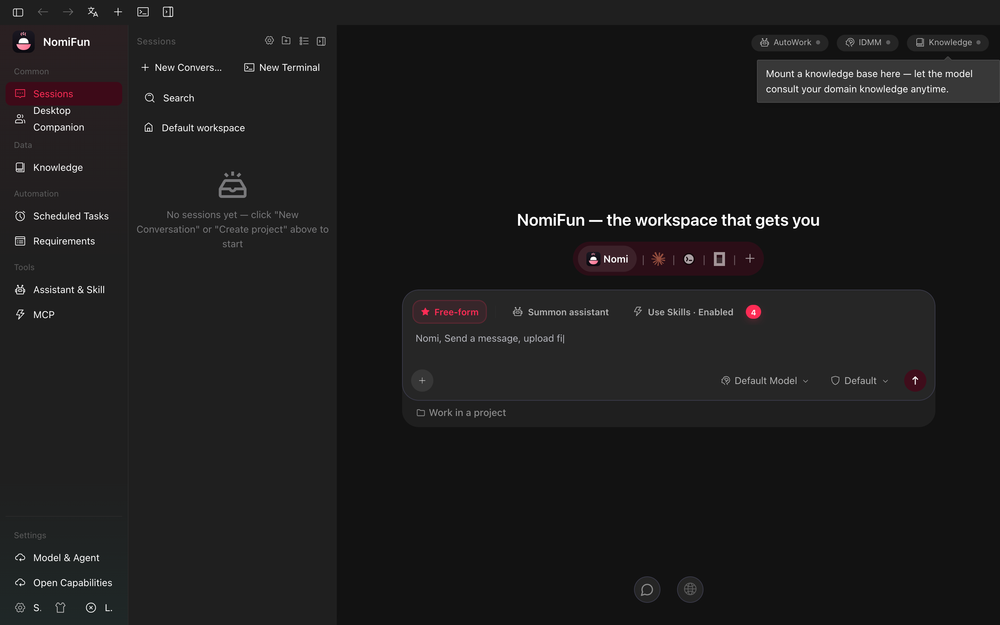
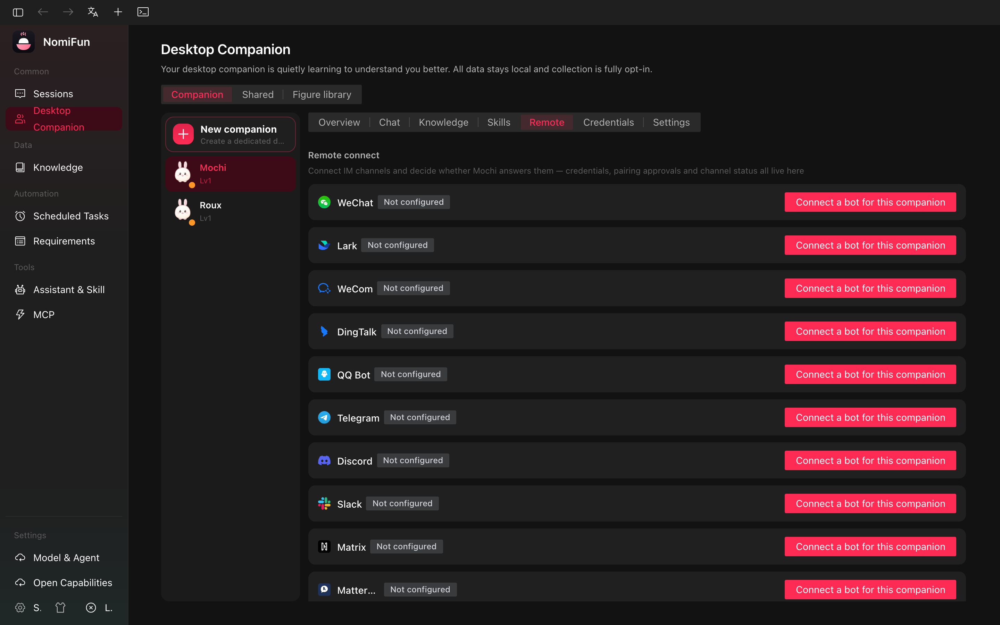
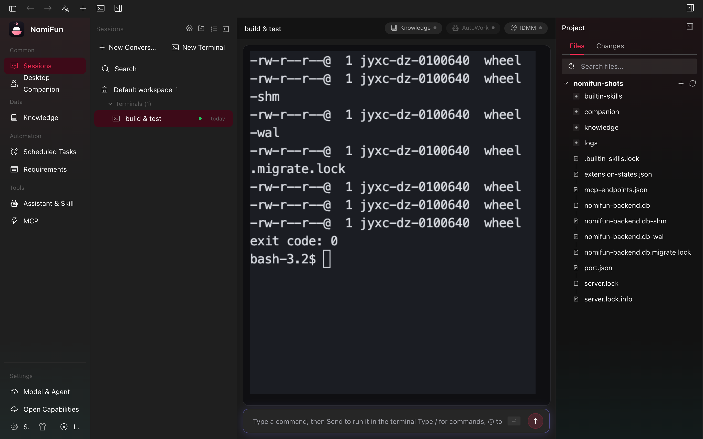

<a name="top"></a>

<div align="center">

<a href="https://www.nomifun.com">
  
</a>

<h3>一项毫无保留、<em>本地优先</em>的超级 AI 工作站。</h3>

<p>
  丰富的创新能力，极高的生产提效 ——<br/>
  而你的<b>数据始终留在自己的电脑上</b>。个人与企业都能放心使用、自由商用、接受审计。
</p>

<p>
  <a href="LICENSE"></a>
  
  
  <a href="https://www.nomifun.com"></a>
</p>

<p>
  
  
  
  <a href="https://github.com/nomifun/nomifun-tauri/stargazers"></a>
</p>

<p>
  <a href="README.md">English</a>&nbsp;·&nbsp;<b>简体中文</b>
</p>

<p>
  <a href="https://www.nomifun.com">🌐 官网</a>&nbsp;·&nbsp;
  <a href="docs/README.zh.md">📖 文档</a>&nbsp;·&nbsp;
  <a href="#-快速开始">🚀 快速开始</a>&nbsp;·&nbsp;
  <a href="https://github.com/nomifun/nomifun-tauri/releases">📦 下载</a>&nbsp;·&nbsp;
  <a href="#-联系我们--社区">💬 社区</a>
</p>

</div>

---

**NomiFun** 满足你对 AI 工作站的全部想象 —— 而且一切由你做主。一套 React 前端 + 一套 Rust 后端，为你带来会成长的桌面伙伴、无人值守的自动化平台、统一知识库、原生的 computer / browser use，以及任何智能体都能驱动的开放能力总线。无需云账号、无遥测、无订阅。除了**你自己配置**的大模型调用，你的数据绝不离开本机。

> 产品名是 **NomiFun**；小写 `nomifun` 仅用于代码标识符、crate 名、环境变量与仓库路径。

---

## ✨ 为什么选 NomiFun

|  | |
|---|---|
| 🔓 **开放 · 本地** | 源码完全开放，毫无保留。数据全在本地、绝不主动外发。个人与企业**均可**免费商用，接受审计。 |
| 🐾 **超级伙伴，智能进化** | 我们所知最完整的伙伴养成体系 —— 越用越懂你。不只是伙伴，更是真正的生产力工具。 |
| 🤖 **智能值守，需求管理** | 你只管指挥。AutoWork + IDMM 高可靠保活，在你离开时持续、可靠地为你工作。 |
| 🌐 **开放能力，超级生态** | 什么都有、什么都能用、什么都能配合 —— 而且*任意*智能体都能经 MCP / REST 拥有它的能力。 |
| 🧩 **无限搭配，config one** | 知识库、skill、agent、MCP、模型统一管理 —— 配置一次，处处复用。 |
| 🖥️ **更 native 的实现** | 进程内、自研的 **computer use** 与 **browser use** 作为原生工具 —— 更强、更快、更省 token。 |
| 🚀 **专为提效设计** | 从实际需求出发，用心打磨，海量创新能力。更多惊喜功能，敬请期待。 |

---

## 🔒 本地优先，是底层设计

在 NomiFun 里，数据安全不是一个开关，而是架构本身。

- **数据全在本地。** NomiFun 绝不主动向外发送任何数据。**唯一**的出站网络请求，是你自己明确配置、调用所选模型厂商的大模型请求；除此之外，没有任何第三方服务的网络对接。
- **关注数据安全的个体与企业都可放心使用。** 代码**完全开源、接受审计**。
- **为了这个承诺，我们砍掉了不少功能。** 为了保障你的数据安全，我们刻意舍弃了很多先进、有趣的功能设计 —— 一切都是为了让用户、也让开发者更放心。
- **无广告、无商业化、无会员制。** 我们承诺：永远不对本项目的任何功能收费。唯一花钱的地方是模型供应商的 token，这是我们无法替你解决的客观成本。（如果你在寻找 / 搭建模型上遇到困难，欢迎[联系我们](#-联系我们--社区)，我们很乐意帮忙搭建统一的模型网关。）

部署威胁模型与漏洞披露策略见 [`SECURITY.md`](SECURITY.md)。

---

## 🖼️ 先睹为快

<div align="center">

<p>
  🎬 <b>宣传视频：</b><a href="https://youtu.be/gEDo5H0H0Pg">https://youtu.be/gEDo5H0H0Pg</a>
</p>

<p>
  
  <br/><sub><b>桌面工作台：会话、伙伴与实时会话指标</b></sub>
</p>

<table>
  <tr>
    <td width="50%"><br/><sub><b>首页与会话</b></sub></td>
    <td width="50%"><br/><sub><b>伙伴 · IM 渠道</b></sub></td>
  </tr>
  <tr>
    <td width="50%"><br/><sub><b>需求 · AutoWork 看板</b></sub></td>
    <td width="50%"><br/><sub><b>开放能力总线</b></sub></td>
  </tr>
  <tr>
    <td width="50%"><br/><sub><b>智能体驱动的终端</b></sub></td>
    <td width="50%"><br/><sub><b>WebUI · 扫码即连</b></sub></td>
  </tr>
</table>

<sub>均为真实应用内截图。完整截图清单与采集方式见 <a href="docs/images/SCREENSHOTS.md">截图 manifest</a>。</sub>

</div>

---

## 🚀 功能亮点

### 🐾 桌面伙伴 —— 越用越懂你

> 指南：[`docs/guides/companions.zh.md`](docs/guides/companions.zh.md)

每天与你对话的伙伴，会悄悄变成那个最懂你的助理。

- **专属形象。** 上传自定义伙伴形象（DIY），或从与具体伙伴解耦的独立**形象库**中挑选。
- **一脑多面。** 运行多个伙伴，共享统一记忆中枢，同时各自保留**专属**私有记忆，并可挂载不同领域的知识库。你只需教好*一个*伙伴，再让它去教其他伙伴。
- **它在学你（默认开启，首启动一次性确认）。** 后台 Learner 把你的使用蒸馏为长期记忆；确定性的进化引擎从你反复出现的多步工具序列中挖掘出 **skill 草稿**，提交给你审阅。记忆**完全可见、可编辑**。
- **会传播的 skill。** 伙伴自动总结、生成 skill 并与你商议，还能把 skill **赠予**另一个伙伴（对方得到一份副本）—— 开启跨伙伴的共享学习。
- **不只是伙伴，更是超级网关。** 每个伙伴都是完整、独立的个体，可连接多个 IM 渠道。只要有网络和社交平台，随时随地一条消息，就能指挥伙伴帮你操作电脑。每个伙伴都能完整驱动桌面的系统能力。

### 🤖 智能值守 —— 需求平台 + AutoWork + IDMM

> 指南：[`autowork-requirements.zh.md`](docs/guides/autowork-requirements.zh.md) · [`intelligent-decision.zh.md`](docs/guides/intelligent-decision.zh.md)

你只管下令，NomiFun 可靠地把活干完。

- **需求平台** —— 带有序轮转的 CRUD 存储、看板、标签与逐项 claim。
- **AutoWork** —— 自动 claim 待办需求、驱动一个回合、轮转到下一个，并在回合进行中续租保活。目标可以是**会话智能体**，也可以是**终端 PTY**。
- **IDMM（智能决策）** —— 逐会话的守护，穿越供应商故障与决策停滞维持会话存活；无 LLM 的规则层 + 旁路备用模型层，叠加在 AutoWork 之上。
- **出站通知** —— 完成通知可推送到**飞书/Lark** 自定义机器人、**Slack** 与 HTTP webhook。

### 📚 统一知识库

> 指南：[`docs/guides/mcp-and-skills.zh.md`](docs/guides/mcp-and-skills.zh.md)

把散落在系统各处的知识，收拢到一个可管理、可追踪的地方。

- **集中管理与追踪** —— 创建、挂载，并跨会话、终端、伙伴追踪消费方。
- **安全回写** —— 代码强制、按使用面分级的写策略。默认把写入**暂存到审阅收件箱**，提供 unified-diff 预览与合并/丢弃 —— 智能体绝不会把内容写错地方。
- **实时 URL 快照** —— 把任意网页变成知识来源（带 SSRF 防护抓取、HTML→Markdown），支持*快照*（持久化、可重抓）与*实时*两种模式。
- **作用域受控的检索** —— 智能体调用 `knowledge_search` 工具，其作用域由服务端裁定、无法被擅自放大。

### 🖥️ 原生 Computer Use 与 Browser Use *（桌面版）*

> 指南：[`docs/guides/computer-browser-use.zh.md`](docs/guides/computer-browser-use.zh.md)

自研、**进程内 Rust** 实现 —— 不依赖 Playwright、不依赖 Node、不依赖第三方自动化守护进程。能力更强、速度更快、token 更省，提供细粒度控制，且完全开源供你增强。

- **Computer use** —— 无障碍树 + Set-of-Marks 叠层 + OCR，引导模型操作真实 UI 元素而非猜像素。macOS（AXUIElement + Vision OCR）与 Windows（UI Automation）已完整，Linux（AT-SPI2）为部分支持。
- **Browser use** —— 进程内 Chromium CDP 引擎，含 ARIA 观察、带带外审批的出站**防火墙**，以及与来源绑定的密钥保险库，凭据绝不进入 LLM。
- **生而受控** —— 每个动作都带 danger × surface 审批矩阵，不可逆操作须显式确认。

> ℹ️ computer/browser 控制随**桌面应用**提供；无头的 web/server 宿主按设计不含。

### 🌐 开放能力总线 —— MCP + REST

> 指南：[`remote-capability-api.zh.md`](docs/guides/remote-capability-api.zh.md) · [`remote-capability-api-examples.zh.md`](docs/guides/remote-capability-api-examples.zh.md)

NomiFun 的每一项能力都经由单一、强类型的能力注册表对外开放 —— **约 20 个域、150+ 个工具** —— 让你能把 NomiFun 接进任何地方。

- **MCP 前门** 位于 `/mcp`（鉴权，Streamable-HTTP）。把 **Claude Code、Cursor 或你自己的智能体**指向它，它们就能像桌面伙伴一样操作 NomiFun。
- **REST + OpenAPI** 位于 `/v1/tools`，支持流式，并自动生成 `/v1/openapi.json`。
- 在总线上新增一项能力，会自动同时出现在 MCP **与** REST 上 —— 不漂移。

### 🧩 自带智能体，也能接入你的

> 指南：[`docs/guides/model-routing.zh.md`](docs/guides/model-routing.zh.md)

- **内置 `nomi` 智能体** —— 无需额外安装。支持 **26+ 模型供应商/预设**（OpenAI、Anthropic、Gemini + Vertex AI、AWS Bedrock、DeepSeek、OpenRouter、Moonshot/Kimi、通义千问/Dashscope、智谱/GLM、MiniMax、SiliconFlow、xAI、火山/豆包 等），覆盖 **4 种线缆协议**，并支持 **New API** 聚合网关。
- **经 ACP 直连约 19 个外部智能体** —— Claude Code、Codex、Gemini、Qwen、Kimi、Cursor、Copilot、Goose、OpenCode、Droid 等，NomiFun 为它们提供模型*以及*自家的原生能力（computer/browser/knowledge/gateway，经注入的 MCP 桥）。
- **处处可用** —— 这些原生能力对内置智能体、ACP 智能体、聊天界面**以及**终端一律可用。

### 💻 终端模式

> 指南：[`docs/guides/terminal.zh.md`](docs/guides/terminal.zh.md)

在应用内 PTY 会话里运行各种 agent CLI（或独立的 `nomi` CLI）。NomiFun 会把原生能力 —— 知识检索、需求完成、生命周期 hooks —— 经各 CLI *自己的*原生配置注入进去，从而保留完整保真度与 OAuth。

### 📱 WebUI 远程操控 —— 一扫即用

> 指南：[`docs/guides/webui-remote-access.zh.md`](docs/guides/webui-remote-access.zh.md)

不用任何社交平台。一键**扫码配对**，就能让手机或平板经局域网连上电脑（一次性令牌，实时走 WebSocket），让你窝在沙发上也能远程操控你的工作站。

### ⚙️ config one，use anywhere

**知识库**、**Assistants & Skills**、**MCP**、**模型**、**开放能力**的集中管理中枢 —— 配置一次，再按会话、终端、渠道或伙伴逐一选用。单一事实源，处处复用。

### 💬 11 个 IM 渠道

> 指南：[`docs/guides/channels.zh.md`](docs/guides/channels.zh.md)

把伙伴绑定到下列任意渠道，从你已经在用的聊天工具里指挥它：

`Telegram` · `飞书 / Lark` · `钉钉 / DingTalk` · `微信 / WeChat` · `Discord` · `Slack` · `Matrix` · `Mattermost` · `Twitch` · `Nostr` · `QQ Bot`

---

## 🏗️ 架构

一套 React 前端、一套 Rust 后端，**两种宿主模式** —— 同一套后端在两者中均为进程内运行。

| | `nomifun-desktop` | `nomifun-web` |
|---|---|---|
| **外壳** | Tauri 2 桌面应用 | 独立 axum 服务器 |
| **后端** | 进程内嵌入，私有回环端口 | 同一后端，进程内 |
| **鉴权** | 注入 webview 的本地信任令牌 | 默认需要登录 |
| **提供** | 原生桌面 UI + 托盘 + 伙伴窗口 | 单端口提供 API + `/ws` + 已构建 SPA |
| **Computer / browser use** | ✅ 含 | ❌ 无头（不含） |

没有 Electron 外壳，没有 Node web 宿主，也没有预编译后端交接。

<details>
<summary><b>仓库结构</b></summary>

```text
apps/
  desktop/      Tauri 2 外壳与桌面专属命令
  web/          API + SPA 的独立 web 宿主
crates/
  agent/        15 个 nomi-* crate：引擎、供应商、工具、MCP、skills、记忆、
                browser/computer use，以及独立 nomi CLI
  backend/      29 个 nomifun-* crate：应用组装、鉴权、数据库、会话、
                MCP、知识库、需求、终端、伙伴、网关等
  shared/       2 个跨层 crate：nomifun-net 与 nomi-redact
ui/             桌面与 web 共用的 React 19 + Vite SPA
docs/           技术文档、用户/运维指南、架构说明
packaging/      web 宿主的 Linux 部署支持
```

系统全景从 [`docs/architecture/overview.zh.md`](docs/architecture/overview.zh.md) 入门。Cargo 工作区定义见 [`Cargo.toml`](Cargo.toml)。

</details>

---

## 🚀 快速开始

> ℹ️ **目前还没有预编译安装包** —— 请从源码安装，或用 Docker 跑服务器。安装包发布请关注 [Releases](https://github.com/nomifun/nomifun-tauri/releases)。

**前置依赖**

- [Rust](https://rustup.rs) —— stable 工具链，edition 2024
- [Bun](https://bun.sh) ≥ 1.3.13
- 建议在 PATH 中具备（以获得完整 agent 工具链）：`node` / `npm` / `npx`、`git`、`ripgrep`

**桌面应用（源码）**

```bash
git clone https://github.com/nomifun/nomifun-tauri.git
cd nomifun-tauri
bun install

bun run dev      # 热重载开发
bun run build    # 为当前操作系统打桌面安装包
```

**Web 服务器（自托管）**

```bash
bun run build:ui && bun run serve:web
# 单端口提供 API + SPA：http://127.0.0.1:8787（需登录）
```

**Docker（自托管服务器）**

```bash
docker compose up -d --build
# 然后打开 http://<服务器IP>:8787  —  配合自带的 Caddyfile 启用 TLS
```

详见 [`docs/getting-started/installation.zh.md`](docs/getting-started/installation.zh.md) 与 [`docs/guides/web-server-deployment.zh.md`](docs/guides/web-server-deployment.zh.md)。

---

## 🛠️ 开发

```bash
bun install        # 安装依赖（一次性）
bun run dev        # 桌面应用开发（热重载）
bun run dev:web    # web 宿主 + Vite 开发
bun run build:ui   # 构建 SPA
bun run check      # 前端 typecheck + i18n + 主题 + 脚本登记 门禁
bun run test       # Rust 测试（日常可用 test:fast 跑 nextest）
```

优先使用脚本入口而非裸 `cargo`/`vite` —— 它们附带了构建目录清理与一致性检查。第一次接触代码库？请读 [`CONTRIBUTING.md`](CONTRIBUTING.md) 与 [`docs/contributing/development.zh.md`](docs/contributing/development.zh.md)。

<details>
<summary><b>完整脚本目录</b></summary>

| 脚本 | 说明 |
| --- | --- |
| **开发（热重载）** | |
| `bun run dev` | 启动桌面应用开发（tauri dev，热重载） |
| `bun run dev:web` | 启动 Web 全栈开发（后端 API + 前端 vite） |
| `bun run dev:ui` | 仅启动前端开发服务器（纯 vite，无后端） |
| **构建（出制品）** | |
| `bun run build` | 为当前操作系统打桌面安装包 |
| `bun run build:signed` | 打桌面包并签名+公证（仅 macOS） |
| `bun run build:updater` | 打桌面包并产出自更新 .sig 制品 |
| `bun run build:ui` | 前端生产构建 → ui/dist |
| **运行（组装好的应用）** | |
| `bun run serve:web` | 启动 Web 服务器，托管已构建的前端 |
| **测试** | |
| `bun run test` | 运行全部 Rust 测试（含 doctest） |
| `bun run test:fast` | 用 nextest 快速跑 Rust 测试（日常） |
| **静态检查 / 门禁** | |
| `bun run check` | 聚合静态门禁：typecheck + i18n + 主题契约 + 脚本登记 |
| `bun run typecheck` | 前端 TypeScript 类型检查（tsc --noEmit） |
| `bun run check:i18n` | 校验 i18n 类型与 locale 键是否一致 |
| `bun run check:theme` | 校验预设 CSS 主题契约 |
| **格式化** | |
| `bun run fmt` | 格式化 Rust 代码（cargo fmt） |
| `bun run fmt:check` | 校验 Rust 代码格式（cargo fmt --check） |
| **代码生成** | |
| `bun run gen:i18n` | 由 locale 重新生成 i18n 类型声明 |
| **维护 / 工具** | |
| `bun run clean` | 深度回收构建空间（debug 产物 + flycheck + 旧安装包） |
| `bun run seed:dev` | 用生产数据目录播种 dev 数据目录 |
| `bun run help` | 打印脚本目录（--check 校验登记 / --readme 生成 README 表） |

<sub>此表的英文权威版由 <code>bun run help --readme</code> 在 <a href="README.md">README.md</a> 中自动维护。</sub>

</details>

---

## 📖 文档

- [`docs/README.zh.md`](docs/README.zh.md) —— 文档索引
- [`docs/getting-started/`](docs/getting-started) —— 安装与首次运行
- [`docs/guides/`](docs/guides) —— 用户与运维指南（伙伴、渠道、AutoWork、知识库、computer/browser use、终端、远程 API……）
- [`docs/architecture/`](docs/architecture) —— 技术架构
- [`docs/reference/`](docs/reference) —— 配置、API 概览、FAQ、排障

文档为双语：每篇都有英文 `*.md` 与简体中文 `*.zh.md` 两份。

---

## 🗺️ 敬请期待

NomiFun 目前处于 **pre-1.0**，且为兼职开发，所以还有很多正在路上：预编译安装包、入站 issue / 需求来源接入、更多知识库连接器（飞书及更多）、官方桌面安装包 —— 以及几个我们非常期待的惊喜。**敬请期待。** ✨

---

## 🤝 贡献与社区

NomiFun 非常需要你的加入来壮大 —— 代码贡献、社区运营、技术布道都热烈欢迎。如果你对这个项目有热情，请[联系我们](#-联系我们--社区)，与我们一起共建 NomiFun 的生态。

- 阅读 [`CONTRIBUTING.md`](CONTRIBUTING.md) 完成环境搭建、了解检查阶梯。
- 友善相待 —— 见 [`CODE_OF_CONDUCT.md`](CODE_OF_CONDUCT.md)。
- 发现漏洞？请按 [`SECURITY.md`](SECURITY.md) 操作。
- 从 [open issues](https://github.com/nomifun/nomifun-tauri/issues) 找一个起点。

---

## 💛 写在最后（来自作者）

> 开发者兼职、精力有限，很多惊喜功能还在路上。如果你认同这件事，欢迎以任何方式加入 —— 一行代码、一条建议、一次转发，都是莫大的鼓励。

NomiFun **完全开源、毫无保留**。个人与企业都可以在它之上二次开发并商用。

- **欢迎二次开发与商用。** 同时，这些行为风险自担 —— 作者与贡献者不承担后续一切法律责任。Apache-2.0 无需我们另行授权。
- **告知一声，是渴望而非要求。** 如果你二次开发或商用 NomiFun，希望你能留言告知我们 —— 这*不是*授权条件，只是因为「知道项目被认可」这份肯定，正是让它走下去的动力。
- **部分功能被刻意排除在开源版之外** —— 为了让本地数据的承诺滴水不漏。在没有足够人力与资金保障每位用户数据安全的前提下，移除它们是负责任的选择。等条件允许，我们希望把更多功能奉上给大家。

谢谢你来到这里。🙏

---

## 🔗 友情链接

这些是我们欣赏的产品与项目：

| 产品 | 简介 |
|---|---|
| [Saytive](http://saytive.ai/) | **Be Creative, Be Saytive.** Saytive 是一款专为创意工作者打造的语音输入法，它通过顶级模型和产品设计，自动感知你的工作上下文，提供快速准确而符合场景的转写体验。 |
| [Fast](https://fast.saien.pro) | **搜索，一触即达。** 你只需输入文字并点击，即可直达小红书、抖音、美团等数十个主流应用的搜索结果页面。拒绝信息流，专注搜索本身，搜索本该如此简单。 |
| [AionUi](https://github.com/iOfficeAI/AionUi) | AionUi 内置完整的 AI agent 引擎。不同于需要你额外安装 CLI agent 的工具，AionUi 安装后即可使用。 |

---

## 📬 联系我们 / 社区

我们很想听到你的声音。最快的方式是 GitHub；下列社交渠道均为官方。

| 渠道 | 入口 |
|---|---|
| 🌐 **官网** | [www.nomifun.com](https://www.nomifun.com) |
| 🐙 **GitHub** | [nomifun/nomifun-tauri](https://github.com/nomifun/nomifun-tauri) · [Issues](https://github.com/nomifun/nomifun-tauri/issues) · [Releases](https://github.com/nomifun/nomifun-tauri/releases) |
| ✉️ **邮箱** | `hello@nomifun.com` <sub>（占位 · 待确认）</sub> |
| 📕 **小红书** | [NomiFun](https://xhslink.com/m/4x6ti8n6cA1) |
| 📺 **哔哩哔哩** | [NomiFun](https://b23.tv/0UhgKDh) |
| 🎵 **抖音** | [NomiFun](https://v.douyin.com/MDT5QVdYaJk/) |
| ▶️ **YouTube** | [@NomiFun-o2y](https://www.youtube.com/@NomiFun-o2y) |
| 𝕏 **X (Twitter)** | [@colir0](https://x.com/colir0) |
| 🎬 **TikTok** | [@colir0luo](https://www.tiktok.com/@colir0luo) |

**加入交流群** —— 扫码即可：

<div align="center">
<table>
  <tr>
    <td align="center"><br/><sub><b>微信群</b></sub></td>
    <td align="center"><br/><sub><b>QQ 群</b></sub></td>
  </tr>
</table>
</div>

---

## ⚖️ 许可证

[Apache-2.0](LICENSE) © 2025–2026 NomiFun。

第三方署名见 [`NOTICE`](NOTICE)，其中包括 NomiFun 在迁移到当前 Tauri/Rust 架构之前最初 fork 自的 [AionUi](https://github.com/iOfficeAI/AionUi) 项目。

<div align="center">
<br/>
<sub>用 💛 打造，献给希望以自己的方式拥有 AI 的人。</sub>
<br/><br/>
<a href="#top">⬆ 回到顶部</a>
</div>
