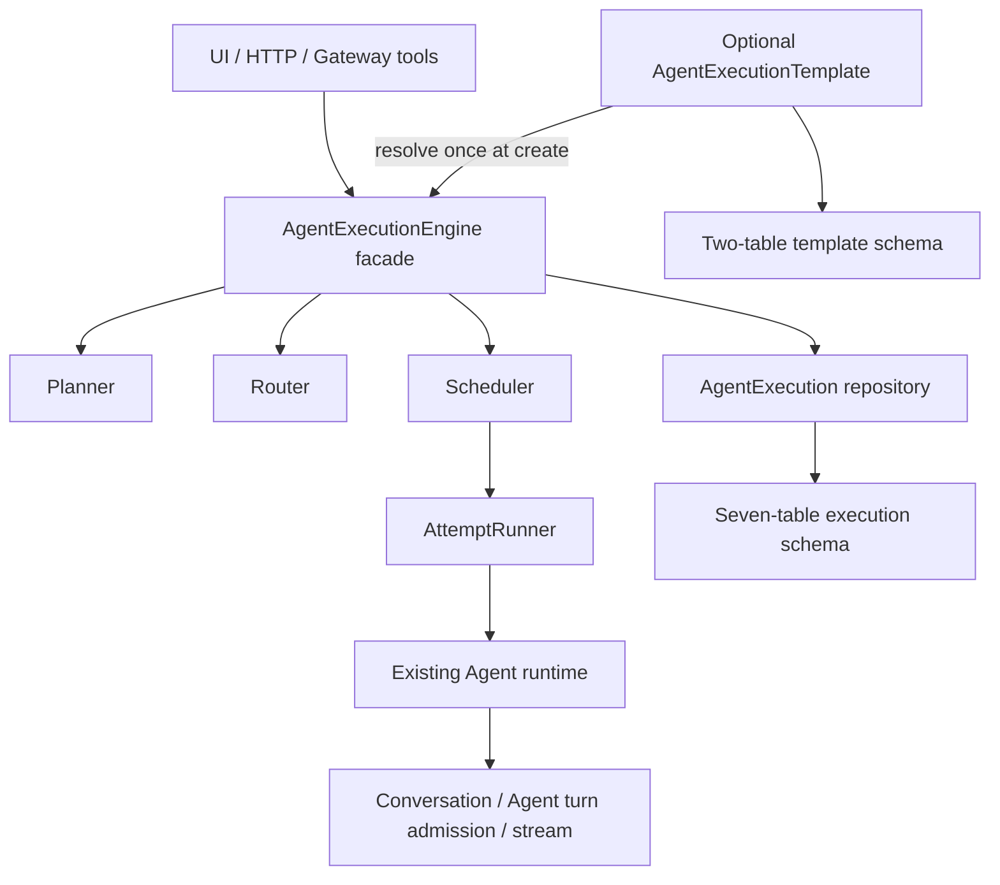

# Agent 执行架构

## 1. 结论与设计目标

NomiFun 的执行域只保留一套词汇：

1. **Agent**：唯一执行主体。模型、工具、规则、能力和身份都属于 Agent。
2. **Conversation / Turn**：Agent 与用户或其他 Agent 交互、流式输出和单回合串行的边界。
3. **AgentExecution**：一次目标执行的领域聚合，统一覆盖单 Agent、并行 Agent、DAG、多轮重试、人工介入和恢复。聚合内只有 Participant、Step、Dependency、Attempt、Link 和 Event 六类有独立持久化价值的记录。

`AgentExecutionEngine` 是这套能力唯一的公开研发外观，不是另一个领域。Planner、Router、Scheduler 和 AttemptRunner 都是 Engine 内部实现。Agent 间关系、参与者快照、执行生命周期和调度策略都属于这一套模型，不再建立并列实体。

在 Agent 协作执行域中，无限定词的 `Run`、编排器、子 Agent、集群、编队等旧称都不再是领域概念：它们不得成为协作产品入口、研发类型、crate/module、API/事件前缀、数据库表或状态真相。旧协作名只允许出现在一次性数据库迁移映射中；普通动词 run，以及 `CronJobRun`（一次调度触发记录）、伙伴学习批次等带明确业务域限定、且不参与 Agent 协作状态机的事实记录，不属于平行执行聚合。Agent 协作运行态始终只有 AgentExecution，Agent 之间的委派始终只是同一聚合中的 Participant、Step 与 Attempt 关系。渠道 Agent 也只是把外部消息接入同一 Agent / Conversation runtime 的上下文，不是新的 Agent 类型或执行聚合。

旧系统还允许保存多套协作成员与工作区配置。它们不是运行态，却包含不能丢失的成员、角色、模型、能力、约束、目录和上下文。最终设计用一个配置态 `AgentExecutionTemplate` 承接，产品只称“协作方案”：它只是创建 Execution 前可复用的一组输入，实例化时一次性解析成 Participant 快照，运行后永不回读。它不进入 Execution 状态机，也不恢复历史配置间的引用、继承或双状态。

这次收敛不是改名补丁。数据库、Repository、HTTP、Gateway 工具、事件、前端状态和恢复逻辑必须在同一版本切到唯一模型；迁移完成后删除旧表、旧路由、旧事件和双读 fallback。

## 2. 统一词汇与旧概念映射

| 统一概念 | 责任 | 旧概念如何归并 |
|---|---|---|
| Agent | 具备模型、工具、规则与能力的执行者 | 所有执行者都是 Agent；父子只是一段执行关系 |
| Conversation | 用户或 Agent 的交互与流式消息边界 | 主会话、Attempt 会话继续保留，但不承担 Execution 状态机 |
| AgentExecution | 一次目标处理及其完整生命周期 | 历史执行聚合统一迁入此模型 |
| AgentExecutionTemplate | 可选的持久化协作输入，产品称“协作方案” | 历史协作配置扁平合并为一个配置聚合；不是运行态或模型工具 |
| ExecutionParticipant | 本次 Execution 可用 Agent 的不可变快照 | 历史成员配置在实例化时收敛为执行时快照 |
| ExecutionStep | 可调度的最小工作单元 | task、node 统一为 Step |
| ExecutionStepDependency | Step 间 blocker → blocked 的有向边 | DAG 边；不是调度器实体 |
| ExecutionAttempt | Step 的一次实际派发与执行 | assignment、retry、rerun 的历史统一落在 Attempt |
| ConversationExecutionLink | Conversation 与 Execution/Step/Attempt 的显式关联 | 替代 conversation extra 中的隐式外键和多处反查 |
| ExecutionEvent | 状态变化、决策和审计的持久化事实 | 替代只存在于 WebSocket 或日志中的瞬时执行事件 |
| AgentExecutionEngine | 对外唯一执行外观 | 历史执行服务的能力入口统一到 facade |
| Planner / Router / Scheduler / AttemptRunner | Engine 内部互斥职责 | Planner 产出 DAG，Router 选择 Participant，Scheduler 管理 ready/lease/并发，AttemptRunner 只运行一次 Attempt；它们不是 DB 实体、API 资源或产品名 |

本文在叙述中统一简写为 Participant、Step、Dependency、Attempt、Link 和 Event。代码类型使用 `ExecutionParticipant`、`ExecutionStep`、`ConversationExecutionLink` 等前缀只是为了 Rust/TypeScript 命名空间清晰，不表示又增加了一层领域概念。

禁止重新引入平行的执行者、协作组、工作区或执行生命周期领域类型，也禁止给 Template 增加 kind、父模板或继承链来换皮恢复它们。Execution 不形成父子树；ConversationExecutionLink 只负责 Conversation 与同一个 Execution/Step/Attempt 的归属。Attempt 内再次委派时，Engine 把新 Step 原子追加到当前 Execution，复用同一组 Participant、策略、调度器和生命周期，不得复制 `host`、`child_agent`、`parent_execution` 或另一组来源实体。Step 上允许保留一个 Engine 派生、调用方不可写的 `delegation_depth` 安全标量，用于限制递归委派；它不是关系、资源或状态机。

## 3. 架构边界：Engine facade + internal scheduler



`AgentExecutionEngine` 是其他 crate 发起执行命令或读取执行投影的唯一入口，负责：

- 创建、审批、启动、暂停、恢复、更新和取消 Execution；
- 在一个事务边界内校验状态迁移、持久化事实并生成 ExecutionEvent；
- 启动和恢复后台执行句柄，并保证同一 Execution 只有一个活动调度循环；
- 向应用服务返回稳定领域结果，不泄漏队列、锁、JoinHandle 或调度实现。

跨域删除完整性只允许通过窄的只读 Link guard 和 DB 外键/trigger 约束实现；它不能绕过 Engine 修改 Execution，也不能让 Conversation 等领域依赖完整执行 Repository。

`Scheduler` 必须是 Engine 私有组件。它只做 ready-step 选择、依赖检查、租约、并发配额和 Attempt 派发，不拥有新的领域状态机。Planner 生成计划，Router 选择 Participant，AttemptRunner 把一个 Attempt 映射到既有 Agent runtime。ConversationEffects 是一个合并后的基础设施端口，统一承载 Attempt 停止/引导与结果投影，生产环境必须一次性完整注入，不能分别漏装。终态结果以稳定 operation id 直接、幂等地写成 lead Conversation 的 assistant message，复用既有 realtime message 契约，不再发送隐藏 user message触发 lead Agent 第二轮模型调用。决策、适配、重试和汇总是 Engine 能力，不再各自建立服务、资源或状态机。

现有 Agent runtime 继续负责一次 Agent 会话内的模型/工具循环；Conversation 继续负责消息、流式事件和 `AgentTurnHandle`。Engine 组合这些能力，不复制它们。

## 4. 生命周期与状态机

```text
Conversation (lead)
  └─ AgentExecution
       ├─ ExecutionParticipant A/B/C (immutable snapshots)
       ├─ ExecutionStep A
       │    ├─ ExecutionAttempt #1 -> Participant A -> Agent Conversation
       │    └─ ExecutionAttempt #2 -> Participant B -> Agent Conversation
       ├─ ExecutionStep B
       ├─ ExecutionStepDependency A -> B
       └─ ExecutionEvent 1..N
```

Execution 持久状态（不存在额外 `created` 过渡态）：

| 当前状态 | 允许的下一状态 |
|---|---|
| `planning` | `awaiting_approval`、`running`、`failed`、`cancelled` |
| `awaiting_approval` | `running`、`failed`、`cancelled` |
| `running` | `awaiting_approval`（显式 replan）、`paused`、`waiting_input`、`completed`、`completed_with_failures`、`failed`、`cancelled` |
| `paused` | `awaiting_approval`（显式 replan）、`running`、`failed`、`cancelled` |
| `waiting_input` | `awaiting_approval`（显式 replan）、`running`、`paused`、`failed`、`cancelled` |
| `completed` / `completed_with_failures` / `failed` | 只有带 expected version 的显式 retry/adopt/add 命令可以重开为 `running` |
| `cancelled` | 无；取消永久终止 |

Pause 同时接受 `running` 与 `waiting_input`。原子暂停会把尚未开始的 queued Attempt 记为 `cancelled`、已经开始的 running Attempt 记为 `interrupted`，相关 Step 回到 `pending`，并停止对应 Agent Turn；已经提交的 waiting question 和 WaitingInput Attempt 保留。Resume 若仍有未回答问题就回到 `waiting_input`，否则回到 `running` 并追加新的 Attempt，绝不复活已结束的调用。显式 Cancel 则把所有在途 Attempt/Step 归约为 `cancelled`，只做停止、Link cleanup 与事件投递，不生成终态结果消息。

同状态写入只用于幂等恢复。非终态 Execution 只有经过 Engine 领域校验和 optimistic version
校验的显式 replan，才能因为新计划的 `plan_gate=require_approval` 回到
`awaiting_approval`；Scheduler 的普通 Attempt 回写不能产生这个反向门禁。Scheduler 的
Attempt 回写也不得让任何已结算 Execution 重开；只有经过同一 Engine 边界校验的显式
retry/adopt/add 命令拥有重开权限。因此，迟到的完成/错误事件不会与 replan、retry、adopt 或 add
竞争并复活旧状态。

Step 持久状态（`ready` 由依赖满足、无活动 Attempt 和 retry 时间到期共同推导，不落库）：

| 当前状态 | 允许的下一状态 |
|---|---|
| `pending` | `running`、`completed`、`failed`、`skipped`、`cancelled` |
| `running` | `pending`、`waiting_input`、`completed`、`failed`、`cancelled` |
| `waiting_input` | `pending`、`running`、`completed`、`failed`、`cancelled` |
| `completed` | `pending`，仅限显式 retry/rerun |
| `failed` / `skipped` | `pending`（显式 retry）或 `completed`（显式 adopt） |
| `cancelled` | 无；不可重开 |

Retry 会把目标 Step 及受它影响的下游 Step 原子归约回 `pending`，但不会修改旧 Attempt；随后调度产生新的 Attempt。Reassign 只改变未来派发使用的 Participant，也不会改写历史 Attempt。

Attempt 状态：

| 当前状态 | 允许的下一状态 |
|---|---|
| `queued` | `running`、`cancelled` |
| `running` | `waiting_input`、`completed`、`failed`、`cancelled`、`interrupted` |
| `waiting_input` | `running`、`completed`、`failed`、`cancelled`、`interrupted` |
| `completed` / `failed` / `cancelled` / `interrupted` | 无；Attempt 永不重开 |

`agent_execution_attempts.version` 同时是持久化 Turn 代际栅栏。派发或 decision continuation 启动时捕获 Step/Attempt version，回调结算必须携带原值做 CAS，禁止结算前重读最新 version 后替旧 Turn 续命。Agent 提交用户问题会先原子写入 WaitingInput 并增加 version，再请求停止当前 Turn；用户回答再次增加 version 并启动 continuation。因此提问前的迟到 callback 和提问后的同 Turn 副作用都不能覆盖已恢复状态。

超时通过 `failed + error_code=timeout` 表达，不再增加一个与失败处理完全相同的
持久状态。`interrupted` 只表示具体调用已经进入 `running` / `waiting_input`，随后因进程退出、
升级切换或重规划替换而失去原调用；恢复或重试必须追加新 Attempt。尚未开始的 `queued`
只是派发预约，恢复清理、重规划或用户取消都归约为 `cancelled`，不得伪造成
`interrupted`。用户显式取消任何在途 Attempt 也统一写 `cancelled`；只有系统失去已开始
调用的控制权时才写 `interrupted`。

普通交互只需要 Conversation/Turn，不为每条聊天虚构 Execution。一旦目标需要独立持久化、跨 Turn 恢复、并行或 DAG，即使只用一个 Agent 也走 AgentExecution：Engine 创建一个 Participant、一个 Step，并在 Step ready 后创建 Attempt。多 Agent 不创建 Cluster：Engine 创建多个 Participant/Step，并由同一个 Scheduler 按依赖和并发上限派发。Attempt 内再次委派只是向当前 Execution 追加 Step；顶层 Conversation 或 Remote actor 才创建新的 Execution。追加调用返回同一个 execution id 与新增 step ids，当前 Attempt 随后正常结束，Scheduler 会在整个 DAG（包括新增 Step）归约完成前阻止 Execution 进入终态。为形成明确 join 语义，Engine 还会在同一事务中把新批次叶节点接成 caller Step 尚未开始的直接下游 Step 的 blocker；已经 running/completed 的下游历史不回写。

Step 只保存当前归约状态；每次实际派发（包括改派后的再次派发、retry 和 rerun）都新增 ExecutionAttempt，禁止覆盖历史 assignment。只修改未来路由的命令本身不伪造 Attempt。Execution 状态由 Step 状态和策略归约产生，已结算状态不得被迟到的 Attempt 事件复活。

### 4.1 有界复杂度

能力可以扩展，单个聚合的工作集必须有硬上限。以下数值定义在 `nomifun-common` 的共享
执行域常量中，Engine、Participant Resolver、Repository 和 DB 约束不得各自复制另一套
可漂移配置：

| 边界 | 硬上限 | 计数口径与入口 |
|---|---:|---|
| 模型池（`MAX_AGENT_EXECUTION_MODELS`） | 16 | 一次 Execution 请求最终解析出的 provider/model 选择。`automatic` 按 lead model 优先、配置目录顺序确定性截取；显式 `range` 超限直接拒绝 |
| 当前 Participant（`MAX_AGENT_EXECUTION_PARTICIPANTS`） | 64 | `retired_in_revision IS NULL` 的不可变 Agent 快照；基础模型和 preset 扩展出的变体共享同一预算。create/reconcile 先校验，DB INSERT trigger 防止绕过 Repository |
| 当前 DAG（`MAX_AGENT_EXECUTION_STEPS`） | 128 | `superseded_in_revision IS NULL` 的 Step 节点；Planner/Engine/Repository 校验，DB INSERT trigger 兜底 |
| 并行度（`MAX_AGENT_EXECUTION_PARALLELISM`） | 64 | `max_parallel` 的允许范围为 1..=64，默认 4；它限制同时执行的 Step，不改变 Participant 或 DAG 数量上限 |
| Step 委派深度（`MAX_AGENT_DELEGATION_DEPTH`） | 4 | 初始 Step 为 0；Attempt 内追加的 Step 由 Engine 原子写为 caller Step + 1。深度 4 的 Attempt 不再获得 delegate 工具。该私有标量与当前 DAG 128 Step 总上限共同防止失控增长，不建立 Execution 父子树 |

Participant 和 Step 的历史 revision 不计入当前工作集上限，也不得为了满足上限而删除。
重规划必须先退役旧 Participant / 作废旧 Step，再插入新快照；这样当前集合始终有界，
完整审计历史仍可无限按 revision 追加。Migration 037 在写入前对每个旧 Execution 的最终
Participant 总数做 64 上限预检，超限就让整次迁移回滚，不能形成“历史运行数据不受约束”的
双标准；迁移完成后的所有新 active INSERT 继续受 DB trigger 防线保护。Template 不是另一套宽松的草稿系统：所有保存方案始终包含 1..64 个可执行 Participant，最多 16 组模型，并行度不超过 64。旧配置以 `sort_order, id` 稳定规范化：无法解析模型的成员丢弃，模型/成员截断到 16/64，最终为空则整个旧方案跳过并清除 Conversation 选择。

## 5. 四类正交策略

策略是 AgentExecution 顶层的强类型属性，拆成四个独立字段，禁止继续用一个 `autonomy` 或 `approval_mode` 混合多种含义。创建后只能通过带 expected version 的 replan 命令变更；Event 和 Attempt 生效配置保留变更事实与执行快照：

| 字段 | 只负责 | 不负责 |
|---|---|---|
| `delegation_policy` | `disabled` / `automatic` / `prefer_parallel`；是否允许委派以及是否优先并行 | 计划审批、Step 决策、失败适配；并发上限由独立的 `max_parallel` 表达 |
| `plan_gate` | `automatic` / `require_approval`；生成计划后是否等待用户审批 | Step 内问题如何回答 |
| `decision_policy` | `automatic` / `ask_user`；Agent 遇到关键不确定项时自动判断还是请求用户 | provider 错误和重试 |
| `adaptation_policy` | `fixed` / `adaptive`；是否允许自动 retry、backoff、改派和重规划 | 是否允许最初的 Agent 委派 |

四类聚合策略只存在于 Execution 顶层，不在 Step 中复制另一组策略 bag。Step 只保存自己的强类型路由、tool policy、failure policy 和 control policy；Engine 创建 ExecutionAttempt 时把实际 Participant 与最终生效配置写入不可变快照，保证恢复和历史复盘不受后续设置变化影响。

Step 的 `role` 是自由文本，只用于人类展示、路由提示和协作方案沉淀，不承担权限语义。工具能力由独立强类型 `tool_policy` 表达：`full` 保留调用 Conversation 已有的工具边界，`read_only` 进一步收缩为 Read/Grep/Glob，`read_shell` 进一步收缩为 Read/Grep/Glob/Bash。任何 policy 都只能收缩既有权限，不能升权；未知持久值必须读取失败。这样 `builder`、`implementer`、中文角色和自定义角色都不会因描述字符串触发隐式授权或运行失败，Planner 和显式并行输入也必须单独给出 policy（省略时兼容为 `full`）。

Conversation 只保存协作入口默认值：`delegation_policy`、`execution_model_pool`、`decision_policy`，以及可选的一等字段 `execution_template_id`。Conversation 与 Execution 的 `execution_model_pool` 共用唯一 tagged wire contract：只允许 `automatic`、`single`、`range` 三种结构，DB 也只接受该结构；`NULL` 表示继承当前 lead model，tagged `automatic` 表示显式按启用模型目录自动选择，两者不能归并。有限的 `single/range` 必须包含 Conversation 当前 `model.use_model`（缺失或空白时取 `model.model`）对应的 provider/model；UI heal/select 与 failover 必须在一次写入中原子更新 model、pool，并由跨列 DB trigger 兜底，`NULL/automatic` 不做成员校验。Migration 037 把 legacy array 一次性转成 `range`，把 legacy `auto` 保留为 tagged `automatic`；有限旧池先把有效当前 lead 前置，再按旧顺序稳定去重并截取 16 个，运行时不得兼容双读。Template 没有隐式 draft/status：保存时必须具有 1..64 个可解析到具体 provider/model 的 Participant，且最多 16 组不同模型；`max_parallel` 与 Participant `constraints.max_concurrency` 均使用 1..64 的共享上限，legacy 超限的 Participant 标量在 Migration 037 收窄为 64。Template 中 `sort_order = 0` 的 Participant 是默认 lead；显式 `lead_model` 必须属于该 Template 并被确定性提升到首位，Conversation/Gateway 始终使用这个当前主模型，缺失或越权选择返回 `BadRequest`。`execution_template_id` 非空还要求同 owner Template 的具体 Participant 包含 Conversation 当前 lead；切换模型必须原子清除不再匹配的选择，Template 替换 Participant 时也在同一事务清理受影响的 Conversation 选择。顶层首次委派时按 owner 读取一次并复制，Attempt 内委派永不读取；Execution 不保存 template id，因此 Template 更新或删除不会改变已实例化 Execution 的快照。Template 删除时 FK 仅把尚未实例化的 Conversation 选择置空。创建 Execution 时把最终决策写入 Execution/Participant/Attempt；Conversation 不保存执行状态，`extra` 也不是执行事实来源。`plan_gate` 与 `adaptation_policy` 是每个 Execution 的显式选择。Migration 037 会一次性将有效且 lead 匹配的旧 `extra.execution_template_id` 迁入列并删除 JSON key；无法解析模型的旧 Participant 被丢弃，模型/成员按稳定顺序截断到 16/64，清理后为空或不包含 lead 的旧 authoring 选择不迁移，相应 Conversation 选择置空。frozen preset 只提供审计与配置快照；Participant 行的最终 `provider_id/model` 是唯一 live binding。实例化时无论当前 Participant 数量多少，frozen lead 都确定性替换首个同 provider/model Participant，使总数与 model authority 恒定；其他同模型但具有不同 Agent 配置的 Participant 保留。

## 6. 模型工具：只保留三个入口

在持久协作执行域，模型、Gateway 和内置 Agent 只看到以下三个工具：

1. `nomi_delegate`：从顶层 Conversation/Remote actor 创建 AgentExecution；从已有 Attempt Conversation 调用时，则向该 ConversationLink 所属的同一个 Execution 原子追加 Step。输入包含目标、可选显式 steps、模型范围、计划门禁、适配策略和并发上限；delegation/decision policy 从调用 Conversation 继承。只有目标时由 Planner 生成计划；显式 steps 仍进入同一持久化和调度入口。
2. `nomi_execution_get`：读取 Execution 摘要、Participant、当前及历史 DAG revision，以及每个 Attempt 的输出、错误和 Conversation。不再拆出近似的 status/result 工具；事件游标由 HTTP 事件端点负责。
3. `nomi_execution_update`：执行带 tag 的命令，当前包括 `replan`、`adjust`、`add`、`rename`、`update_step`、`reassign`、`configure`、`steer`、`retry`、`approve`、`pause`、`resume`、`cancel` 和 Attempt 内的 `request_user_decision`。修改命令携带 expected version，统一经过领域校验。用户或 lead 对已完成/失败 Execution 显式 add 时，Engine 必须先确保上一终态回执已幂等投影，再原子追加并重开为 running；cancelled 永不重开。

Step Agent 请求决策也使用 `nomi_execution_update(request_user_decision)`。Attempt actor 在该工具中只允许这个命令；它要扩展工作必须走 `nomi_delegate` 的受控追加入口，不能 replan/adjust/add/update/reassign/configure/steer/retry 或控制整个聚合。完整更新命令只开放给 owner、HTTP/UI 与顶层 lead Agent。execution、step、attempt 和调用者身份从当前会话的 `ConversationExecutionLink` 与认证上下文解析，不允许模型提交可伪造的归属字段。HTTP/UI 仍可提供 `adopt`、事件分页和工作目录浏览等面向用户的操作，但不为每项操作新增模型工具。

Attempt 内 `nomi_delegate` 还必须具备数据库持久幂等。Engine 用可信的 execution/step/attempt 身份与规范化后的 goal、model pool、显式 DAG 在服务端派生内容寻址 operation id；该字段不出现在模型 schema。Repository 在同一 Execution 的 Event 中唯一记录 operation id 与首次写入的 `added_step_ids`，重放先于 Attempt active/version 校验和 Planner 调用，直接返回原 Step id。并发相同调用在 SQLite 写锁与唯一索引下也只能落一批 Step，不使用进程内缓存，不增加第八张运行表。

三个工具只调用 `AgentExecutionEngine` facade，不可直接操作 Scheduler、后台句柄或 Repository。`strategy=parallel` 在所有部署中直接复用 `nomi-types::agent::ParallelDelegationRequest`：模型字段固定为 `strategy`、`tasks`、`synthesize`；task 字段固定为 `name`、`prompt`、自由文本 `role`、强类型 `tool_policy`，由同一个 serde/JsonSchema 定义生成 schema，未知字段和未知 policy 一律拒绝。平台和 embedded 部署也统一返回 `AgentExecutionReceipt`，基础字段只有 `execution_id`、规范的 `AgentExecutionStatus` 与 `message`。平台 scheduler 异步执行时返回活动状态；纯 CLI/embedded 宿主在当前 Turn 内同步执行后返回 `completed`、`completed_with_failures` 或 `failed`，并在同一强类型 receipt 上附加 terminal summary/results/synthesis。不存在 `mode`、`execution_mode`、第二套 envelope 或第二套生命周期。

embedded fan-out 的并行与协调属于 AgentExecution 内部实现：宿主预登记调用，自动维护私有 progress ledger，并通过 `ContextContributor` 向每个 child 注入经过长度限制和 JSON 编码的兄弟任务/状态快照。快照明确标为不可信数据，不能授予工具权限；模型看不到额外 task-board 或任何第四个协作工具。workspace 调度只依据 `parent allowlist ∩ AgentToolPolicy ∩ exact_tools` 的最终有效权限，并与 registry 共用一份带 effect 的 tool catalog：`Write`、`Edit`、`Bash` 可修改 workspace，其他内置 child tool 只读。一个批次只有零个或一个可写 Step 时继续共享源 workspace；两个及以上可写 Step 时，只有可写 Step 进入隔离 worktree，只读 Step 仍共享。非 Git workspace 无法隔离时只对受影响的可写 Step 在最终 receipt 中显式告警，不静默降级。一次 fan-out 只冻结一个稳定源码基线；私有 Git index/object store 不修改源 index、refs 或 ODB，基线在有限次一致性捕获后自包含，所有 writer 从同一 revision 启动，最终 patch 始终相对该 revision 且包含 committed、unstaged、untracked 与 binary 增量。该策略由宿主确定，不接受用户配置或模型参数。`synthesize=true` 追加一个 `read_only` synthesis Agent。历史实现曾让 child 继承 parent raw-shell hooks；这属于越过 capability 的隐式授权，本次权限边界迁移明确禁止继承。未来若恢复 child hook，只能让 HookEngine 经过 `ProcessSupervisor + CapabilityPolicy` 并把 effect 纳入同一 catalog，绝不能恢复无约束 shell。底层只公开一次调用原语 `AgentInvocationRunner::invoke(AgentInvocationInput) -> AgentInvocationOutput`；fork-mode Skill 使用同一个 trait，embedded runner/tool/progress module 均为 `nomi-agent` crate-private 实现细节。

协作方案只通过 owner-scoped HTTP/UI 管理和实例化，不增加第四个模型工具。自动规划只在调用方没有给显式 Step 时发生；显式并行/DAG 直接物化计划。Execution 终态只有在某个 completed synthesis Step 的依赖祖先闭包覆盖全部当前业务 Agent Step 时才复用它；否则复用唯一业务输出，或生成包含全部当前 Step 结果的确定性 digest。这样后追加的任务不会被旧 synthesis 吞掉。Engine 不再调用“总结模型”，lead Conversation 也不再为转述结果启动第二个 Turn。

## 7. 最终七张运行表与两张配置表

数据库运行态只保留以下七张执行域表：

| # | 领域模型 | 表名 | 核心职责 |
|---:|---|---|---|
| 1 | AgentExecution | `agent_executions` | 目标、所有者、状态、四类策略、work_dir、计划版本、汇总、统计和 optimistic version |
| 2 | ExecutionParticipant | `agent_execution_participants` | 本次执行可使用的 Agent/preset/provider/model/tool/rule 不可变快照和来源说明 |
| 3 | ExecutionStep | `agent_execution_steps` | Step 规格、自由文本 role、显式 tool policy、当前归约状态、当前路由、Engine 派生的委派深度、受约束的节点配置和版本 |
| 4 | ExecutionStepDependency | `agent_execution_step_dependencies` | blocker_step_id → blocked_step_id 有向边及其 revision 生命周期 |
| 5 | ExecutionAttempt | `agent_execution_attempts` | attempt_no、participant_id、触发原因、生效配置快照、状态、错误、输出、token、开始/结束时间 |
| 6 | ConversationExecutionLink | `conversation_execution_links` | lead/attempt Conversation 与 execution/step/attempt 的显式关系和活动状态 |
| 7 | ExecutionEvent | `agent_execution_events` | execution 内单调 sequence、事件类型、不可变的实际 actor（system/user/agent 与 Agent 会话/attempt 上下文）、由执行 owner 事务内派生的 `on_behalf_of_user_id`、step/attempt 引用、payload 和时间戳 |

关键约束：

- Participant 只保留两类真正执行的约束：1..64 的 `max_concurrency` 和按 `ExecutionStepProfile.kind` 匹配的 `allowed_profile_kinds`。模型成本档位只有 Capability 上一个真相源；旧 `constraints.cost_tier` 在迁移时与 Capability 合并，冲突则中止迁移。
- 一个请求最多解析 16 个 provider/model、一个 Execution revision 最多保留 64 个当前 Participant 和 128 个当前 Step，`max_parallel` 不得超过 64。Attempt 内委派也只能追加到这 128 个当前 Step 的同一预算中，并受 Step depth 0..=4 约束；历史 Participant/Step revision 不计入当前集合上限。

- Execution 的产品删除是原子墓碑：取消在途 Step/Attempt、失活 Attempt Link、写入 `deleted` Event，再设置 `deleted_at`；不物理删除 Participant、Step、Dependency、Attempt、Link 或 Event。只有用户账户整体删除可以按外键级联物理清理完整聚合。
- Participant、Step、Dependency、Attempt 和 Event 都有 owner-aware `BEFORE DELETE` guard：只要 Execution owner 仍存在，raw SQL 也不得物理删除审计事实；删除用户账户时 owner 已退出生命周期，五类子记录才随完整聚合级联清理。
- 普通查询和修改都排除 `deleted_at` 非空的聚合。Execution 没有父子谱系，因此删除、暂停、取消和恢复只需在一个聚合内闭合。
- Dependency 两端必须属于同一 Execution，禁止自环并在写入计划时验证整个 DAG 无环。
- `UNIQUE(execution_id, step_id, attempt_no)`；Attempt 的 participant 和生效配置从创建起就不可变。
- Participant、Step 和 Dependency 都记录引入 revision 及可选退役/作废 revision。重规划通过追加新 revision 并退役旧图实现，禁止为替换当前计划而删除历史 Attempt、Step、Dependency 或 Event。
- Provider 删除以“未来是否仍可调度”为边界，而不是以“当前是否运行”为边界：未墓碑且非 `cancelled` 的 Execution（包括 `completed`、`completed_with_failures`、`failed`，它们可通过 retry/adopt 重开）的当前 Participant 都是硬引用；只有 `cancelled` 或已墓碑 Execution 不再阻断。frozen preset snapshot 不是 live provider 引用。
- `UNIQUE(execution_id, sequence)`；状态变更与对应 ExecutionEvent 在同一事务提交，WebSocket 只转发已提交事件。
- Event 类型固定为 `created`、`migrated`、`status_changed`、`plan_changed`、`step_changed`、`attempt_changed`、`decision_requested`、`decision_answered`、`deleted` 九种。第一条只能是 live `created` 或 migration `migrated`，之后不允许再次出现基线事件。
- Conversation Link 必须满足 relation 对应的空值规则：lead 只需 execution，attempt 必须同时指向 step 和 attempt。同一 Attempt 只能有一个活动 link；Link 身份不可改写，只能从 active 单向转为 inactive。只要 Conversation 曾有 attempt Link，即使 Link 已失活或 Execution 已结算，它仍是该 Attempt 的审计 transcript，永远不能成为另一个 Execution 的 lead；Gateway 只能把相同语义的重放路由回原 Execution，任何新委派由 Engine 拒绝。
- 非终态且未墓碑 Execution 的 active lead Conversation 是可恢复与最终回执的权威入口，用户不得删除；Execution 进入 `completed`、`completed_with_failures`、`failed` 或 `cancelled` 后，lead Conversation 恢复为普通产品数据，可删除并级联清理对应 Link。账户级删除始终允许清理完整聚合。
- Attempt Conversation 及其 message transcript 是 Execution 审计记录的一部分；普通 Conversation 删除，以及 reset、clear messages、edit-resubmit 等物理删 message 路径都必须 fail-closed，即使对应 Link 已失活。只有删除用户账户时才允许整套聚合随 owner 一起清理。
- ExecutionEvent 的 sequence、类型、actor、payload 和关联对象提交后不可改写；唯一可变的 outbox 元数据是 `published_at`。发布失败靠后台有界退避重扫未发布行，不在 Event 表复制尝试次数、错误或另一套投递状态。
- `agent_executions.version` 和 `agent_execution_steps.version` 用于命令并发控制；状态字段使用 DB `CHECK` 约束，时间、token 和 attempt_no 不允许负值。
- 所有按 user、status、execution、step、conversation 和 event cursor 的恢复/查询路径建立明确索引；Repository 不允许依赖全表扫描。

协作方案是运行前配置，单独使用两张表，但不形成第二套执行域：

| 配置模型 | 表名 | 核心职责 |
|---|---|---|
| AgentExecutionTemplate | `agent_execution_templates` | owner、名称、说明、并行默认值、work_dir、opaque context 与用于强制非空聚合的 primary participant；没有状态机、kind、父模板或运行引用 |
| AgentExecutionTemplateParticipant | `agent_execution_template_participants` | 可复用的 Agent/preset/provider/model/role/capability/constraints 输入；实例化时复制到不可变 ExecutionParticipant |

七张运行表分别保存真正有独立生命周期或审计价值的数据：

- 不再保留 `fleets` / `fleet_members` / `orch_workspaces`。它们的独立保存能力迁到唯一 AgentExecutionTemplate；每次 Execution 仍只持有最终解析出的 ExecutionParticipant 快照。
- Template 与 Execution 之间没有 FK。修改或删除方案不影响已经创建的 Execution，恢复路径也不会重新读取方案。
- 不再保留 `orch_assignments`。待执行 Step 的当前路由使用 Step 上的强类型 assignment 字段；每次实际派发都将 participant 和生效配置冻结到新 ExecutionAttempt，因此历史无需反查或覆盖。
- 不在 Conversation `extra` 中保存 Execution 真相。关联全部进入 ConversationExecutionLink；extra 最多是可丢弃的展示缓存，目标实现应直接删除该缓存。
- 进程实现中的动作命名不得演化成独立表、DTO、API 资源或用户概念。

## 8. DB 一次性迁移

迁移必须以旧版本真实数据库快照为输入，在一个版本内完成建表、搬迁、校验和删旧，不增加别名列、兼容 view、长期双写或运行时 fallback。

数据映射：

| 旧数据 | 新数据 |
|---|---|
| `orch_runs` | `agent_executions`；goal/status/work_dir/summary/token/时间原值迁移，旧 autonomy/approval 字段显式转换成四类策略 |
| `orch_runs.fleet_snapshot`，必要时补读 `fleet_members` | 每个 Execution 的 `agent_execution_participants` 快照；不保留到全局旧成员集合的运行时依赖 |
| `orch_run_tasks` | `agent_execution_steps`；task status 通过确定性映射转换，旧英文受限 role 显式映射为 `read_only` / `read_shell`，其他中文、自定义、builder、implementer 与空 role 映射为 `full`；override 和 pending question 分别进入 Step/Attempt |
| task `pattern_config.delegation_depth` | `agent_execution_steps.delegation_depth`；缺省为 0，非法或超过 4 的值令迁移失败，不把它继续藏在松散 JSON 中 |
| `orch_run_task_deps` | `agent_execution_step_dependencies` |
| `orch_assignments` 与 task retry/current execution 信息 | 按时间顺序生成 `agent_execution_attempts`；最后一次 Attempt 承接当前输出、错误和终态 |
| conversation extra/link 中的 run/task id | `conversation_execution_links`；无法解析的脏引用必须记录迁移错误，不得静默丢失 |
| `fleets` / `fleet_members` | 归一为 `agent_execution_templates` / `agent_execution_template_participants`；按稳定顺序清理不可执行成员并应用 16 模型/64 成员/64 并行度上限，清理后为空的 Fleet 不迁移 |

旧 ad-hoc model range 会把普通 Nomi 执行者保存为具有明确 provider/model、但
`agent_id = ""` 的 bare member；这是已发布的合法哨兵值，不是损坏数据。Migration 037
必须把它确定性转换为 `source_agent_id = "nomi"`，并保持 member id、provider/model、
能力、顺序和派生 override Participant 不变。缺失或非字符串的 `agent_id` 仍属于不可解释
的 wire shape，必须在迁移前失败。

旧 retry worker 可能已经把 Task 结算为 `failed`，但仍留下最后一次
`next_retry_at`。迁移不能把这个已失效时间继续变成 Step 调度门禁：仅 `pending` Task
映射到 `ExecutionStep.dispatch_after`；原值无论 Task 是否终结都保留在对应历史
`ExecutionAttempt.retry_after`，从而同时保证不会错误重调度、也不会抹掉失败现场。

旧 Planner 可能给所有节点写入 assignment，即使 `verify`、`judge`、`loop` 在旧 Engine
中也是同步结算、从未派发给该成员。迁移后这些节点继续作为不绑定 Participant 的控制
Step，不能为了迁移历史而恢复虚假的 Agent 执行权限；旧 assignment 的 id、member、
score、rationale、source、locked 和 created_at 必须完整进入 Execution 的 `migrated`
Event payload，作为不可变审计证据保存。旧 pending 控制节点为兼容新表约束而生成的
cancelled Attempt 必须使用 `migrated_unstarted_control_reservation`，明确表示它只是未启动
的迁移占位，不伪装成一次真实执行。

旧 `orch_runs.lead_conv_id` 没有外键，终态 Run 可以在用户删除 lead Conversation 后继续
保留。Migration 037 必须保留这种 Execution，不得伪造 Conversation 或因悬空 id 拒绝
升级；它不创建无效 Link，而是把原 id 写入 `migrated` Event 的
`legacy_missing_lead_conversation_id`。仍然存在的 Conversation 才转换为强类型 Link。
该例外只适用于 `completed`、`completed_with_failures`、`failed`、`cancelled`；非终态
Execution 缺失 lead 无法安全恢复，必须让整个迁移事务失败。

旧 retry 会复用一条 Task 行，早期 Conversation 继续通过 `extra` 中的旧 Task 引用字段
指向同一 Task；`task.conversation_id` 则由 detached best-effort
回调写入，可能在 retry/reset 后残留上一代，也可能落后于最新 transcript。因此它们不是
冲突或重复 Link，也不能简单把该列当作当前代。Migration 037 使用以下唯一判定：

- `pending` 表示新 generation 尚未开始，所有候选 Conversation 都是历史，当前 Attempt
  不创建 Conversation Link；候选数必须小于等于当前 `attempt`。
- `needs_review` 使用最新候选；其他非 pending 状态在候选数恰好为 `attempt + 1` 时也以
  最新候选为当前。只有证据不足且旧列本身也是最新候选时才允许退回旧列；旧列落后于
  另一个候选却又没有完整 cardinality 证据时，generation 归属不可无损判断，迁移事务
  必须整体失败，不能制造时间倒序或静默猜测。仍无证据则当前 Attempt 无 transcript。
- 历史候选按稳定创建顺序右对齐到当前 Attempt 之前，即占用
  `[attempt - 历史数, attempt - 1]`。缺失的早期 generation 保持为可见空洞，不从 0
  开始伪造连续历史；每条历史 Attempt 的 effective config 标记编号为迁移推断，并保存
  candidate ordinal/count。

旧表只保留当前 generation 的详细结果，因此历史 generation 明确记为 `interrupted` 并
链接完整 transcript，绝不从消息文本猜测 completed/failed；当前 Attempt 继续承接 Task
的状态、输出、错误和 retry 时间。有当前 Conversation 时 Attempt 的创建、开始、完成和
更新时间优先采用该 Conversation 的时间，Task 时间只作无 transcript fallback。若完整候选
证据选出的当前 Conversation 与旧列冲突，二者及选择依据必须同时写入当前 Attempt 配置和
Execution 的 `migrated` Event，不能静默覆盖旧身份。

SQLite 的 INTEGER affinity 不是强类型。迁移前必须同时校验旧 `attempt` 和非空
`next_retry_at` 的 storage class 确为 `integer` 且非负，不能只做数值比较后把 REAL/TEXT
交给 Rust `i64` 解码。
| `orch_workspaces` | 当其默认 Fleet 规范化后非空时，扁平迁为独立 Template，复制名称、目录、上下文及规范化成员快照；否则跳过，且不建立 Template 继承或引用 |
| `orch_runs.forked_from` | 不恢复执行树；每条历史记录独立成为根 Execution，非空旧值只写入该 Execution 的 `migrated` Event payload 供审计 |
| 旧瞬时事件 | 不伪造历史流水；每个迁移 Execution 写一条 `migrated` 基线事件，后续事件从该 sequence 继续 |

进程升级时旧 `running` 调用已经失去实际 Turn，不能原样迁成可继续回写的 active Attempt。迁移必须把这次历史 Attempt 记为 `interrupted`、将对应 Step 归回 `pending`、失活旧 Attempt Link，并让 Execution 保持 `running` 供统一恢复器重新派发。旧 `waiting_input` 则保留问题与等待状态；它只有在用户回答后才创建 continuation。这样 fixed/adaptive 策略都不会把“升级中断”误判成业务失败。

迁移步骤：

1. 启动迁移前取得数据库独占写边界，创建带最终约束和索引的七张运行表与两张配置表。
2. 按 Execution 聚合搬迁，所有旧 id 使用确定性映射；策略转换器必须是纯函数并有 fixture 覆盖。Participant 上限 trigger 必须在旧成员快照与 per-step override 两批 legacy Participant 全部写入之后创建，不能让新边界破坏历史搬迁；Attempt message 删除 guard 必须在 legacy ConversationExecutionLink 全部落库后创建，不能继续依赖旧 extra 字段识别 transcript。
3. 对每个聚合校验 Step 数、Dependency 数、Attempt 序号、Conversation 引用、终态一致性和 DAG 无环。
4. 执行 `PRAGMA foreign_key_check`、关键行数/孤儿行检查，并验证所有旧非终态 Execution 都能从新 Repository 构造恢复计划。
5. 只有 Execution 完整迁移，且 Template 规范化后的行数、成员快照、上限和引用都通过校验，才删除 `orch_*`、`fleets`、`fleet_members` 及旧索引并提交事务；任一失败整次回滚，应用拒绝以半迁移 schema 启动。
6. 同一发布中切换 Repository、API、事件和前端，迁移后运行时代码不得再引用旧表名或旧 conversation extra key。

必须准备三类迁移 fixture：全新空库、包含所有旧状态/策略/重试/人工问题的历史库、带脏引用且应原子失败的损坏库。

## 9. API、事件和 UI

- HTTP 根路径统一为 `/api/agent-executions`，命令使用显式 action DTO 与 expected version。
- 协作方案使用 owner-scoped `/api/agent-execution-templates` CRUD，并提供唯一的 `create-execution` 实例化动作。保存边界与 DB 同时保证方案始终可执行；实例化仍二次校验，然后在一个应用服务边界内读取一次 Template、解析 Participant 并创建 Execution。Execution 不保存 template id，也不会在恢复时回读 Template。
- 普通失效事件统一为 `agentExecution.changed { execution_id, sequence, change_kind }`；`agentExecution.leadThinking` 作为不落 outbox 的高频流单独保留。前端按 sequence 去重、补拉，不再镜像五组等价事件名。
- UI 只显示“协作”“协作进度”“任务”“协作者”。诊断详情可显示“尝试”。不建立独立协作路由或额外协作术语；协作状态投影在所属 Conversation 内。
- “多 Agent”只是 `delegation_policy` 的产品化选择，不创建会话类型、DB 实体、路由分支或独立状态机。
- 主 Conversation、Attempt Conversation 和协作面板都从 ConversationExecutionLink 读取关系，不各自维护一份关联真相。

## 10. 必须保持的能力与不变量

1. 每个 Attempt 的 Agent 会话仍可流式观察、介入、取消和恢复。
2. 不同 Step 可真并行；同一 Conversation 仍保持单回合串行。
3. 只有推导结果为 ready 的 Step 可派发；Scheduler 每次派发前必须再次在事务内确认依赖、Step 版本、活动 Attempt 与 retry 时间。
4. 计划、Step、Attempt、分派、决策与状态变更必须先持久化，再发外部事件。
5. 应用重启后恢复 planning、awaiting_approval、running、paused 和 waiting_input 数据，不重复启动已注册循环或重复派发活动 Attempt。
6. 取消传播到所有在途 Attempt/Agent 会话；迟到完成、错误或流事件不能覆盖已结算 Execution/Step。显式 retry/adopt 可以重开 settled 结果，但 cancelled 永不重开。
7. 人工确认、节点提问、重试、改派、模型覆盖、失败策略、动态加步/重规划、汇总、token 统计、共享工作目录和历史复盘全部保留。
8. 用户/租户权限在 Execution、Conversation Link 和三个模型工具入口一致校验，Attempt Agent 不能读取或修改其他 Execution。
9. 数据迁移后不得存在旧运行表、旧 API 路由、旧事件订阅或运行时 fallback 双读。

## 11. 实施顺序与验证策略

采用大批次开发、阶段性静态检查、最后集中测试：

1. 先冻结领域 DTO、七表 DDL、状态迁移表和四类策略 schema，并完成旧库迁移器与新 Repository。
2. 实现 AgentExecutionEngine facade，将现有计划、调度、恢复、取消和汇总逻辑移入内部组件；调用方只依赖 facade。
3. 切换三个 Gateway 工具、HTTP、事件和 Conversation Link，再切换前端 wire model。
4. 删除全部旧实现、Repository、路由、事件、类型和表引用，不保留 deprecated facade。
5. 大批量实现完成后统一运行格式化、定向编译、迁移 fixture、领域/Engine 测试和工作区全量测试；避免每个机械改名后重复执行耗时的 `cargo test`。

合并门禁应至少包含：除一次性迁移及其历史映射文档外，运行时代码与当前文档中的旧概念/表名静态扫描为零；以及三类迁移 fixture、重启恢复、并行派发、DAG、防重复 Attempt、并发 update version、取消竞态、迟到事件、人工决策、重试/改派/显式重开、事件补拉和原业务端到端能力回归。

任何新增能力都必须先回答：它属于 Agent 配置、AgentExecution 属性、ExecutionStep/ExecutionAttempt 属性，还是 Engine 策略？若已属于其中之一，不得再建立第五个近义领域。
