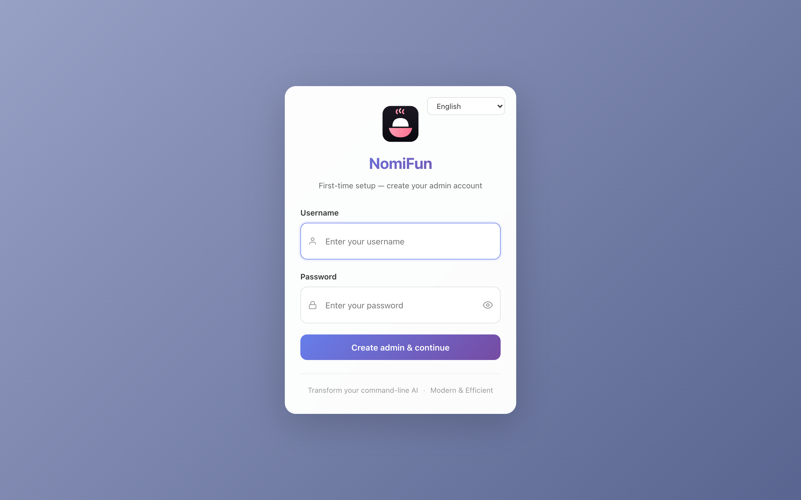

# 安装

NomiFun 有两种宿主模式，共享同一个 Rust 后端（参见
[简介](introduction.zh.md)）。本页覆盖目前可行的全部三种安装方式：

- [从源码构建桌面应用](#从源码构建桌面应用) —— `nomifun-desktop`
  （Tauri 外壳），桌面本地信任，单用户。
- [从源码构建 Web 服务](#从源码构建-web-服务) —— `nomifun-web`，
  带鉴权，自托管。
- [Docker / Docker Compose](#docker--docker-compose) —— 同一个 Web 服务
  的容器化方案。

> **官方预构建安装包尚未发布。** 桌面包、macOS 签名、updater 产物、Docker
> 和 native Linux service 都可以本地构建；但还没有官方公开发布渠道。下面所有
> 安装路径都需要从源码构建。当前打包说明见
> [`../contributing/building-and-packaging.zh.md`](../contributing/building-and-packaging.zh.md)。

## 前置条件

无论你选择哪种模式，都需要一套可工作的构建工具链。具体要求如下：

| 工具 | 最低版本 | 用途 | 备注 |
| --- | --- | --- | --- |
| **Rust** | stable，edition 2024 | 编译后端（桌面端还需编译 Tauri 外壳）。 | 通过 [`rustup`](https://rustup.rs/) 安装。工作区固定使用 `edition = "2024"` 与 `resolver = "3"`。 |
| **Bun** | **≥ 1.3.13** | 前端包管理器与构建（同时也是智能体引擎的硬运行时依赖）。 | `1.1.38` 存在 stdin 缺陷——请勿使用。 |
| **Tauri CLI** | v2 | 构建桌面外壳。 | 作为 `devDependency` 引入；无需全局安装。 |
| **Git** | 任何近期版本 | 克隆仓库，以及技能发现与若干内置工具会用到。 | |
| **C/C++ 构建工具** | 因平台而异 | `rusqlite`（bundled）、`aws-lc-rs`、`libgit2-sys` 需要。 | Windows：MSVC + WebView2 运行时。macOS：Xcode CLT。Linux：`build-essential cmake clang pkg-config perl`。 |

在运行 NomiFun 的宿主上推荐安装（构建机不需要）：

- **`ripgrep`** —— 代码搜索后端；不可用时回退到 `grep`。
- **`node` / `npm` / `npx`** —— 许多用户安装的 MCP stdio 服务通过
  `npx -y …` 启动。

### 克隆仓库

```bash
git clone <your-fork-or-mirror>/nomifun-tauri.git
cd nomifun-tauri
```

本页其余内容均假设你的工作目录为仓库根目录。

### 安装 JS 依赖

```bash
bun install
```

这会为整个工作区与 `ui/` 填充 `node_modules/`。每当 `package.json` 或
`ui/package.json` 发生改变时都需重新执行。

## 从源码构建桌面应用

桌面应用是一个 Tauri 2 外壳（`apps/desktop`，二进制
`nomifun-desktop`），它在进程内链接后端，并在一个空闲 localhost 端口上以
桌面 `TrustLocalToken` 策略启动后端。自己的 WebView 会收到每次启动生成的
本地信任 secret，因此桌面窗口没有登录界面。

### 在开发模式下运行

```bash
bun run dev
```

完整流程如下：

1. Tauri 的 `beforeDevCommand` 执行 `bun run --filter=./ui dev`，启动
   Vite 开发服务器在 `http://localhost:5173`。
2. `cargo` 编译 `nomifun-desktop`（以及它依赖的整个工作区）。
3. 外壳启动，挑选一个空闲端口，派生嵌入式后端，并加载 Vite 开发地址。
   渲染端支持热重载；后端只在其 Rust 代码变更时才会重启。

你会在控制台中看到类似 `Server listening on 127.0.0.1:54760` 的 tracing
日志——这就是嵌入式后端。渲染端会读取 `window.__backendPort`（由 Tauri
外壳作为 init script 注入），因此 SPA 始终知道 `/api` 该往哪里调用。


### 构建 Release 二进制

```bash
bun run build:ui         # 将 SPA 构建到 ui/dist
bun run build    # tauri build → 安装包 + 独立二进制
```

`tauri build` 会产出：

- 位于 `target/release/nomifun-desktop`（Windows 上为 `.exe`）的独立可
  执行文件。
- 位于 `target/release/bundle/` 下的平台安装包——`.msi`/`.exe`
  （Windows）、`.dmg`/`.app`（macOS）、`.deb`/`.AppImage`（Linux）。

`bun run build` 产物适合本地测试。要分发 macOS 构建，请配置
`apps/desktop/signing/.env.signing` 并使用 `bun run build:signed`。Windows
签名仍需要外部证书。若要测试 updater 骨架，可使用 `bun run build:updater`，
它会把 `bundle.createUpdaterArtifacts` 设为 true。发布任何更新前，必须替换
`apps/desktop/tauri.conf.json` 中的 updater endpoint 与公钥。

### 数据存放位置（桌面端）

桌面应用把数据库与运行时文件存放在按用户区分的应用数据目录下，
再拼接 `Nomi`：

| 操作系统 | 默认路径 |
| --- | --- |
| Windows | `%LOCALAPPDATA%\NomiFun\Nomi`（例如 `C:\Users\<you>\AppData\Local\NomiFun\Nomi`） |
| macOS | `~/Library/Application Support/NomiFun/Nomi` |
| Linux | `$XDG_DATA_HOME/NomiFun/Nomi`（通常为 `~/.local/share/NomiFun/Nomi`） |

启动前可通过 `NOMIFUN_DATA_DIR=<absolute path>` 覆盖——外壳会附加
`/Nomi`，因此目录会变成 `$NOMIFUN_DATA_DIR/Nomi`。

> 旧版本默认使用 `<system temp>/nomifun-data/Nomi`，操作系统的临时目录
> 清理可能在那里销毁用户数据。现在应用首次启动时会自动把这类旧安装
> 搬迁到按用户区分的位置（一次性）：复制数据、改写数据库内的绝对路径，
> 并把旧目录保留作备份。若搬迁无法完成，应用会先从旧目录启动，并在
> 下次启动时重试。

> 提示：应用对用户呈现的名称统一为 `Nomi`——bundle 产品名
> （`apps/desktop/tauri.conf.json`）、运行时窗口标题、数据文件夹都用
> `Nomi`。内部标识符按设计仍保留旧的 `nomifun` 名（crate、`NOMIFUN_*`
> 环境变量、`com.nomifun.*` bundle 标识符）。

## 从源码构建 Web 服务

`nomifun-web` 是一个 axum 服务，**既**在进程内挂载同一个后端，**又**在
同一个端口（默认 `8787`）上提供已构建的 SPA。它适合在 LAN、VPN 或
VPS 上自托管。

### 构建并运行

```bash
bun install
bun run build:ui       # ui/dist —— 在非开发模式下提供服务前必须先构建
bun run serve:web            # = cargo run -p nomifun-web
```

默认情况下，服务绑定在 `127.0.0.1:8787`，并使用与桌面应用相同的按用户
数据目录（参见[数据存放位置（桌面端）](#数据存放位置桌面端)）：

```text
nomifun-web: embedded backend + SPA on one port
listening on 127.0.0.1:8787  auth=required  dist=../../ui/dist
```

在同时装有桌面应用的机器上，直接裸跑 `nomifun-web` 会打开桌面应用的
数据——排他的 `server.lock` 保证两个后端不会同时运行在该目录上。

在浏览器中打开 `http://127.0.0.1:8787`。首次访问会被引导到设置页——
你输入的用户名与密码**将成为初始管理员账户**。此后所有人都需要登录。



### 常用参数

`nomifun-web`（定义在 `apps/web/src/main.rs` 中）同时接受 CLI 参数与
环境变量：

| 参数 | 环境变量 | 默认值 | 含义 |
| --- | --- | --- | --- |
| `--host` | `NOMIFUN_WEB_HOST` | `127.0.0.1` | 绑定地址。仅在确实需要 LAN/VPN/公网访问时使用 `0.0.0.0`；请先预置或完成管理员设置。 |
| `--port` | `NOMIFUN_WEB_PORT` | `8787` | `/api` 与 SPA 共用的端口。 |
| `--data-dir` | `NOMIFUN_DATA_DIR` | _按用户应用数据目录，与[桌面端默认](#数据存放位置桌面端)相同_ | 后端数据目录（数据库 / 日志 / bun 缓存 / 智能体状态）。环境变量取字面值（不附加 `/Nomi`）。生产环境请使用绝对路径。 |
| `--dist` | `NOMIFUN_WEB_DIST` | `../../ui/dist` | SPA 静态目录。**在仓库根目录之外运行时务必显式指定。** |
| `--admin-user` | `NOMIFUN_ADMIN_USERNAME` | `admin` | 预置管理员的用户名（仅在管理员尚未存在时生效）。 |
| `--admin-password` | `NOMIFUN_ADMIN_PASSWORD` | _（无 —— 交互式首次设置）_ | 预置管理员密码并跳过交互式首次启动。 |
| `--insecure-no-auth` | `NOMIFUN_WEB_INSECURE_NO_AUTH` | `false` | **危险。** 完全禁用鉴权（桌面式本地模式）。仅限 loopback / 受信任的私有网络。 |
| _（仅环境变量）_ | `NOMIFUN_HTTPS` | `false` | 当前面有 TLS 终止时设为 `true`，使 cookie 获得 `Secure` 标记。 |

例：将其开放到 LAN，并预置管理员：

```bash
nomifun-web \
  --host 0.0.0.0 --port 8787 \
  --data-dir /var/lib/nomifun \
  --dist /opt/nomifun/web \
  --admin-user admin \
  --admin-password "change-me-to-something-strong"
```

完整的部署指南——systemd unit、反向代理与安全注意事项——请参见
[`../guides/web-server-deployment.md`](../guides/web-server-deployment.md)。

## Docker / Docker Compose

仓库附带一份多阶段 `Dockerfile` 与一份 `docker-compose.yml`，会构建出
一个**无 GUI**镜像：在 `debian:bookworm-slim` 上的 SPA + `nomifun-web` +
`bun`。

### 用 Compose 快速上手

在仓库根目录：

```bash
docker compose up -d --build
# 然后访问 http://<server-ip>:8787
```

服务配置了 `restart: unless-stopped`，所以**安装即等同于开机自启**。
持久化状态（SQLite 数据库、日志、bun 缓存、智能体状态）存放在挂载到容器
内 `/data` 的命名卷 `nomifun-data` 中。

镜像默认值已针对容器生命周期进行了调优：

```text
NOMIFUN_WEB_HOST=0.0.0.0
NOMIFUN_WEB_PORT=8787
NOMIFUN_DATA_DIR=/data
NOMIFUN_WEB_DIST=/opt/nomifun/web
SHELL=/bin/bash
```

鉴权已开启，但首次设置可被第一个访问到服务的浏览器认领。请先预置
管理员或在受信网络完成 setup，再大范围发布 `8787`。对于公网可达的部署，
请在前面加一层 TLS——附带的 `Caddyfile` 与 `docker-compose.yml` 中被注释掉的
`caddy` 服务即是推荐做法。届时记得把 `nomifun` 服务的 `NOMIFUN_HTTPS=true`
打开，让会话 cookie 获得 `Secure` 标记。

### 预置管理员（推荐用于非交互式部署）

否则首次访问浏览器的人会获得管理员账号；预置管理员可以关闭这个竞态
窗口：

```yaml
# docker-compose.yml —— 在 services.nomifun 下
environment:
  NOMIFUN_ADMIN_USERNAME: admin
  NOMIFUN_ADMIN_PASSWORD: "change-me-to-something-strong"
  NOMIFUN_HTTPS: "true"   # 仅当部署在 TLS 反向代理之后时
```

### 加速 Rust 构建

Rust 阶段使用了 BuildKit cache mounts（`/usr/local/cargo/registry` 与
`/src/target`），所以一行源代码改动只需几秒就能重新编译。如需为 cargo
注册表配置镜像（例如在网络较慢时）：

```bash
docker build --build-arg CARGO_REGISTRY_MIRROR=https://rsproxy.cn/index/ .
```

完整的部署指南（TLS、反向代理模式、systemd unit、安全注意事项）请参见
[`../guides/web-server-deployment.md`](../guides/web-server-deployment.md)。

## 验证你的安装

无论走哪条路径，都可以做一次 30 秒的快速检验：

```bash
# Rust 工作区编译干净
cargo check --workspace

# 三个二进制都能构建
cargo build --workspace --bins
# → target/(debug|release)/{nomicore, nomifun-web, nomifun-desktop}

# Web 主机响应 SPA + 鉴权状态
curl -sS http://127.0.0.1:8787/                | head -c 200
curl -sS http://127.0.0.1:8787/api/auth/status
# → 200 {"success":true,"needs_setup":..., "user_count":...}
```

如果你在日志中看到 `nomifun-web: embedded backend + SPA on one port`，
并且 `/api/auth/status` 返回了 JSON，则后端已启动，并且 SPA 在同一个
端口上提供服务。

## 接下来

- [快速上手](quick-start.zh.md) —— 你在 NomiFun 中的第一段会话。
- [`../guides/web-server-deployment.md`](../guides/web-server-deployment.md)
  —— Web 主机的生产环境加固。
- [`../contributing/development.zh.md`](../contributing/development.zh.md)
  —— 搭建开发环路（渲染端热重载、后端重建、调试工具）。
