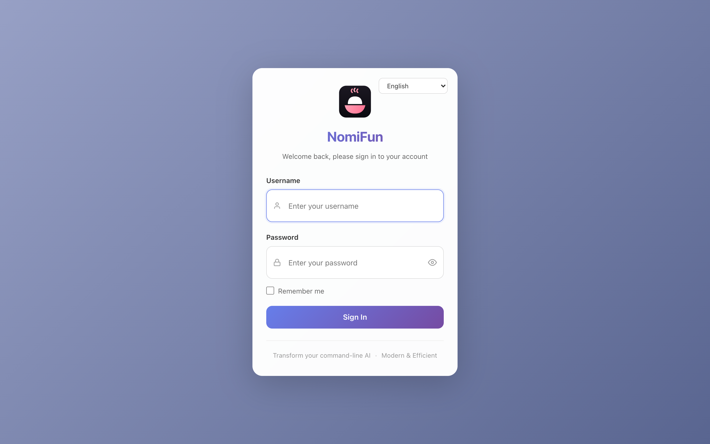
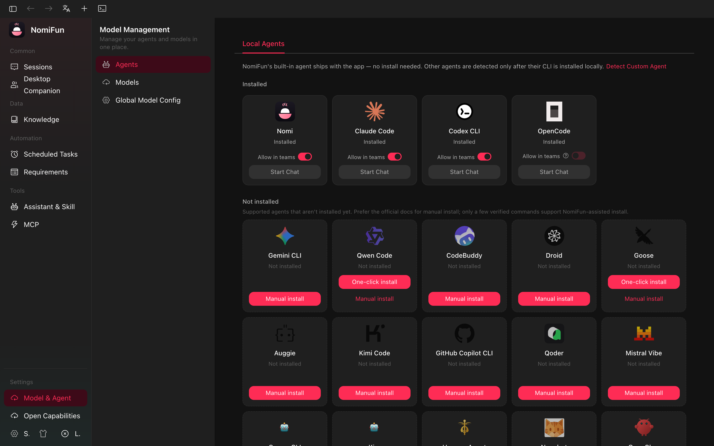

# 快速上手

这页带你完成第一段 NomiFun 会话。若还没有安装，请先看
[安装](installation.zh.md)。

桌面应用和 Web 服务使用同一份 UI。差异主要在鉴权：桌面 WebView 通过本地
信任 token 免登录；`nomifun-web` 和 WebUI 远程访问需要登录。

## 1. 启动

### 桌面开发模式

```bash
bun run dev
```

这会启动 Vite、编译 Tauri shell，并在桌面进程中嵌入 `nomifun-app` 后端。
后端会选择一个空闲 localhost 端口，桌面 WebView 自动携带本地信任 token。

### Web 服务模式

```bash
bun run build:ui
bun run serve:web
```

访问 `http://127.0.0.1:8787`。首次访问会创建管理员账号，之后需要登录。



## 2. 认识首页

登录后默认进入 `/guid`。这里提供开始会话所需的几件事：

- **agent 选择**：选择 Nomi、Claude Code、Codex、Gemini、Qwen、OpenCode 等后端。
- **模型选择**：对支持模型切换的 agent 选择 provider 和 model id。
- **助手**：选择预设 persona、system prompt、技能与工具组合。
- **工具与工作区**：选择本次会话可见的 MCP server 和技能，并确认工作目录。
- **输入框**：输入第一条提示词，必要时用 `@` 引用文件、技能或助手。


## 3. 配置模型

发送第一条消息前，至少需要配置一个可用模型。打开 `/models`：

- 添加 Anthropic、OpenAI、Bedrock、Vertex 或兼容 OpenAI/Anthropic 协议的 provider。
- 为 provider 填写 API key、base URL 和默认模型。
- 如需无人值守长任务，可配置 **Model Failover Queue**，让 Nomi 引擎在模型失败、
  限流或不可用时按顺序尝试备用模型。



外部 CLI agent 仍需要在宿主机上安装对应 CLI；`/models` 只解决模型凭据和
模型选择，不会替你安装第三方 CLI。

## 4. 创建第一段会话

回到 `/guid`：

1. 选择 **Nomi**，它不依赖外部 CLI，最适合首跑验证。
2. 选择一个已配置的模型。
3. 可选：选择一个助手。
4. 输入提示词，例如：

   > 写一个返回第 n 个斐波那契数的 Python 函数，并附一个小测试。

5. 发送。

NomiFun 会创建新会话并进入 `/conversation/:id`，随后开始流式输出。

## 5. 使用会话工作区

每段会话都有独立工作目录。会话页通常包含：

- **消息流**：模型回复、工具调用、文件变更和执行状态。
- **文件树**：显示本会话工作目录中的文件。
- **预览面板**：预览代码、Markdown、PDF、Office、HTML 和 diff。
- **终端**：从 `/terminal-new` 或会话内入口启动 PTY，默认挂载到工作目录。

可以让 agent 把刚才的函数写入文件，然后在文件树和预览面板里检查结果。

## 6. 常用入口

- `/assistants`：管理助手；`/assistants?tab=skills` 管理技能。
- `/mcp`：管理 MCP server、连接测试、OAuth 和导入/同步。
- `/open-capabilities`：管理 WebUI 远程访问和对外能力暴露。
- `/scheduled`：创建 cron 会话任务；支持从会话带上下文创建。
- `/requirements`：AutoWork 需求看板。
- `/nomi`：Nomi 伙伴、远程频道绑定和 companion 设置。

接下来可以继续阅读：

- [MCP 与技能](../guides/mcp-and-skills.zh.md)
- [助手](../guides/assistants.zh.md)
- [终端](../guides/terminal.zh.md)
- [WebUI 远程访问](../guides/webui-remote-access.zh.md)
- [Web 服务部署](../guides/web-server-deployment.zh.md)
