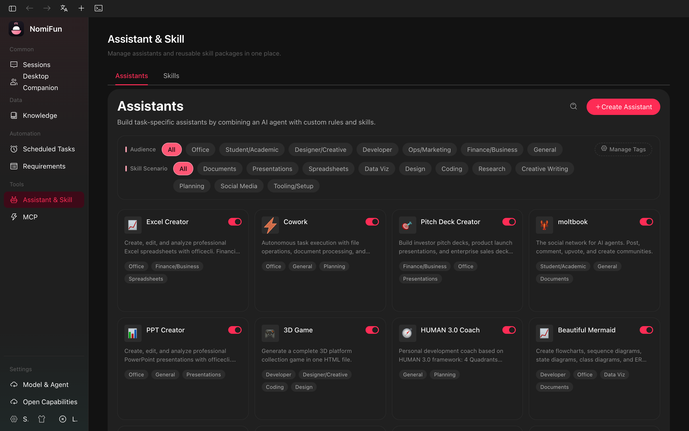
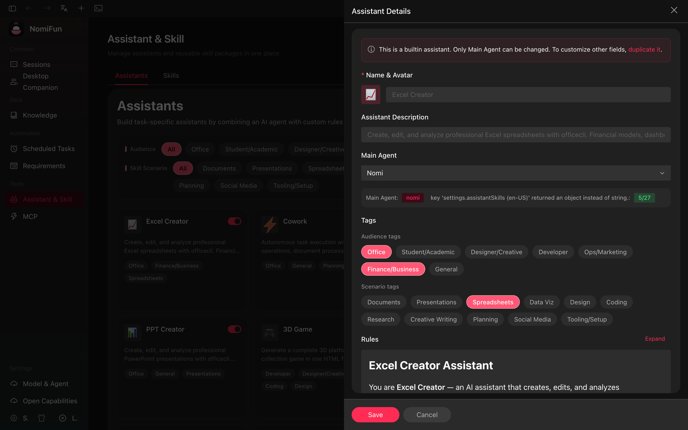

# 助手

**助手**是一套可复用的 agent persona：展示信息、默认 agent 后端、可选模型偏好、
system prompt 和技能选择。

当前入口是 **`/assistants`**。旧 `/settings/assistants` 会重定向到
`/assistants?tab=assistants`。

## 来源

助手由三类来源合并：

| 来源 | 来自哪里 | 是否可编辑 |
| --- | --- | --- |
| Builtin | 嵌入在 `crates/backend/nomifun-app/assets/builtin-assistants/` 的 manifest，由 `BuiltinAssistantRegistry` 加载。 | 内容只读；启用、排序、最近使用和 builtin `preset_agent_type` 覆盖单独存储。 |
| Custom | 用户创建的 `assistants` 表记录和数据目录中的文件。 | 可完整编辑和删除。 |
| Extension | 已安装扩展通过 `resolvers::assistant` 提供。 | 此页只读；生命周期由扩展管理。 |

合并后的列表由 `GET /api/assistants` 返回。

## 助手包含什么

关键字段：

- `id`、`source`、`name`、`description`、`avatar`
- `preset_agent_type`：默认后端，例如 `nomi`、`claude`、`codex`、`gemini`
- `models`：可选模型偏好
- `prompts` / `prompts_i18n`：助手指令
- `enabled_skills`：启动会话时附加的技能
- `enabled`、`sort_order`、`last_used_at`
- picker/filter 使用的标签元数据

自定义助手文件位于数据目录：

- `assistant-rules/`
- `assistant-skills/`
- `assistant-avatars/`

删除自定义助手会清理关联文件。

## 编辑规则

| 字段 / 操作 | Builtin | Extension | Custom |
| --- | --- | --- | --- |
| 启用 / 禁用 | yes | yes | yes |
| 排序 / 最近使用 | yes | yes | yes |
| 修改默认 agent 后端 | 仅 builtin override | no | yes |
| 编辑名称 / 描述 / 头像 | no | no | yes |
| 编辑 prompt / skill 文本 | no | no | yes |
| 删除 | no | no | yes |

Builtin 的可变状态写入 `assistant_overrides`。Extension 助手由扩展拥有，因此在
这里只读。

## 技能

技能 tab 也在 `/assistants` 下：

- `/assistants?tab=assistants`
- `/assistants?tab=skills`

助手的 `enabled_skills` 会在 session start 时与自动注入的 builtin 技能合并。
后端会按不同 agent 后端的规则 materialize 技能；正常使用时不需要手动复制技能目录。

MCP server 已独立到 `/mcp`。技能和 MCP 都能扩展 agent 能力，但当前是分开管理。

## API

| 操作 | Endpoint |
| --- | --- |
| 列表 / 创建 | `GET`, `POST /api/assistants` |
| 更新 / 删除 | `PUT`, `DELETE /api/assistants/{id}` |
| 状态覆盖 | `PATCH /api/assistants/{id}/state` |
| 头像 | `GET /api/assistants/{id}/avatar` |
| 批量导入 | `POST /api/assistants/import` |
| 标签 | `GET`, `POST /api/assistant-tags`; `PUT`, `DELETE /api/assistant-tags/{key}` |

助手规则和助手技能文件通过 `/api/skills/assistant-*` 路由读写，以便正确分发到
builtin、extension 或 user source。

## 注意

- 创建助手但未指定 `preset_agent_type` 时，需要至少有一个已配置 provider；能推断时默认使用 `nomi`。
- CLI 型 agent 仍需要宿主机安装对应 CLI。选择 `claude`、`codex`、`gemini`
  不会自动安装这些工具。
- 旧 JSON 导入是 insert-only 且幂等的：已有 id 会跳过，错误按行报告。

## 相关

- [MCP 与技能](./mcp-and-skills.zh.md)
- [模型故障转移队列](./model-routing.zh.md)
