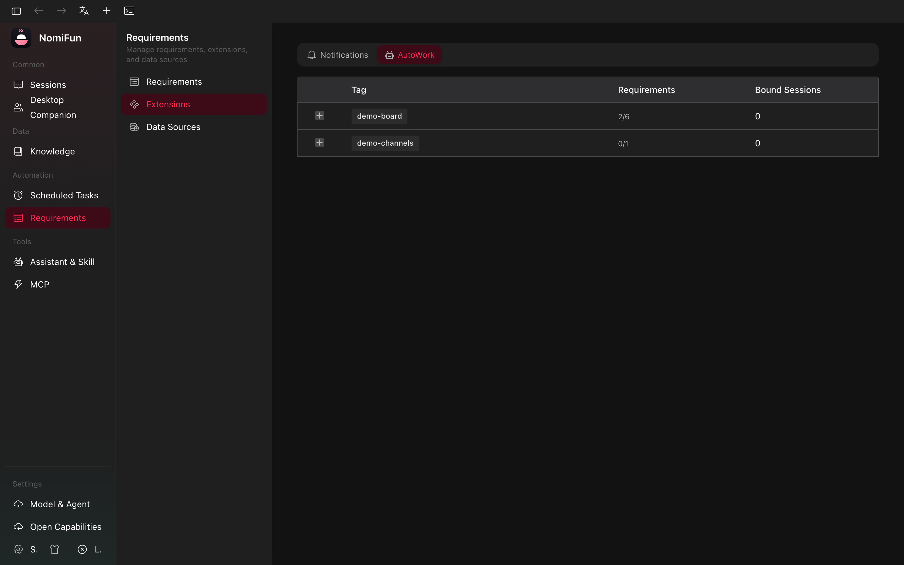
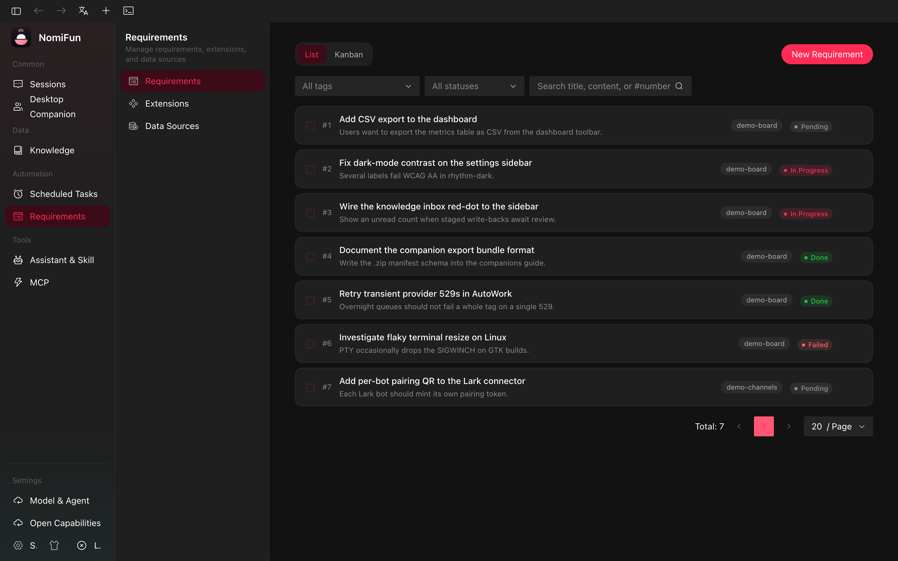
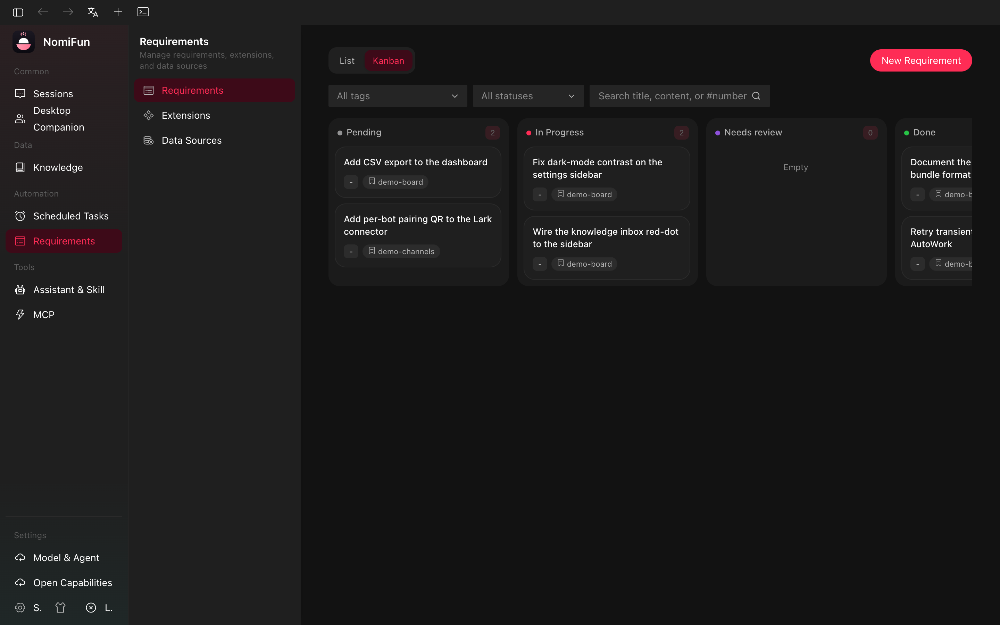
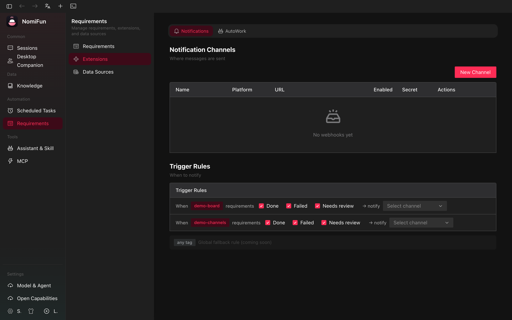

# AutoWork & Requirements

AutoWork is Nomi's flagship automation: a **requirements board** plus an
**orchestrator** that drives an AI agent (or an agent CLI in a terminal) to
work through those requirements one at a time, without you holding its hand.

You file requirements, group them by tag, bind a tag to a session
(conversation or terminal), and the orchestrator claims, executes, and
finalises them in order. When a requirement reaches a terminal state it can
fire a **completion notifier** (Lark/飞书 webhook) so your team hears about
it the moment it lands.

Everything described here is **backend-authoritative**: AutoWork resumes on
boot and runs whether or not you have the UI open.



## Concepts

| Term                  | What it means                                                                                                                                                |
| --------------------- | ------------------------------------------------------------------------------------------------------------------------------------------------------------ |
| **Requirement**       | A unit of work: title, content (the actual instructions), tag, an `order_key` (string compared lexicographically), and a status. Stored in SQLite.           |
| **Tag**               | A free-form string used to group requirements into a queue. Bindings, kanban columns, and webhook routing all key off the tag.                               |
| **Status**            | `pending` → `in_progress` → `done` (or `failed` / `cancelled`). The kanban view has one column per status.                                                   |
| **Claim & lease**     | The orchestrator atomically transitions the lowest-`order_key` `pending` requirement in a tag to `in_progress` and writes a lease that expires.              |
| **Lease sweeper**     | A background task (every 60 s) that re-pends `in_progress` rows whose lease expired and whose owning session is no longer live — so a crash never orphans work. |
| **Orchestrator**      | The per-target loop that claims → injects → waits → finalises → repeats. One loop per bound session. Persistent: it idles when the queue drains, it does not exit. |
| **Target**            | The thing executing the work. Two kinds: a **conversation** (an AI agent), or a **terminal** (a real CLI agent over a PTY).                                  |
| **Turn completion** | How a turn signals "done." For agent targets, the agent ends its turn (or calls a Nomi-only tool); for terminal targets, the terminal simply goes quiescent — a clean end-of-turn.       |
| **Completion notifier** | A Lark/飞书 webhook fired when a requirement reaches `done`/`failed`/`cancelled`. Bound per tag.                                                            |
| **IDMM**              | Intelligent Decision-Making Mode — a session supervisor that keeps targets alive through provider faults and decision stalls. Stacks on AutoWork.            |

## Lifecycle of one requirement

```
pending  ──claim_next()──▶  in_progress (lease)  ──injection──▶  agent / CLI runs
                                  │                                   │
                                  ▼                                   ▼
                       sweeper re-pends if lease         Finish event / quiescence
                       expires & loop is gone                        │
                                                                     ▼
                                                            done | failed | cancelled
                                                                     │
                                                                     ▼
                                                       CompletionNotifier fires (best-effort)
```

The orchestrator does **not** exit when the tag is empty. It awaits a wake
notification (with a 10 s safety-net poll) and keeps claiming forever, so a
new requirement filed against a bound tag is picked up almost instantly.

It exits only when:

- you disable AutoWork on that target,
- the binding hits its `max_requirements` cap (which is then persisted as
  disabled, so the cap survives a restart), or
- a terminal target's row is deleted (a terminal whose PTY merely exited
  idles and waits for re-launch — it does not stop).

## Three views

AutoWork's data is the same in every view; the views are different lenses.

### Requirements list — `/requirements`

The flat table. Filter by tag, status, or free-text search. Bulk-delete
selected rows. Open a row to see its detail drawer; **Edit** lives at
`/requirements/:id/edit`. **New requirement** opens the list with
`/requirements?new=1`; the old `/requirements/new` route redirects there.



### Board — `/requirements?view=board`

One column per status for a chosen tag. Drag-and-drop is intentionally not
the way to change status here; use the detail drawer. The board re-fetches
on every `requirements.*` realtime event so it tracks the orchestrator
live.



### Tag sessions — `需求平台 → 扩展能力 → 自动执行`

The AutoWork admin (`/requirements/extensions?tab=autowork`). Lists every
tag, every binding (which conversations and terminals are bound to which
tag), and the live run-state for each binding (`Idle`, `Active` while a
turn is in flight). The per-tag completion webhook now lives one tab over,
in **通知** (see [Completion notifications](#completion-notifications--lark--http--slack)).

This is where you watch the fleet. To **start** AutoWork on a binding, open
the session itself and toggle AutoWork there — that is the canonical place
to bind a tag, set `max_requirements`, and persist the configuration.


## Filing a requirement

Press **New requirement** from the list page (or navigate to
`/requirements?new=1`). The form has:

- **Title** — short label.
- **Tag** — pick an existing tag or type a new one. Tags are created on
  first use.
- **Content** — the actual instructions the agent / CLI will be handed.
  Write it like you would write a ticket: enough context that the agent can
  start without asking back, plus a clear definition of done.
- **Order key** — a string used for queue order. Lexicographic, so common
  patterns are `1.0`, `1.1`, `1.2.0` etc. Lower is earlier.
- **Status** — defaults to `pending`. You can manually mark a row `done` or
  `cancelled` from here too.

Submit and the row is queued. If a session is already bound to that tag, it
is woken up immediately and starts on this requirement (assuming nothing
else is in flight ahead of it).

## Binding a session: agent vs terminal

A binding is `(target_kind, target_id, tag, max_requirements?)`. There are
exactly two target kinds.

### Agent target (a conversation)

Open any conversation. The header has an **AutoWork** control. Pick a tag,
optionally set a completion cap, and enable.

What happens per turn:

1. The orchestrator claims the next `pending` requirement in that tag.
2. It builds an injection prompt that names the requirement and tells the
   agent how to signal completion. The exact contract is **engine-aware**:
   - On Nomi-engine sessions only, the agent has the
     `requirement_complete` / `requirement_update_status` tools registered
     and the prompt asks the model to call them.
   - On every other engine (ACP / Codex / Gemini / Openclaw / Nanobot /
     Remote), the agent has no requirement tools registered, so the prompt
     uses the **tool-free contract**: do the work, end the turn with a
     plain-text completion note, and the platform records `done`
     automatically when the turn finishes cleanly. Failures are surfaced in
     plain text (the prompt asks the model to start the final line with
     `Requirement failed:` followed by the reason).
3. The injected message is hidden from the user-visible transcript.
4. The orchestrator subscribes to the agent's stream and waits for a
   `Finish` (clean) or `Error`/timeout (re-pend or fail). It also captures
   the agent's prose into a tail-bounded **completion note** that is stored
   on the requirement and, on tool-free engines, becomes the report sent
   downstream.
5. When the turn ends cleanly, `finalize_if_needed` records the row as
   `done` and fires the notifier.

### Terminal target (an agent CLI over a PTY)

Open a terminal whose preset is `claude` or `codex` (a plain shell is not
eligible). Gemini terminals can be run manually, but the backend does not
accept them as terminal AutoWork targets yet because the turn lifecycle and
completion contract are not wired into the orchestrator. The header has the
same **AutoWork** control for eligible terminals. Bind a tag and enable.

What happens per turn:

1. The orchestrator subscribes to the terminal's live output stream
   **before** injecting (so nothing is missed).
2. It writes the requirement prompt into the PTY wrapped in bracketed-paste
   markers (`ESC [200~ … ESC [201~`) followed by `CR`, so the multi-line
   text lands as a single paste in the CLI's editor and Enter actually
   submits.
3. The prompt just asks the agent to do the work and **end its turn** — there
   is no marker to print. Scraping a protocol string out of an interactive TUI
   proved unreliable (cursor-painted output, no clean newlines, the model
   mis-copying a code), so completion is detected from the turn itself.
4. When the output goes **quiescent** (silent for ≥ 10 s after a 3 s minimum,
   with the PTY still alive) the agent has finished and gone idle — the turn is
   recorded as `done`, the same clean-finish contract a tool-free chat agent
   uses.
5. If the agent cannot complete the requirement it is asked to say so in plain
   text (e.g. a final `Requirement failed:` line); such turns still finish as
   `done` at the platform level, so review the conversation when in doubt.
6. PTY death mid-turn → re-pend. Hard turn timeout is 1 hour.

> **Full Auto recommended.** A turn that hits an interactive approval
> prompt will block until the timeout. Each agent CLI has a non-interactive
> flag the terminal's "Full Auto" mode adds for you (see
> [Terminals → Creating a terminal](./terminal.md#creating-a-terminal)).

A terminal that has been bound but whose PTY has exited keeps its loop
alive in idle: the moment you re-launch the terminal, AutoWork resumes
where it left off — no need to toggle the bind off and on.

## Boot resume — it runs without you

The orchestrator's running set is in-memory, but every binding's `enabled`,
`tag`, and `max_requirements` are persisted (in conversation `extra.autowork`
or the terminal's `autowork` column). On process start the backend lists
every user, walks every tag binding, and **spawns the loops itself**. You do
not need to open the session page for AutoWork to work; the UI just shows
you what is already running.

This is why "AutoWork only worked while I had the tab open" is a bug, not a
feature. If you observe it, check the orchestrator logs for resume failures
on that user / target.

## Completion notifications (Lark / HTTP / Slack)

When a requirement transitions to a terminal state, the
`CompletionNotifier` is invoked. Today it does this:

1. Look up the **per-tag setting** for the requirement's tag — if the tag
   has no setting or no bound webhook, the notifier silently no-ops. If
   the tag's event filter (**完成 / 失败 / 待复核**) excludes this
   transition, it also no-ops.
2. Look up the bound webhook by id; if it is disabled, no-op.
3. Build a payload for the webhook's platform — a **Lark/飞书** interactive
   card, a **通用 HTTP** JSON body, or a **Slack** message — carrying these
   fields:
   `需求id` · `需求名` · `需求内容` (truncated to 500 chars) ·
   `完成状态` (`done`/`failed`/`cancelled`) ·
   `完成记录(报告)` (the completion note captured during the turn,
   truncated to 500 chars).
4. POST to the webhook URL. If the webhook has a secret configured, the
   request is signed with the standard Lark custom-bot scheme
   (`HMAC-SHA256(key="{ts}\n{secret}", msg="")`, base64).
5. Failure is logged at `warn` and swallowed — a flaky webhook never
   affects requirement state.

### Setting it up

Notification setup now lives entirely inside the platform at
**需求平台 → 扩展能力 → 通知** (`/requirements/extensions?tab=notify`) —
channel and routing sit side by side on the one sub-tab.

1. In the **通知** sub-tab, **Create webhook**: give it a name, pick the
   platform (**Lark/飞书**, **通用 HTTP**, or **Slack**), paste the URL,
   and (optionally) the matching secret. Use **Test** to send a card and
   verify the bot is reachable.
2. Under **触发规则** in the same sub-tab, find the tag and pick the
   webhook from the per-tag dropdown. You can also filter which events
   fire — **完成 / 失败 / 待复核** — so a tag only notifies on the states
   you care about. The setting is saved per tag.

You can change which webhook a tag points to at any time, including
clearing the binding to mute notifications for that tag.



## IDMM — keeping turns alive through stalls

IDMM is a separate, optional supervisor (`nomifun-idmm`). It watches a
session and intervenes when a stall is detected:

- **Rule tier (no LLM)** — provider error, repeated retries, model spinning
  on a tool call, etc. — handled with a deterministic policy.
- **Sidecar tier** — a lightweight backup model is asked to make the next
  decision so the session does not hang.

When AutoWork starts a turn, it asks IDMM (if wired) to **ensure
supervision** of the target for the duration of that turn. The two
features compose: AutoWork drives forward progress, IDMM keeps each turn
from getting stuck so it actually reaches a terminal state instead of
timing out. Toggle IDMM from the same place as AutoWork (the session
header).

See `crates/backend/nomifun-idmm/` for the per-tier policy detail and the
intervention log API.

> For the full picture — the rule tier, the sidecar model, session keep-alive
> and when to turn it on — see the dedicated
> [Intelligent Decision (IDMM)](intelligent-decision.md) guide.

## Routes & API

| What                              | Where                                                            |
| --------------------------------- | ---------------------------------------------------------------- |
| Requirements list                 | `/requirements`                                                  |
| Board (per tag)                   | `/requirements?view=board`                                       |
| Tag sessions admin (自动执行)     | `/requirements/extensions?tab=autowork`                          |
| Notification config (通知)        | `/requirements/extensions?tab=notify`                            |
| New / edit                        | `/requirements?new=1`, `/requirements/:id/edit`                  |
| Legacy `/requirements/new`, `/requirements/kanban` | redirect to the current query-param routes      |
| Legacy `/autowork`, `/requirements/tag-sessions` | redirect to `/requirements/extensions?tab=autowork` |
| Legacy `/settings/webhook`, `/other` | redirect to `/requirements/extensions?tab=notify`             |
| List / create requirement         | `GET /api/requirements`, `POST /api/requirements`                |
| Tags                              | `GET /api/requirements/tags`                                     |
| Tag bindings (admin)              | `GET /api/requirements/tag-bindings`                             |
| Per-tag board                     | `GET /api/requirements/board?tag=…`                              |
| Get / update / delete             | `GET|PUT|DELETE /api/requirements/:id`                           |
| Status / complete / claim         | `POST /api/requirements/:id/status`, `…/complete`, `…/claim`     |
| AutoWork toggle / state           | `POST /api/requirements/autowork`, `GET …/autowork/:kind/:tid`   |
| Webhooks                          | `GET|POST /api/webhooks`, `…/{id}`, `…/{id}/test`                 |
| Per-tag webhook                   | `GET|PUT /api/tags/:tag/settings`                                |

## Implementation notes (for the curious)

- `requirements.conversation_id` intentionally has **no foreign key** to the
  conversations table. A requirement is created and rotates through
  conversations as it gets re-pended; tying it to a single conversation
  with referential integrity made cleanups awkward and added no real
  safety. Treat the column as advisory.
- The orchestrator's `wake` Notify is shared with `RequirementService`;
  every state transition that re-pends or creates work fires it, and the
  loop is armed-then-awaited around each `claim_next()` call so a wake
  arriving between "claim returned None" and "await" is never lost.
- The terminal injection wraps the prompt in bracketed-paste markers so the
  multi-line text lands as one paste, and submits with a separate `CR` written
  a beat later (a CR in the same write would be swallowed by the paste-burst
  detection modern agent TUIs use).
- The completion note for tool-free engines is bounded (`MAX_NOTE_CHARS =
  4000`) and **tail-biased** — agents tend to summarise at the end, so the
  tail is what we keep when truncation is needed.
