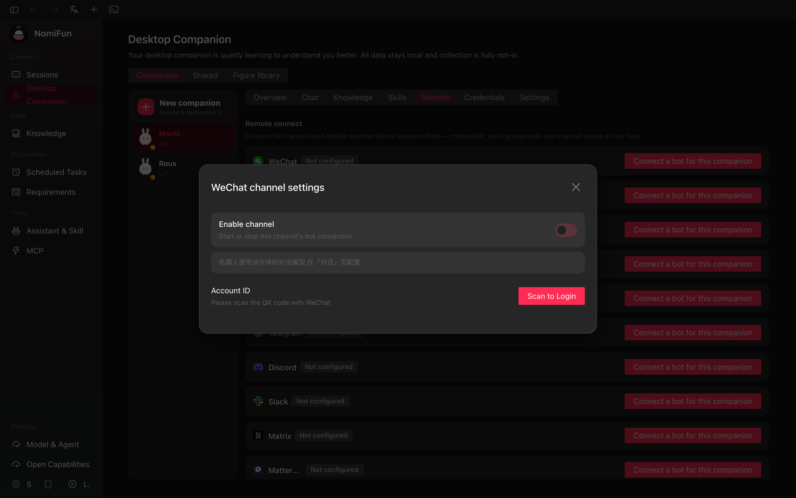

# Channels

通过 **channel**，你可以从外部聊天应用——Telegram、Lark / 飞书、钉钉、微信——操作 NomiFun 的智能体，而不必坐在桌面客户端前面。你启用一个插件，粘贴它的凭证，用一次性验证码授权一个聊天用户，从此发到你机器人的消息就会被分发到智能体，智能体的回复也会回到同一个会话。

Channel 适用于以下场景：

- 你想从手机或群聊里给智能体下达指令；
- 你希望让一个工作区感知的智能体能从团队现有 IM 中触达；
- 你希望长时任务（[AutoWork](./autowork-requirements.zh.md)）能从桌面之外被发起，而不必启动 WebUI。

> 每个平台插件都是 `nomifun-channel` 上的一个 Cargo feature（`telegram`、`lark`、`dingtalk`、`weixin`）。NomiFun 的默认构建把它们全部打开；如果你用非默认 feature 集合自行构建后端，对应的 tab 就直接消失。


## 在哪里找

打开 Nomi 页面（`/nomi`），选择一只伙伴，然后进入 **Remote** tab（`/nomi?companion=<id>&tab=remote`）。这个 tab 会列出该伙伴可用的远程连接器——内置的（Telegram、Lark、DingTalk、WeChat、WeCom、Slack、Discord、扩展）。每个插件你能看到：

- 一个状态药丸（`stopped` / `connected`）；
- 连接成功后的 bot 用户名；
- 当前已授权用户数；
- 一个 per-channel 的 **默认 agent** + **默认模型** 选择器。

Slack / Discord / WeCom 目前作为内置占位符出现——这两者的后端接线被 feature gate 覆盖且仍在搭建中；今天可用的是 Telegram / Lark / DingTalk / WeChat。

## channel 是怎么工作的

```
external IM ──▶ plugin (long-poll / WebSocket)
                    │
                    ▼
            ChannelManager  ◀─▶  PairingService
                    │
                    ▼
              SessionManager  ──▶  agent / conversation
```

- **Plugin** 持有平台特定连接（Telegram 长轮询带指数退避，Lark / 钉钉 WebSocket，微信通过 SSE 上的 QR-code 登录）。
- **PairingService** 把"我是 Telegram 上的 John，让我进来"变成一个由你在桌面 UI 上批准的 6 位验证码。
- **SessionManager** 把 `(platform_user, chat_id)` 映射到一个智能体会话，因此每个外部聊天都是一个稳定 session，后续消息落到同一个智能体。
- **消息循环** 把进入的消息接到智能体流，并把智能体的回复以"对同一条 IM 消息编辑"的形式送回（除微信外都支持消息编辑——微信会回退为发送追加回复）。

## 各平台配置步骤

### Telegram

1. 找 [`@BotFather`](https://t.me/BotFather) 创建一个 bot，保存 token（形如 `123456:ABC-DEF…`）。
2. 在 **Nomi → Remote → Telegram** 粘入 token。
3. 点 **Test**——后端会调 `getMe`，成功后显示 bot 用户名。
4. 点 **Enable**。插件开始长轮询（25 s 超时，指数退避，最多 10 次重连）。

为了把 Telegram 用户与桌面端配对：用户给你的 bot 发消息；bot 用一个 6 位验证码（10 分钟 TTL）回复。在桌面端的 **Nomi → Remote → Pending pairings** 中粘入或键入该验证码并点 **Approve**。从此该 Telegram 用户即可与智能体对话。

### Lark / 飞书

1. 在飞书开发者控制台创建一个自定义 app，开启你需要的事件（文本消息、卡片动作、bot 菜单）。
2. 复制 **App ID**、**App Secret**，以及（可选）**Encrypt key / Verification token**。
3. 把它们填入 Channels tab 中的 Lark 表单，点 **Enable**。

Lark 插件通过飞书的 WebSocket 长连接接入（无需公网 webhook），带一个 60 秒的事件去重清理循环和分片重组。回复以 **互动卡片** 形式发送，因为飞书 API 只支持编辑卡片消息。

### 钉钉

1. 在钉钉开发者后台创建一个内部 app，启用 **Stream Mode**。
2. 把 **Client ID** 与 **Client Secret** 填入 DingTalk 表单并启用。

钉钉插件通过标准 stream-mode 握手打开 WebSocket；配对流程与 Telegram 一致。

### 微信

1. 微信用 QR-code 登录。在 WeChat 插件上点 **Enable**——后端会打开一个 SSE 流（`POST /api/channel/weixin/login/start`）推送 QR-code 刷新事件。
2. 用微信 app 扫码确认登录，插件转为 `connected`。

微信 **不支持** 消息编辑——回复以新消息形式投递到同一聊天，而不是就地编辑。

## 配对与授权用户

配对请求有两种来源：

1. 平台用户首次给 bot 发消息（Telegram / Lark / 钉钉）。插件自动创建一份待处理请求，并把验证码回复给用户。
2. 你可以在 **Nomi → Remote → Pending pairings** 中批准 / 拒绝待处理请求，或以编程方式调用 `POST /api/channel/pairings/approve` 与 `POST /api/channel/pairings/reject`。

已批准用户会出现在 **Authorised users** 中，并显示 `last active`。你可以随时撤销（`POST /api/channel/users/revoke`）；服务也会清理该用户的活跃 session，使下一条消息从头开始重新配对。



## 渠道 Agent 接入

渠道消息与桌面端共用同一套 Agent 和 Conversation runtime，它不是
额外的 Agent 类型，也不是可切换的模式。机器人绑定桌面伙伴且使用 Nomi
时，入站消息会进入该伙伴唯一的持久 Conversation。渠道 Agent 上下文
注入伙伴人格与记忆上下文，并接入**平台 Gateway** 工具，因此桌面端
和 IM 会共享同一份对话记录与 runtime 身份。
该权限绝不写入 Conversation 元数据；Agent factory 校验本机实例所有者后，
只注入由进程私有根签发、带作用域和有效期的能力声明。

旧的按平台开关已被删除，不存在历史关闭态。若机器人绑定的是对外伙伴，
则遵循对外伙伴策略：每个聊天使用隔离的 Conversation，且永远不会获得
平台 Gateway 能力声明；factory 的对外伙伴安全边界默认拒绝私有能力。

网关工具（统一前缀 `nomi_*`，目前共 32 个）能替你做的事：

- **会话**——列出所有会话及其运行态，查看单个会话（状态 + 最近消息，
  含进行中的流式回复），向任意会话注入消息或任务 prompt，新建会话，
  修改与删除旧会话（`nomi_list_conversations`、`nomi_conversation_status`、
  `nomi_send_to_conversation`、`nomi_create_conversation`、
  `nomi_update_conversation`、`nomi_delete_conversation`）。
- **定时任务**——列出 / 创建 / 修改 / 删除 cron 任务
  （`nomi_cron_list`、`nomi_cron_create`、`nomi_cron_update`、
  `nomi_cron_delete`）。
- **长期记忆**——读写伙伴的全局记忆库（`nomi_memory_list`、
  `nomi_memory_save`、`nomi_memory_update`、`nomi_memory_delete`）。
- **需求平台**——浏览与管理需求平台（`nomi_requirement_list`、
  `nomi_requirement_create`、`nomi_requirement_update`、
  `nomi_requirement_delete`）。
- **终端与监督**——列出终端会话、创建新终端（可经 `knowledge_base_ids`
  顺带绑定知识库），以及读取 / 切换某个终端的 AutoWork 绑定与 IDMM
  监督（`nomi_list_terminals`、`nomi_create_terminal`、
  `nomi_get_autowork`、`nomi_set_autowork`、`nomi_get_idmm`、
  `nomi_set_idmm`）。
- **知识库**——浏览知识库与绑定关系，改绑会话 / 终端 / 伙伴，新建
  知识库，向库内写 markdown 文件，触发 AI 梗概生成，或把一个 URL
  抓取为 markdown——伙伴可以自主沉淀知识
  （`nomi_knowledge_list_bases`、`nomi_knowledge_get_binding`、
  `nomi_knowledge_set_binding`、`nomi_knowledge_create_base`、
  `nomi_knowledge_write_file`、`nomi_knowledge_autogen`、
  `nomi_knowledge_fetch_url`）。`nomi_knowledge_create_base` 带
  `urls` 时抓取为后台异步——工具立即返回，等待期间勿重复建库；
  库描述（description）出现即代表抓取与梗概流水线已完成。
- **Provider**——列出已配置的 LLM provider（`nomi_list_providers`）。

于是"把我的日报 cron 改到早上 9 点，再说说现在桌面上有什么在跑"
只需要一条飞书消息。

**选择由哪只伙伴接待。** 有了[多伙伴](./companions.zh.md)之后，机器人按
**渠道行**绑定伙伴：`channel_plugins` 每行代表一个机器人（同一平台
可以接入多个机器人，比如飞书上为每只伙伴各开一个企业自建应用），行上
的 `companion_id` 决定由哪只伙伴接待，`UNIQUE(type, bot_key)` 唯一约束从结构
上保证**同一个机器人永远不会被绑到第二只伙伴**（bot 身份：飞书
`app_id`、Telegram bot id、钉钉 `client_id`……）。绑定 / 解绑走
`POST /api/channel/settings/companion`（带 `plugin_id`），一步完成持久化与
**该渠道** session 的重置——下一条进来的消息由新宠的人格、模型与知识
库挂载接待（会话带 `extra.companionId`）。在伙伴面板的 **远程连接** tab 里
为某只伙伴连接机器人，就是「新建渠道行 + 绑定该宠」一步完成。未绑定
伙伴的渠道行回退到平台级偏好 `channels.<platform>.companionId`。系统不会
隐式回退默认伙伴：若两级绑定都未解析到存活伙伴，该渠道保持未绑定，
也不注入伙伴人格。绑定变更会重置受影响的 session，确保下一轮从新归属
干净启动。

**Agent 与模型解析。** 渠道连接表单只配置传输凭据和归属绑定，不再引入
另一套 Agent 或模型选择器。绑定桌面伙伴的 Nomi 机器人以伙伴 profile
中的模型为权威值，仅在该模型缺失时回退部署配置
`channels.<platform>.defaultModel`。绑定对外伙伴的机器人在公开能力边界内
使用该对外伙伴解析出的模型。未绑定渠道默认使用 Nomi；若部署显式配置了
`channels.<platform>.agent`，也可选择其他引擎，ACP 则继续读取其部署级
backend/model 配置。平台级配置发生变化后，调用
`POST /api/channel/settings/sync` 会清理该平台 session，使下一轮按新配置解析。

## 从 IM 端能做什么

平台无关抽象（`UnifiedIncomingMessage`、`UnifiedOutgoingMessage`、`UnifiedAction`）覆盖：

- **纯文本**——双向。
- **流式编辑回复**——智能体的增量更新会被编辑进正在飞行的 bot 消息（微信除外）。
- **动作按钮**——确认 prompt、重试动作等等，渲染为 inline keyboard（Telegram）、互动卡片按钮（Lark）或对应平台的等价物。
- **Bot mention / require-mention**——群聊可配置为只在 bot 被 `@` 时才回应。

从 IM 端目前还做不到：

- 超出平台插件原生能力的文件上传；
- per-user 工作区选择——智能体的工作区就是它路由到的会话上设的那个。

## 路由与 API

| 用途                            | 位置                                                       |
| ------------------------------- | ---------------------------------------------------------- |
| Channels UI                     | `/nomi?companion=<id>&tab=remote`                          |
| 列出插件 / 状态                 | `GET /api/channel/plugins`                                 |
| 启用 / 禁用                     | `POST /api/channel/plugins/enable`、`…/disable`            |
| 测试凭证                        | `POST /api/channel/plugins/test`                           |
| 待处理配对                      | `GET /api/channel/pairings`                                |
| 批准 / 拒绝配对                 | `POST /api/channel/pairings/approve`、`…/reject`           |
| 已授权用户                      | `GET /api/channel/users`、`POST .../users/revoke`          |
| 活跃 session                    | `GET /api/channel/sessions`                                |
| 同步（变更时清掉 session）      | `POST /api/channel/settings/sync`                          |
| 绑定渠道伙伴                    | `POST /api/channel/settings/companion`                     |
| 微信 QR 登录 SSE                | `POST /api/channel/weixin/login/start`                     |

## 注记

- 插件生命周期是一个状态机——`Created → Initializing → Ready → Starting → Running → Stopping → Stopped`，每一步都可能转到 `Error`。UI 上的状态药丸就是这个枚举。
- 撤销用户时，session 会先于该 user row 被拆掉。来自该平台用户的下一条消息会触发新的配对码。
- 配对码 6 位，由 `getrandom` 生成，TTL 10 分钟。配对服务运行一个周期清扫，把 TTL 已过的待处理码过期掉。
- 微信单独被 feature gate 控制，因为它的依赖树更重（QR / 登录 / 鉴权流）。如果你用 `--no-default-features` 构建，会看到占位卡片但没有启用按钮。

## 相关

- [伙伴（Companions）](./companions.zh.md)——多伙伴管理、共享记忆，以及搭载在渠道会话上的每宠知识库绑定。
- [AutoWork & Requirements](./autowork-requirements.zh.md)——从聊天里登记一条需求，再用 webhook 卡片把通知打回飞书。
- [Web Server Deployment](./web-server-deployment.zh.md)——当你在服务器上自托管后端时同样能暴露这些 channel。
