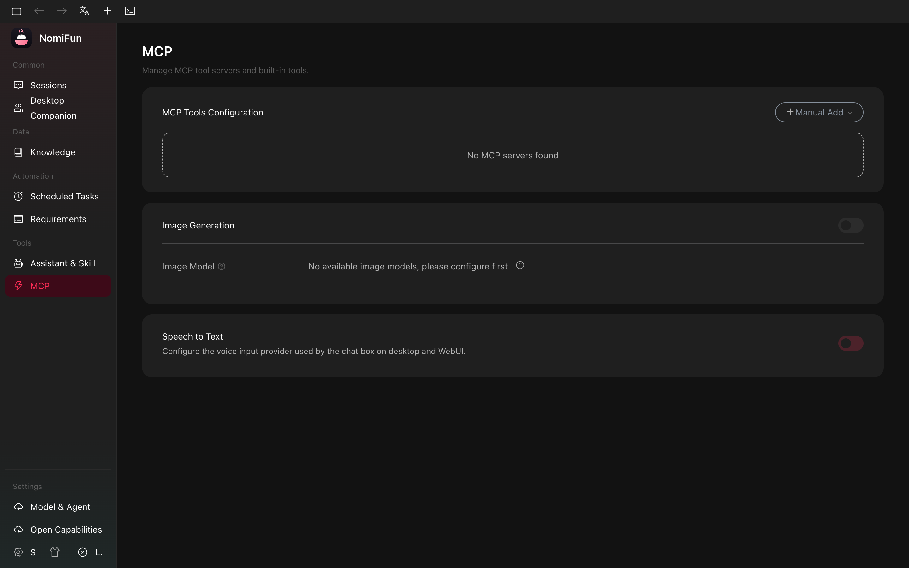
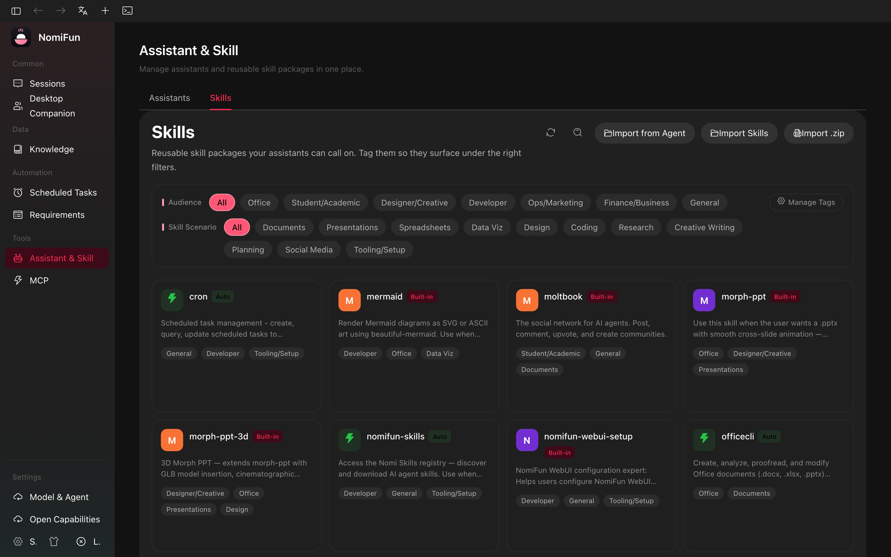

# MCP & Skills

NomiFun has two extension mechanisms that are easy to confuse:

- **MCP servers** are external tool servers. They expose callable tools over
  stdio, HTTP, or SSE.
- **Skills** are markdown/folder knowledge bundles. They tell an agent how to do
  a workflow; they are not long-running tool servers.

Current pages:

| Capability | Page |
| --- | --- |
| MCP servers | `/mcp` |
| Skills | `/assistants?tab=skills` |
| Assistants | `/assistants?tab=assistants` |
| Public/remote capability exposure | `/open-capabilities` |

Legacy settings URLs redirect to these pages.

## MCP Servers

Open `/mcp` to add, import, test, enable, disable, and sync MCP servers.

Each server row owns:

- name;
- transport: `stdio`, `http`, or `sse`;
- command / args / env for stdio, or URL for HTTP/SSE;
- raw imported JSON, when imported from another agent config;
- enabled state;
- last connection-test result.

Connection test uses a temporary MCP client, performs the handshake, lists tools,
and persists the result. Failure codes include command-not-found, permission,
timeout, HTTP, RPC, and protocol errors.

OAuth-backed HTTP/SSE servers use the `/api/mcp/oauth/*` flow.

## Importing and Syncing Agent Configs

`GET /api/mcp/agent-configs` detects MCP config files from supported local agent
CLIs. The UI lets you import detected servers into NomiFun and push the NomiFun
list back to selected agent configs when an adapter supports writing.

This sync is config management only. A conversation still decides which MCP
servers are visible for that session.

## Per-Conversation Selection

Enabling an MCP server globally makes it available. It does not inject it into
every agent automatically. Conversation/session setup builds the final MCP list
from:

- globally enabled servers;
- the servers selected for that conversation;
- built-in bridge servers required by the active capability set.

The resulting list is passed to the agent session start payload.

## MCP API

| Operation | Endpoint |
| --- | --- |
| List / create | `GET`, `POST /api/mcp/servers` |
| Import batch | `POST /api/mcp/servers/import` |
| Get / update / delete | `GET`, `PUT`, `DELETE /api/mcp/servers/{id}` |
| Toggle | `POST /api/mcp/servers/{id}/toggle` |
| Test connection | `POST /api/mcp/test-connection` |
| Detect agent configs | `GET /api/mcp/agent-configs` |
| OAuth | `POST /api/mcp/oauth/check-status`, `/login`, `/logout`; `GET /api/mcp/oauth/authenticated` |

## Skills

Open `/assistants?tab=skills`.

A skill is either a single markdown file or a directory containing `SKILL.md`.
Sources:

| Source | Meaning |
| --- | --- |
| Builtin | Shipped with the app. Some are auto-injected. |
| Custom | Imported by the user or placed in a configured skill directory. |
| Extension | Provided by an installed extension. |

Skills can be tagged, imported, exported/symlinked, scanned from external paths,
or materialized for a specific agent backend.

## Skill API

| Operation | Endpoint |
| --- | --- |
| List | `GET /api/skills` |
| Builtin auto-injected list | `GET /api/skills/builtin-auto` |
| Tags | `PUT /api/skills/{name}/tags` |
| Info / paths | `POST /api/skills/info`, `GET /api/skills/paths` |
| Import / export / delete | `POST /api/skills/import`, `POST /api/skills/import-symlink`, `POST /api/skills/export-symlink`, `DELETE /api/skills/{name}` |
| Scan / detect paths | `POST /api/skills/scan`, `GET /api/skills/detect-paths`, `GET /api/skills/detect-external` |
| Materialize for agent | `POST /api/skills/materialize-for-agent` |
| Assistant rule/skill files | `/api/skills/assistant-rule/*`, `/api/skills/assistant-skill/*` |
| External paths | `GET`, `POST`, `DELETE /api/skills/external-paths` |
| Skills market | `POST /api/skills/market/enable`, `POST /api/skills/market/disable` |

## Related

- [Assistants](./assistants.md)
- [Remote Capability API](./remote-capability-api.md)
- [Terminal](./terminal.md)
