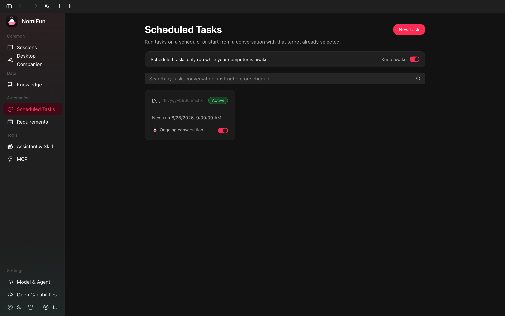
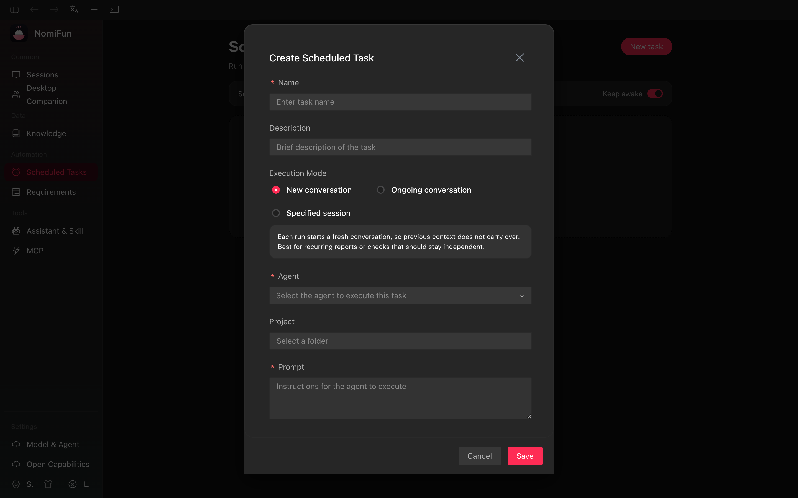
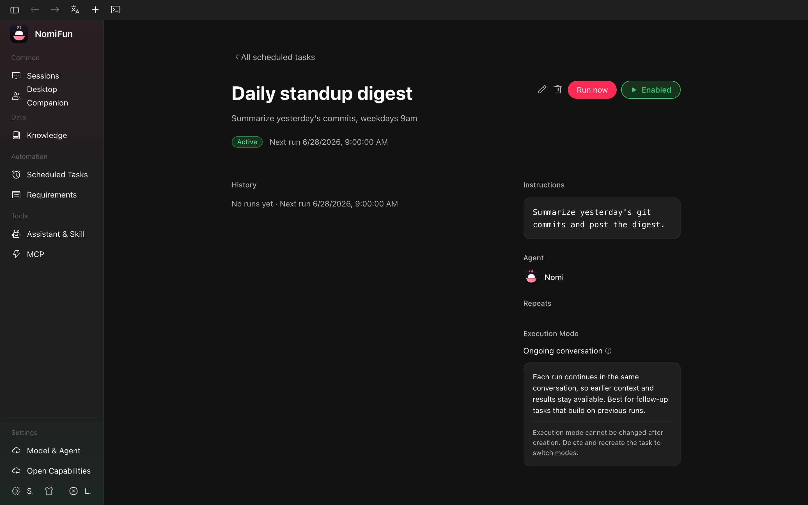

# Scheduled Tasks (Cron)

A scheduled task in NomiFun is a recurring (or one-shot) job that fires at a
time you choose and drives an AI agent to do something. You can configure it
from the Scheduled Tasks page, run it on demand, attach a personalised
**skill** so the agent always behaves the right way for that job, and you
can ask any agent in chat to manage tasks for you using a built-in cron
skill.

> Looking for one-off async work that should run as soon as possible, not on
> a clock? See [AutoWork & Requirements](./autowork-requirements.md). Need a
> live shell instead? See [In-App Terminals](./terminal.md).



## What a job does

`nomifun-cron` is a backend scheduler + executor:

- The **scheduler** computes the next fire time for each enabled job using
  a 5-field (Unix) or 6-field (seconds-prefixed) cron expression — both are
  accepted; a 5-field expression is normalised to 6 fields by prepending
  `0` for seconds. Schedules can also be a single absolute timestamp
  (`At { at_ms }`) or a fixed interval (`Every { every_ms }`).
- A timezone (e.g. `Asia/Shanghai`, `America/Los_Angeles`) is honoured per
  job, so `0 9 * * MON` means 09:00 in **that** zone, not UTC.
- The **executor** drives the job's agent when the timer fires. Two
  execution modes:
  - **`new_conversation`** — start a fresh conversation per fire. The job
    carries the workspace, agent, model, and prompt; the executor creates
    the conversation, broadcasts a `cron_trigger` artifact (so the chat
    UI shows "this conversation was started by a scheduled task"), and
    sends the prompt.
  - **`existing`** — reuse the conversation that owns the job. Each fire
    sends the prompt as a new message in that same thread. Good for
    "remind me", "summarise the day", or any job where continuity matters.
- A **busy guard** prevents the same conversation from being entered
  concurrently. If the previous run is still going when the next fire
  lands, the new run is skipped (logged as `skipped`).
- A **missed-trigger handler** runs at boot and after the OS wakes from
  sleep (`/api/cron/internal/system-resume`). It walks every enabled job
  whose `next_run` is in the past and emits a system message so you can
  see that a fire was missed (e.g. while your laptop was asleep), then
  re-arms the timer for the next cron tick.
- Each fire is recorded with a status — `ok` / `error` / `skipped` /
  `missed` — and (when applicable) a link to the conversation that
  resulted, so the detail page can show you the run history.

## Creating a job

Open **Scheduled Tasks** from the sidebar (route: `/scheduled`) and press
**New task**. The dialog covers four areas.

### Frequency

Pick from a small set of presets — `Manual` (no automatic schedule, fire
only via Run now), `Hourly`, `Daily`, `Weekdays` (`MON-FRI`), `Weekly`, or
`Custom`. Presets render an editable cron expression in the builder; pick
**Custom** to type one directly. The builder validates as you type.

Cron syntax cheat-sheet (5-field — seconds field is added automatically):

```
*  *  *  *  *
│  │  │  │  └─ day of week  (0–6 or SUN–SAT, MON-FRI works)
│  │  │  └──── month        (1–12 or JAN–DEC)
│  │  └─────── day of month (1–31)
│  └────────── hour          (0–23)
└───────────── minute        (0–59)
```

The job's timezone is set on creation (defaults to your browser's IANA
zone) and stored on the row; if a job's stored zone is invalid for any
reason, the detail page offers a one-click repair to your local zone.

### Agent

Pick the agent that runs each fire. Three flavours show up in the picker:

- **CLI agents** — `claude` / `codex` / `gemini` (whatever the backend
  detected on `PATH`). The job records the backend label and uses ACP
  end-to-end.
- **Nomi (built-in)** — uses Nomi's own engine with your selected
  provider/model.
- **Preset assistants** — pre-configured agent personalities; the job
  records the assistant id.

The **Advanced** section lets you override the workspace (working
directory the agent runs in), the model, and arbitrary `config_options`
key/value pairs that get forwarded to the agent factory. No directory name
in a workspace path may begin or end with whitespace — that is enforced
server-side; the form will surface the error. Interior spaces
(`My Project`) are fine.

### Execution mode

Choose `new_conversation` or `existing` (called "specified conversation"
in the UI when you also pick which one). The detail page later shows you
the resulting conversation(s).

### Prompt + name

The **prompt** is what gets sent to the agent each time. Write it as a
**self-contained instruction** — the agent will not get to see your
original "I want this" framing, only this prompt. Patterns like:

- `Reply with a short weekly meeting reminder that includes the current date and time.`
- `Search for the latest AI news from this week and produce a concise bullet-point summary report.`
- `Run the weekly database health check and post the results back here.`

…work better than restating the user's wish. **Name** is just a label.



## Running, pausing, deleting

The list view (`/scheduled`) shows every job, its next fire, and an enable
toggle. From the detail page (`/scheduled/:job_id`) you can:

- **Run now** — fires the job immediately, regardless of schedule. The
  busy guard still applies.
- **Pause / Resume** — stops further fires without deleting the row.
- **Edit** — same dialog as create, in edit mode.
- **Delete** — removes the job and its per-job skill directory. Conversations
  created by previous runs remain in the conversation list and can be deleted
  separately.

The detail page also lists the conversations created by this job, sorted
by activity — useful when the job runs in `new_conversation` mode and
fans out one thread per fire.



## Keep-Awake

Cron jobs only fire while the host process is running. The list page has a
**Keep system awake while NomiFun is running** toggle that asks the OS to
inhibit sleep (Windows: `SetThreadExecutionState`, macOS: `caffeinate`,
Linux: `systemd-inhibit` where available) so jobs you set up on a laptop
do not silently miss their fires the moment the lid closes.

If a fire is missed because the system slept anyway (or NomiFun was not
running), the missed-trigger handler at next boot/wake will record a
`missed` run and post a system message into the affected conversation,
then re-arm the timer for the next normal fire.

## Skills attached to a job

A **skill** is a `SKILL.md` file the agent reads when it joins a session
— same mechanism the rest of Nomi uses, but with a per-job scope. You can
write/edit the skill on the detail page; behind the scenes the file is
written to the data directory under `cron/skills/cron-<job_id>/SKILL.md`,
and the executor injects it into the agent's session each fire.

Use cases:

- A consistent **persona** for that job's output (style, tone, format).
- **Tool/MCP** preferences (which servers to enable, which to ignore).
- Workspace-specific conventions (commit message style, directory
  layout, deployment quirks).

The job has its own skill directory (named with the job id, prefixed
`cron-`), so two jobs sharing the same workspace can carry different
behaviour without colliding. Deleting the job removes its skill
directory.

There is also an automatic **skill-suggest** detector that watches the
agent's output during a run; when it produces a clean candidate skill
(matching the expected format and not just a placeholder template), the
detector creates a `skill_suggest` artifact in the conversation so you
can review and save it as the job's skill in one click.

## Managing tasks from chat — the built-in `cron` skill

NomiFun ships a built-in auto-inject skill named `cron` that any agent can
load when you ask it to "set up a reminder", "schedule X every Monday",
etc. The conversation middleware then watches the agent's reply for the
following directive blocks and runs them through the cron service:

| Directive            | Meaning                                                 |
| -------------------- | ------------------------------------------------------- |
| `[CRON_LIST]`        | List the cron jobs scoped to the current conversation.  |
| `[CRON_CREATE]…[/CRON_CREATE]` | Create a job (fields: `name`, `schedule`, `schedule_description`, `message`). |
| `[CRON_UPDATE: <id>]…[/CRON_UPDATE]` | Update an existing job in place.              |
| `[CRON_DELETE: <id>]` | Delete a job by id.                                    |

The middleware **strips** these blocks from what the user sees and posts
the system response (`Created cron job 'X'`, `No scheduled tasks`, etc.)
back into the conversation. So in chat it looks like a normal back-and-
forth; behind the scenes the agent emitted a directive and the platform
executed it.

The skill is constrained to **one task per conversation** by design —
this keeps the loop simple ("query, then act") and avoids duplicate jobs
piling up when you re-ask. To manage many jobs at once, use the
Scheduled Tasks page directly.

## Routes & API

| What                            | Where                                                            |
| ------------------------------- | ---------------------------------------------------------------- |
| List page                       | `/scheduled`                                                     |
| Detail page                     | `/scheduled/:job_id`                                             |
| List / create job               | `GET /api/cron/jobs`, `POST /api/cron/jobs`                      |
| Get / update / delete           | `GET|PUT|DELETE /api/cron/jobs/:id`                              |
| Run now                         | `POST /api/cron/jobs/:id/run`                                    |
| List conversations for a job    | `GET /api/cron/jobs/:id/conversations`                           |
| Per-job skill                   | `GET|POST|DELETE /api/cron/jobs/:id/skill`                       |
| System resume (internal)        | `POST /api/cron/internal/system-resume` (requires internal hdr)  |

Realtime events the UI subscribes to: `cron.job-created`,
`cron.job-updated`, `cron.job-removed`, and `cron.job-executed`. A missed
fire is represented as a `cron.job-executed` payload whose status is
`missed`.

## Troubleshooting

- **The job did not fire on time.** Was the host running and awake at
  that moment? If you closed the laptop or the app, look at the next
  conversation entry after wake — the missed-trigger handler will have
  posted a `missed` notice and re-armed the timer.
- **My cron expression is rejected.** Both 5-field (`m h dom mon dow`)
  and 6-field (`s m h dom mon dow`) forms are valid. Validate it locally
  with [crontab.guru](https://crontab.guru/) or the in-dialog builder.
- **Jobs run but the agent does the wrong thing.** Re-read the prompt as
  if you had no other context. It must tell the agent exactly what to
  produce. Then consider attaching a skill to lock in the behaviour.
- **Two scheduled fires collide.** The busy guard skips overlapping
  runs in `existing` mode (the run is recorded as `skipped`). If you
  expect long-running fires, switch the job to `new_conversation` so
  each fire gets its own thread.
- **A `cron` directive in chat did nothing.** The middleware no-ops if
  the cron service is not wired (e.g. some test harnesses); in a normal
  app build it is always wired. If a directive is malformed (missing
  closing tag, missing `schedule`), it is silently dropped — re-prompt
  the agent with cleaner input.
