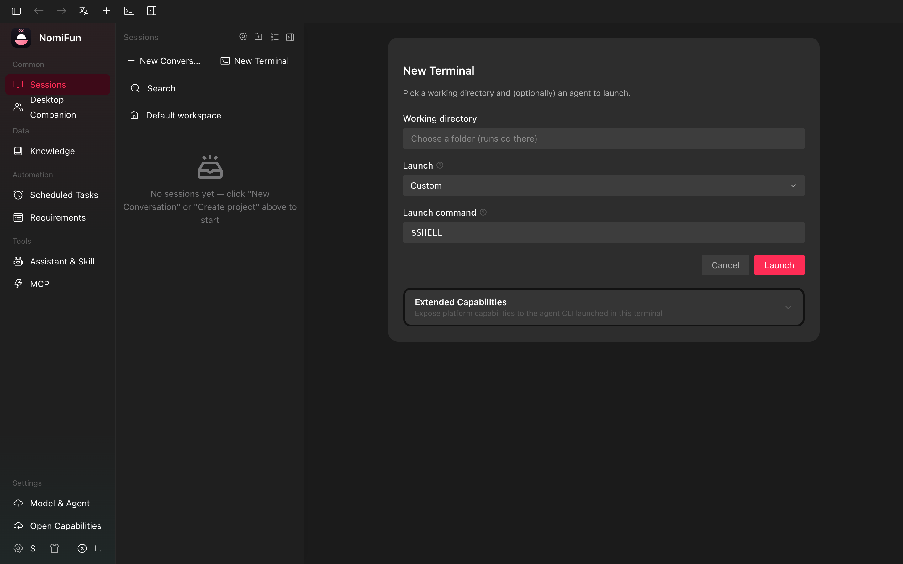

# In-App Terminals

Nomi ships a real terminal inside the app. Each terminal is a backend-managed
PTY session you can drive interactively from your browser/desktop window — and
that AutoWork can drive on your behalf when you bind it to a tag.

> Need the automation guide? See [AutoWork & Requirements](./autowork-requirements.md).
> Need to run an agent on a schedule? See [Scheduled Tasks](./scheduled-tasks.md).

## What an in-app terminal is

When you create a terminal, the backend (`nomifun-terminal`) spawns a child
process attached to a real pseudo-terminal via [`portable-pty`]. The session
has three pieces:

- **Persistent metadata** — id, name, working directory, command + args, env,
  preset/backend, permission mode, current size (cols × rows), pinned flag,
  exit status. Stored in SQLite so the session entry survives restarts.
- **A live PTY** (only while the child is running) — the OS pseudo-terminal,
  its byte-stream output, and a scrollback buffer the backend keeps for late
  joiners.
- **Realtime events on the WebSocket bus** — every chunk of PTY output is
  base64-encoded and broadcast as `terminal.output`. Lifecycle events
  (`terminal.created`, `terminal.updated`, `terminal.exit`, `terminal.removed`)
  ride the same bus. The xterm.js view in the renderer subscribes and renders
  the stream.

A PTY child cannot be paused or moved between processes: when the child exits,
the row stays but the live PTY is gone. Re-launching is in-place — the same
session id keeps a fresh process attached, so you do not get a new sidebar
entry every time you restart a CLI.

[`portable-pty`]: https://crates.io/crates/portable-pty

## Creating a terminal

Open the Terminal create page (the **+** button in the terminal sidebar
section, or navigate to `/terminal-new`). You pick five things:

1. **Workspace** — the working directory the child process will be spawned in.
   Recent workspaces are remembered.
2. **Preset** — `Shell`, `Claude Code`, `Codex`, or `Gemini`. The shell preset
   resolves to your platform's login shell at launch time (Windows:
   PowerShell/`cmd`, macOS/Linux: `$SHELL`); the agent presets launch the
   matching CLI binary that must already be installed and on `PATH`.
3. **Permission mode** (agent presets only) — `Default` (interactive
   approvals) or `Full Auto` (the CLI's own non-interactive flag is added):

   | Preset       | Full-auto flag                              |
   | ------------ | ------------------------------------------- |
   | `claude`     | `--dangerously-skip-permissions`            |
   | `codex`      | `--dangerously-bypass-approvals-and-sandbox`|
   | `gemini`     | `--yolo`                                    |

   These bypass the CLI's interactive approval prompt — needed for AutoWork to
   drive a turn end-to-end without a human pressing Enter, but the same flags
   give the CLI broad capability on your machine. Treat full-auto terminals
   like a logged-in shell.
4. **Launch command** — the dialog renders the resolved `command + args` into
   an editable field. Tweak it freely (extra flags, alternative entry point,
   etc.) before pressing **Launch**.
5. **Knowledge bases** (optional) — multi-select one or more knowledge bases
   to bind to this session. Bound bases are mounted at
   `{workspace}/.nomi/knowledge/` before the child spawns, together with a
   generated `README.md` (retrieval protocol + per-base digests + TOC +
   write-back rules); the `claude` preset additionally gets an
   `--append-system-prompt` pointer to that README. Rebinding takes effect on
   the next re-launch. (The gateway tool `nomi_create_terminal` accepts the
   same binding via `knowledge_base_ids`.)

The backend persists the row and spawns the child. The page navigates to
`/terminal/<id>` and you start receiving live output.

## Driving a terminal

The session page is xterm.js wired to the realtime stream:

- **Type** to send keystrokes to the PTY. The send box also accepts paste with
  bracketed-paste markers, so multi-line text becomes one paste rather than a
  flurry of Enters.
- **Resize** the panel and the backend resizes the PTY accordingly (`SIGWINCH`
  is delivered to the child). The new dimensions are persisted.
- **Re-launch** when the child has exited: a single button kills any leftover
  PTY for the same id, spawns a fresh process with the stored command + cwd
  + env, clears the view, and the same `terminal.<id>` subscription picks up
  the new output. You keep the same sidebar entry.
- **Rename / pin** from the session header (renames broadcast as
  `terminal.updated`; pinned terminals float to the top of the sidebar).
- **Kill** stops the child but keeps the row (it transitions to `exited` and
  becomes re-launchable). **Delete** kills the child and removes the row
  entirely.

## Streaming model

Output flows over a single WebSocket. While you are looking at a session, your
client receives `terminal.output` events for that id and renders them. The
backend keeps a scrollback buffer in memory while the PTY is live: when you
open a terminal that is already running, the GET response includes a
base64-encoded `scrollback_b64` snapshot, so xterm replays history before live
events stream in.

Client-to-server input goes the other direction over a small REST endpoint
(base64-encoded bytes). The backend writes those bytes straight to the PTY's
stdin.

## Terminals as automation targets

The same in-memory PTY map that powers the UI is shared with the **AutoWork
execution loop** in `nomifun-requirement` via the `TerminalDriver` trait. That
trait lets AutoWork:

- Subscribe to a copy of the terminal's live output (it watches for completion
  markers and detects quiescence — see the AutoWork guide for the contract).
- Write input bytes to the PTY (it injects the requirement prompt wrapped in
  bracketed-paste so a multi-line instruction lands as a single paste).
- Check liveness, read the row's metadata (user, backend, mode), and read or
  write a per-terminal `autowork` config blob.

In other words: **a terminal you create here is automatable by AutoWork**.
Bind a tag from the AutoWork toolbar in the session header, and the
AutoWork loop will start claiming requirements and feeding them to the CLI
running in this terminal. Only agent-CLI terminals (`claude`, `codex`,
`gemini`) are eligible — a plain shell can be driven manually but is not an
AutoWork target. The AutoWork loop also recommends Full Auto mode, because a
turn that hits an interactive approval prompt will block until it times out.

If the workspace has knowledge bases mounted (`{cwd}/.nomi/knowledge/`
exists), AutoWork- and cron-driven prompts are automatically prefixed with a
one-line hint pointing the CLI at the mounted `README.md` before it starts
working.

If the PTY exits while AutoWork is still bound, the loop does not stop — it
idles and waits for you to re-launch the terminal, then resumes claiming
where it left off. If you delete the row, the loop stops for good.

## IDMM (decision-stall supervision)

Long-running CLI sessions sometimes stall: the provider drops, the model
spins on a tool call, the CLI prints a confirmation prompt nobody answers.
The IDMM (Intelligent Decision-Making Mode) supervisor watches a session and
intervenes — first with rule-based nudges (no LLM), then by calling a sidecar
backup model — so the turn reaches a terminal state instead of hanging until
the AutoWork timeout fires.

You can enable IDMM per-terminal from the same session header (the **IDMM**
control next to AutoWork). It works whether or not AutoWork is also bound;
when both are on, AutoWork ensures IDMM is supervising for the duration of
each turn.

## Routes & API

| What                       | Where                                       |
| -------------------------- | ------------------------------------------- |
| Create page                | `/terminal-new`                             |
| Session page               | `/terminal/:id`                             |
| List / create              | `GET /api/terminals`, `POST /api/terminals` |
| Get / update / delete      | `GET|PATCH|DELETE /api/terminals/:id`       |
| Send input                 | `POST /api/terminals/:id/input`             |
| Resize                     | `POST /api/terminals/:id/resize`            |
| Kill child                 | `POST /api/terminals/:id/kill`              |
| Re-launch in place         | `POST /api/terminals/:id/relaunch`          |
| Live output / lifecycle    | WebSocket events `terminal.*`               |

## Troubleshooting

- **The CLI is not found.** The agent presets call `claude`, `codex`, or
  `gemini` directly — they must be on the `PATH` of whatever account is
  running the backend. Either install the CLI globally or edit the launch
  command to use an absolute path before launching.
- **AutoWork bind is greyed out.** Only `claude`/`codex` terminals are
  AutoWork targets today. A plain shell preset cannot be bound, and Gemini
  terminal AutoWork is not wired into the backend completion contract yet.
- **Re-launch keeps reusing the same env / cwd.** That is intentional — the
  session row stores them. To change them, create a new terminal with the
  desired settings.
- **The output is garbled after resize.** Some TUIs need a redraw on
  `SIGWINCH`. Press `Ctrl-L` (or your CLI's redraw shortcut).
