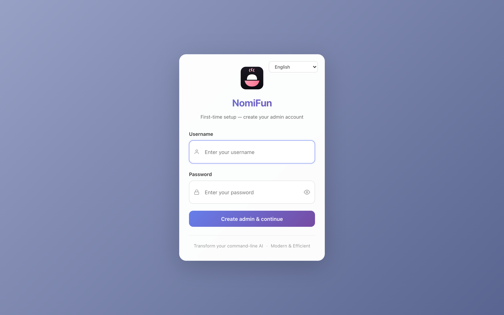

# Web 服务器部署

`nomifun-web` 是 NomiFun 的**无头、自托管**运行方式。它与 [桌面应用](./desktop-app.zh.md)嵌入的后端是同一个 Rust 后端，但被构建为一个独立二进制，并且会在同一个端口上同时提供 SPA (`ui/dist`)。它没有 GUI，没有 WebView，也不需要 `DISPLAY` —— 任何能运行静态二进制的 Linux/macOS/Windows 服务器上都能跑。

与桌面外壳不同，**`nomifun-web` 默认要求认证**。第一个浏览器访问者要么以交互方式创建管理员账户 (首次运行设置)，要么你通过 `NOMIFUN_ADMIN_PASSWORD` 预置凭据。

> 如果你想暴露一个*已有的*桌面安装以便远程访问，而不需要搭建服务器，请参阅 [WebUI 远程访问](./webui-remote-access.zh.md)。那是一个按实例启用的功能；本指南面向的是专用服务器。

```text
  浏览器 / 手机 / 局域网              nomifun-web（单进程、单端口）
  ┌──────────────────┐               ┌───────────────────────────────────────┐
  │  SPA + 登录       │  HTTP / WS    │  axum router                          │
  │  (ui/dist)        │ ────────────► │   ├─ /            → SPA (ui/dist)      │
  └──────────────────┘               │   ├─ /api/*       → REST handlers      │
                                      │   ├─ /ws          → WebSocket 事件     │
                                      │   └─ /login …     → 鉴权（默认开启）   │
                                      │                                       │
                                      │  进程内后端 (nomifun-app)              │
                                      │   └─ SQLite · agents · cron · channels │
                                      └───────────────────────────────────────┘
```

## 快速开始

### 直接运行二进制

```bash
cargo build --release -p nomifun-web
./target/release/nomifun-web --host 127.0.0.1 --port 8787 \
  --data-dir ./data --dist ./ui/dist
```

然后打开 `http://127.0.0.1:8787`，首次访问时让你创建管理员账户。之后，setup 端点会返回 `409 Conflict`，唯一的进入方式就是通过登录表单 (或 `NOMIFUN_ADMIN_PASSWORD`)。



### 或者从仓库通过 Cargo 运行

```bash
bun install
bun run build:ui              # 产出 ui/dist
cargo run -p nomifun-web      # 会自动使用默认 --dist=../../ui/dist
```

## CLI 参数和环境变量

下方所有参数由 `apps/web/src/main.rs` 读取。每个都有对应的环境变量，方便用于 systemd、Docker 等部署环境。

| 参数 | 环境变量 | 默认值 | 用途 |
|---|---|---|---|
| `--host` | `NOMIFUN_WEB_HOST` | `127.0.0.1` | 绑定的 IP。`0.0.0.0` 会接收 LAN/VPN/公网流量；大范围暴露前请先预置管理员或完成首次设置。 |
| `--port` | `NOMIFUN_WEB_PORT` | `8787` | TCP 端口。提供 API、`/ws` 处的 WebSocket，以及 SPA。 |
| `--data-dir` | `NOMIFUN_DATA_DIR` | 按用户目录 | 后端数据目录 (SQLite 数据库、agent 状态、日志、Bun 缓存)。默认是与桌面应用共享的按用户位置 (`%LOCALAPPDATA%\NomiFun\Nomi`、`~/Library/Application Support/NomiFun/Nomi`、`$XDG_DATA_HOME/NomiFun/Nomi`)。**生产环境请仍显式指定绝对路径。** |
| `--dist` | `NOMIFUN_WEB_DIST` | `../../ui/dist` | 构建好的 SPA 所在目录。**部署时请显式设置。** |
| `--admin-user` | `NOMIFUN_ADMIN_USERNAME` | `admin` | 预置首个管理员时使用的用户名。一旦管理员存在则被忽略。 |
| `--admin-password` | `NOMIFUN_ADMIN_PASSWORD` | — | 在启动时预置首个管理员密码，跳过交互式设置。一旦管理员存在则被忽略。 |
| `--insecure-no-auth` | `NOMIFUN_WEB_INSECURE_NO_AUTH` | `false` | **危险。** 完全禁用认证 (类似桌面的本地模式)。仅在 loopback 或完全可信的私有网络上使用。 |
| — | `NOMIFUN_HTTPS` | `false` | 当为 `true` 时，session 和 CSRF cookie 会带上 `Secure` 标记。每当应用通过 HTTPS 访问 (例如位于 TLS 反向代理之后) 时都应设置。 |
| — | `SHELL` | 平台默认 | Agent 引擎派生进程时使用的 shell。在 Linux 服务器上若 `$SHELL` 未设置，请设为 `/bin/bash`。 |

布尔类环境变量接受 `1`、`true`、`yes`、`on` (大小写不敏感)。

错误的 `--host` (任何无法解析为 IP 的内容) 会在启动时快速失败并给出清晰错误，而不是抛出晦涩的 socket 错误。

后端启动时会对 `{data_dir}/server.lock` 取 OS 级排他锁 —— **同一数据目录只允许一个后端实例**。第二个指向同一目录的进程会快速失败，错误信息会指出当前持有者 (pid + exe)；要部署多个实例，请为每个实例指定各自独立的 `NOMIFUN_DATA_DIR` / `--data-dir`。锁在进程退出或崩溃时由 OS 自动释放，残留的 `server.lock` 文件是无害的。

### 密码与用户名规则

当管理员账户被创建时 (无论是交互式还是预置)，值都会在服务端校验：

- **用户名**：3–32 字符，`[a-zA-Z0-9_-]`，不能以 `-` / `_` 开头或结尾。
- **密码**：8–128 字符，若出现在一个小型常见密码列表中 (`password`、`12345678`、`qwertyui` …) 则被拒绝。

弱的 `NOMIFUN_ADMIN_PASSWORD` 会拒绝启动。交互式输入的弱密码会返回 `400` 并附带校验信息。

## 首次运行管理员配置

支持两种路径。

### 交互式 (默认)

不设置 `NOMIFUN_ADMIN_PASSWORD`。在新的数据目录上，安装处于 "未初始化" 状态：`GET /api/auth/status` 会报告 `needs_setup: true`，SPA 显示首次运行表单，**第一个浏览器访问者所选的用户名 + 密码会通过原子化的 `POST /api/auth/setup` 成为管理员**。该写入是一个条件性 UPDATE —— 即便两个并发的首次运行请求也无法同时获胜；输者会收到 `409 Conflict`。

> **安全提示 —— 首次运行窗口期。** 在服务器可达的那一刻起，到你完成设置之间，任何能到达该端口的人都可以认领管理员账户。在非 loopback 绑定上，服务器会记录一条醒目的警告。可通过先在受信任的隧道/VPN 上完成设置来缓解，或预置 (见下一节) 让安装在上线前就已初始化。

### 预置 (推荐用于自动化)

在首次启动前提供 `NOMIFUN_ADMIN_PASSWORD` (以及可选的 `NOMIFUN_ADMIN_USERNAME`，默认 `admin`)。引导例程会原子地哈希并存储凭据，从首次启动开始首次运行 setup 端点就会返回 `409`，没有任何窗口让别人来认领账户。

```bash
NOMIFUN_ADMIN_USERNAME=alice \
NOMIFUN_ADMIN_PASSWORD='change-me-to-something-strong' \
nomifun-web --host 0.0.0.0 --port 8787 \
  --data-dir /var/lib/nomifun --dist /opt/nomifun/web
```

预置是**幂等的** —— 一旦管理员存在，后续启动时这些环境变量会被忽略。要轮换凭据，请使用应用内的修改密码 / 修改用户名流程，而不是环境变量。

## Docker

仓库附带一个多阶段 `Dockerfile` 和一个 `docker-compose.yml`。镜像会：

1. 用 Bun 构建 SPA。
2. 从 workspace 编译 `nomifun-web`。
3. 组装一个精简的 `debian:bookworm-slim` 运行时，包含 `bun`、`git` 和 `ripgrep`。

它暴露端口 `8787`，并使用 `/data` 作为数据卷。

### Compose

```bash
docker compose up -d --build
# 然后打开 http://<server-ip>:8787 并创建首位管理员
```

`restart: unless-stopped` 让服务在主机启动时启动 —— 安装它*就是*启用它。默认的 ports 块直接发布 `8787:8787`；请先预置管理员或在受信网络完成首次设置，再大范围暴露。暴露到公网前请加上 TLS (下一节)。

验证就绪：

```bash
docker compose logs -f nomifun
# 查找：“nomifun-web: embedded backend + SPA on one port”
```

compose 文件挂载了一个名为 `nomifun-data:/data` 的具名卷，其中保存着 SQLite DB、日志、Bun 运行时缓存以及每个 agent 的状态。请像对待其他数据库一样仔细备份。

### 在 Compose 中预置管理员

取消 `environment:` 块的注释：

```yaml
environment:
  NOMIFUN_ADMIN_USERNAME: admin
  NOMIFUN_ADMIN_PASSWORD: "change-me-to-something-strong"
  NOMIFUN_HTTPS: "true"        # 在 Caddy / nginx 加 TLS 前置时启用
```

### 在缓慢的 registry 后构建

Rust 阶段接受一个 `CARGO_REGISTRY_MIRROR` 构建参数用于 cargo 注册表镜像 (例如在 crates.io 较慢的网络上)：

```bash
docker build --build-arg CARGO_REGISTRY_MIRROR=https://rsproxy.cn/index/ -t nomifun-web:local .
```

```text
$ docker compose up -d
[+] Running 2/2
 ✔ Network nomifun_default  Created
 ✔ Container nomifun-web    Started

$ docker compose logs -f web
nomifun-web  | listening on 0.0.0.0:8787 (auth: enabled)
```

## 通过 Caddy 反向代理实现 TLS

仓库附带一个用于 Caddy 2 的 `Caddyfile`。Caddy 会自动签发 HTTPS 证书 (默认 Let's Encrypt 或 ZeroSSL) 并代理到应用。`/ws` 处的 WebSocket 升级会自动透传，无需额外配置。

```caddy
your.domain.com {
    encode zstd gzip
    reverse_proxy nomifun:8787
}
```

要在 `docker-compose.yml` 中启用 Caddy 服务：

1. 编辑 `Caddyfile` 并把 `your.domain.com` 替换为你的真实域名。
2. 在 `nomifun` 服务的环境变量中设置 `NOMIFUN_HTTPS=true` (这样 cookie 会带上 `Secure` 标记)。
3. 把 `ports: ["8787:8787"]` 替换为 `expose: ["8787"]`，让只有 Caddy 对外发布。
4. 取消 `caddy:` 服务以及 `caddy-data` / `caddy-config` 卷的注释。
5. `docker compose up -d`。

应用本身已经提供了登录界面，所以**不要在 Caddy 里配置 HTTP basic auth** —— Caddy 的职责只是 TLS 终结和代理。

对于没有公网域名的仅局域网主机，可以使用一个内部名加上 `tls internal`，或者干脆不加 Caddy 直接发布端口 `8787` (应用内登录依然提供保护)。

## systemd (Linux 服务器，无 Docker)

仓库包含 `packaging/linux/nomifun-web.service` 以及一份长篇 Linux 部署指南 `packaging/linux/README.md`。

### 构建产物

你需要一台 Linux 构建主机 (从 Windows 交叉编译 C 依赖很痛苦 —— 最简单的变通是用 `docker cp` 从 Docker 镜像中提取二进制)。在 Linux 上：

```bash
bun install
bun run build:ui                      # → ui/dist (~21MB)
cargo build --release -p nomifun-web  # → target/release/nomifun-web
```

### 布局

```
/opt/nomifun/nomifun-web    # 二进制
/opt/nomifun/web/           # ui/dist 的内容
/var/lib/nomifun/           # 数据目录 (由 systemd 的 StateDirectory 创建)
```

```bash
sudo useradd --system --home /var/lib/nomifun --shell /usr/sbin/nologin nomifun
sudo mkdir -p /opt/nomifun/web
sudo cp target/release/nomifun-web /opt/nomifun/
sudo cp -r ui/dist/. /opt/nomifun/web/
```

### Bun 必须在系统 `PATH` 上

Agent 引擎需要 **`bun ≥ 1.3.13`** 作为运行时依赖。由于服务以一个 `nologin` 系统账户运行，安装在某个用户 `~/.bun/bin/` 下对它来说是不可见的。请二选一：

- **系统级安装**：`curl -fsSL https://bun.sh/install | bash`，然后 `sudo install ~/.bun/bin/bun /usr/local/bin/bun`。
- **嵌入二进制**：使用 `NOMIFUN_EMBED_BUN=1 cargo build --release -p nomifun-web` 构建。Bun 会被打包进二进制中，并在首次运行时自解压到数据目录。

验证：`sudo -u nomifun -s -- which bun` 必须返回一个路径。否则首次 agent 派生会以一个晦涩的错误失败。

### 安装 unit

```bash
sudo cp packaging/linux/nomifun-web.service /etc/systemd/system/
sudo systemctl daemon-reload
sudo systemctl enable --now nomifun-web
sudo systemctl status nomifun-web
```

附带的 unit：

- 默认绑定 `127.0.0.1:8787`。只有在首次设置完成或已配置
  `NOMIFUN_ADMIN_PASSWORD` 后，才应把 `NOMIFUN_WEB_HOST` 改成
  `0.0.0.0`。
- 设置 `NOMIFUN_DATA_DIR=/var/lib/nomifun` 以匹配 systemd 管理的 `StateDirectory=nomifun`。**保持这两者同步** —— 如果你删除该环境变量行，数据目录会静默回退到服务用户的按用户目录 (`$XDG_DATA_HOME/NomiFun/Nomi`，通常是 `~nomifun/.local/share/NomiFun/Nomi`)，与 systemd state 解耦。
- 以专用的 `nomifun` 用户运行 (`User=nomifun`、`Group=nomifun`)。
- 失败时以 3 秒退避重启。
- 应用适度的硬化 (`NoNewPrivileges=yes`、`PrivateTmp=yes`)。**不要添加** `ProtectHome=yes` 或严格的 `ProtectSystem` —— agent 引擎需要读写操作员指定的文件，过度沙箱化会破坏核心功能。

要在 TLS 代理后启用 HTTPS cookie，请取消注释：

```ini
Environment=NOMIFUN_HTTPS=true
```

要预置管理员而不是交互式设置：

```ini
Environment=NOMIFUN_ADMIN_USERNAME=admin
Environment=NOMIFUN_ADMIN_PASSWORD=change-me-to-something-strong
```

```text
$ sudo systemctl status nomifun-web
● nomifun-web.service - NomiFun web host
     Loaded: loaded (/etc/systemd/system/nomifun-web.service; enabled; preset: enabled)
     Active: active (running) since Tue 2026-06-25 09:12:03 UTC
   Main PID: 12345 (nomifun-web)
     CGroup: /system.slice/nomifun-web.service
             └─12345 /usr/local/bin/nomifun-web --host 127.0.0.1 --port 8787 …
nomifun-web[12345]: listening on 127.0.0.1:8787 (auth: enabled)
```

## Linux 运行时依赖

| 依赖 | 是否必需 | 说明 |
|---|---|---|
| `glibc` + `ca-certificates` | 是 | sqlite 是静态链接的，TLS 使用 rustls —— **不需要 openssl，不需要 libsqlite**。 |
| `bun` ≥ 1.3.13 | **是** | Agent 执行运行时。1.1.38 有 stdin bug；不要使用。Docker 镜像里已包含。 |
| `node` / `npm` / `npx` | 推荐 | 许多用户配置的 MCP stdio 服务器通过 `npx -y …` 启动。 |
| `git` | 推荐 | 技能发现和一些内置工具会使用。 |
| `ripgrep` (`rg`) | 推荐 | 代码搜索后端。缺失时回退到 `grep`。 |
| `DISPLAY` / X11 / WebView | **否** | `nomifun-web` 是完全无头的。 |

## 安全检查清单

- **任何公网部署都要使用 TLS。** 通过明文 HTTP 传输的 cookie 和登录凭据可能被嗅探。在 TLS 代理后请设置 `NOMIFUN_HTTPS=true`，让 session cookie 带上 `Secure` 标记。
- **强管理员密码。** 校验器会拒绝长度低于 8 字符的密码以及一些显而易见的字典条目，但它并不强制执行强度评分 —— 请选择长且随机的内容。怀疑被泄露时，请通过应用内流程修改它；修改密码端点会轮换 JWT 密钥，使所有现有会话失效。
- 对于任何在你能进行交互式设置之前就已可达的主机，请用 `NOMIFUN_ADMIN_PASSWORD` **关闭首次运行窗口期**。另一种做法是先保持 `127.0.0.1`，完成设置后再显式绑定 `0.0.0.0`。
- **`--insecure-no-auth` 默认是敌对的。** 它完全禁用认证；*任何*能到达该端口的人都会成为拥有 shell、文件和 agent 访问权限的特权用户。仅在 loopback 绑定或完全可信的私有网络上使用。当它在非 loopback 地址上启用时，服务器会记录警告。
- 后端拥有终端、文件系统和 agent 执行能力 —— 远程运行它，本设计上等同于给自己开通了对该主机的远程代码执行。Auth + TLS 是底线，不是上限。请像对待 root 凭据一样对待数据目录和管理员密码。

## 故障排查

**`invalid --host '<value>'`。** 请传入一个 IP 字面量 (`127.0.0.1`、`0.0.0.0`、显式接口 IP)。不解析主机名。

**HTTPS 下 cookie 无法保留。** 设置 `NOMIFUN_HTTPS=true` 以加上 `Secure` 标记。否则浏览器会在 HTTPS 响应中拒绝该 cookie。

**在 systemd 下 agent 命令失败并报 `bun: command not found`。** 请系统级安装 bun (参见上面的 bun-on-PATH 一节) 或使用 `NOMIFUN_EMBED_BUN=1` 重新构建。

**健康检查。** 使用 `GET /health` 作为进程存活探针；只有在调用方还需要设置 / 认证状态时，才使用 `GET /api/auth/status`。

## 另请参阅

- [以桌面应用方式运行 NomiFun](./desktop-app.zh.md)
- [WebUI 远程访问](./webui-remote-access.zh.md) —— 把现有桌面安装变成一个可远程访问的服务器 (无需另置一台机器)。
- `packaging/linux/README.md` —— 更深入的 Linux 笔记 (主要是中文；本指南涵盖了其英文部分)。
- `apps/web/src/main.rs` —— 参数、环境变量和引导顺序的真相之源。
