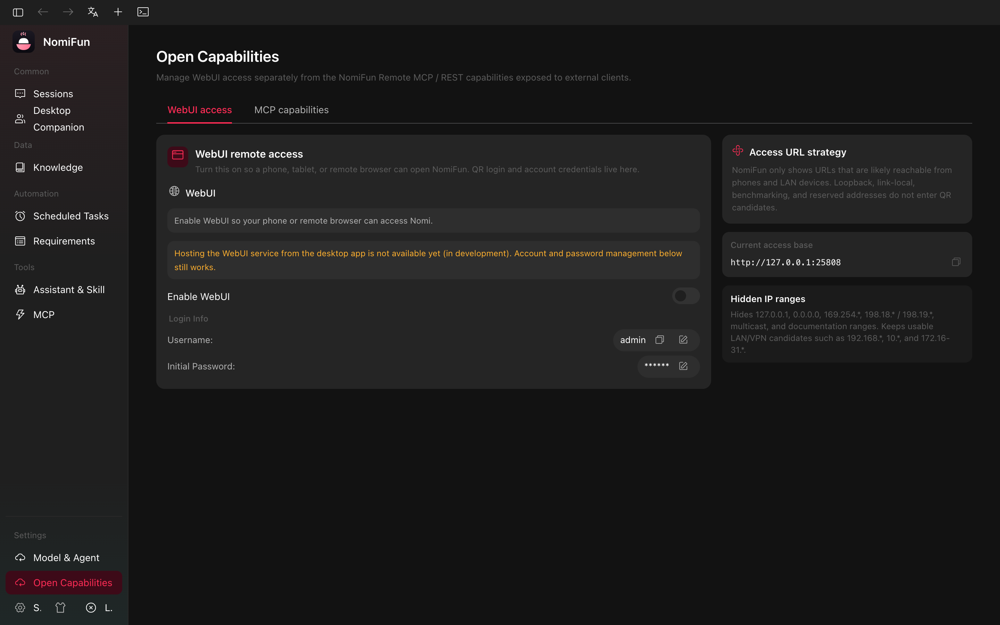
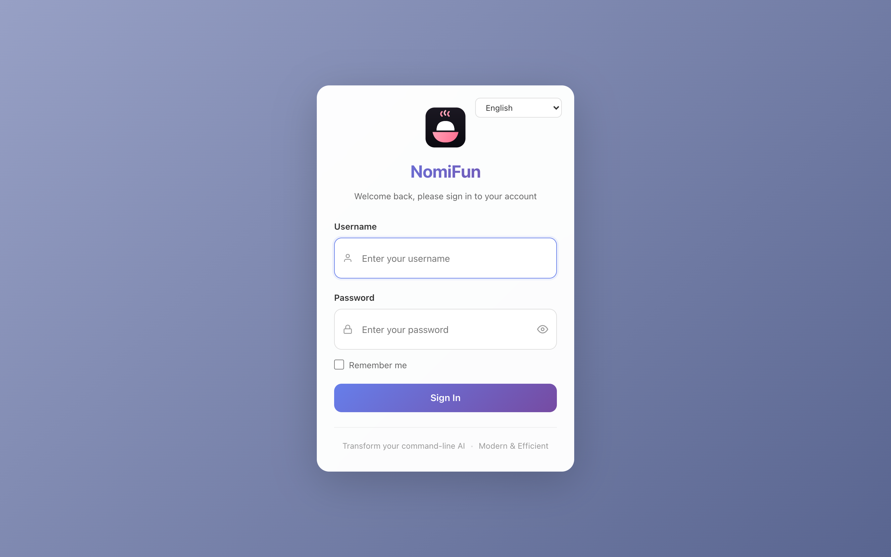
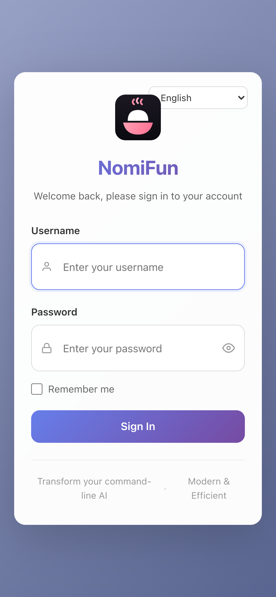

# WebUI 远程访问

桌面应用本来就在一个 localhost 端口上为自己的 webview 运行了一个后端 —— 为什么不直接把它暴露出去？因为把一个无认证的后端放到 LAN 上，等于把对该网络上每台设备完全的 shell、文件和 agent 访问权拱手相让。

**WebUI 远程访问**正是为此而生。桌面后端运行在 *trust-local-token* 策略下：桌面自己的 webview 通过一个每次启动生成的密钥被信任（每个请求都携带它，所以本机从不需要登录），而任何其他客户端都必须认证。一键即可在一个稳定的 LAN 端口上额外绑定一个监听器，把应用经登录（密码 + 二维码）服务给远程浏览器，让你在不放弃本地模式便利性的前提下，从手机或另一个浏览器使用 Nomi。

它是**按实例启用**的 —— 它存在于你已经运行着的桌面应用内 —— 与专用的 [Web 服务器部署](./web-server-deployment.zh.md)是不同的。当你已经有一个桌面安装并且只想从同一网络上的另一台设备访问它时，请使用本功能。当你想要一个长期运行的无头部署时，请使用专用服务器。

## 在哪里找到它

打开 **开放能力**（路由 `/open-capabilities`）中的 WebUI 远程访问面板。旧
`/settings/webui` 路由会重定向到这里。

- **WebUI 远程访问** 控制本指南描述的桌面 LAN listener。
- 页面上的其他卡片管理 public/remote capability 暴露，启用前应单独审查。

> WebUI 远程访问控制主要用于桌面壳。若你正在浏览器里访问 `nomifun-web`，
> 说明已经在使用专用 Web host；请按 [Web 服务部署](./web-server-deployment.zh.md)
> 的方式配置。

## 启用它做了什么

打开 **Enable WebUI** 会在桌面进程内启动一个额外的认证服务器：

- **默认端口 `25808`** (开发模式下为 `25809`，当 `NOMIFUN_MULTI_INSTANCE=1` 时为 `25810`)。
- 一个管理员用户 (默认名 `admin`) 会被开通，并带有一个新生成的随机密码 —— 在首次启动时**仅以明文显示一次**，以便你复制。
- 服务器的生命周期由桌面主进程跟踪；该开关反映服务器的*真实*状态，而不是某个被记住的偏好，所以一次静默失败 (端口冲突等) 会让开关保持关闭，而不是误导你以为它已开启。

## 架构：双监听器，一个后端

桌面进程在**两个** socket 上服务后端，二者共享同一个（只构建一次的）路由：

- 一个 **永久 loopback 监听器**（随机端口）—— 桌面自己的 webview，通过每启动密钥被信任。始终在线；切换远程访问从不打断它。
- 一个 **按需 LAN 监听器**（`0.0.0.0:25808`）—— 仅在你开启远程访问时绑定，关闭时拆除。远程浏览器连这个，且必须登录。信任的依据是**密钥**（只有桌面 webview 持有），而非"来自 loopback"，因此共享工作站上的其他 OS 账户、以及同机反向代理都**不会**被自动信任。LAN 监听器还强制 Host/Origin 白名单（仅 IP/localhost，阻断 DNS-rebinding），并按真实对端地址限流。

由于数据目录独占锁，桌面进程是其数据目录上唯一的后端 —— 所以 LAN 监听器活在桌面应用*内部*，它不是另跑的 `nomifun-web`。

## 绑定与访问 URL

开启远程访问会绑定 **`0.0.0.0:25808`**（开发模式 `25809`；若 `25808` 被占用则回退到一个随机端口），使你网络上的其他设备可以访问。显示的 URL 会自适应：

- **桌面本机**：`http://localhost:<port>`。
- **远程 (LAN/VPN)**：`http://<your-LAN-IP>:<port>`（例如 `http://192.168.1.42:25808`）。候选网卡地址从主机网络接口探测；在带多个网卡的 VPN 主机上，请确认广播出的地址是手机真正可达的那个。

复制按钮会复制 URL；点击它会在默认外部浏览器中打开。LAN 监听器运行时会显示二维码登录。

## 登录：用户名和密码

凭据面板显示：

- **用户名** —— 默认 `admin`。可通过铅笔图标编辑 (服务端校验：3–32 字符，`[a-zA-Z0-9_-]`，不能以 `-` / `_` 开头或结尾)。
- **初始密码** —— 在*仅*第一次启动时以明文显示，之后被遮蔽为 `******`。在它可见时可以复制明文。一旦你复制了它 (或第一次会话结束)，它就永久切换为遮蔽状态。
  - 明文只显示一次，因为后端存储的是 bcrypt 哈希，而不是明文。在第一次显示之后，连桌面 UI 也无法恢复原始值。

要稍后修改密码，点击被遮蔽字段旁的铅笔图标。表单需要新密码和一次确认；成功后新值会被哈希并持久化，缓存的明文会被清除。密码校验器会拒绝长度低于 8 字符的值以及一小列常见密码 (`password`、`12345678` …)。

"重置密码" 路径 (当你忘记时) 会在服务端生成一个新的 16 字符随机密码；像初始密码一样是一次性显示的值。

## 二维码登录

WebUI 启用时（局域网监听器运行中），凭据卡中会出现一个二维码。

- 用手机扫描会在手机的默认浏览器中打开 `http://<host>:<port>/qr-login?token=<one-time>`。
- 该 URL 命中一个静态页面，该页面调用 `POST /api/auth/qr-login` 并带上 token。token 是一次性使用的，并被原子性地校验；服务器返回一个 session cookie + JWT，页面跳转到 `/`。
- Token **5 分钟后过期**；UI 每 4 分钟自动刷新一次二维码，避免一个一直开着的面板失效。
- 二维码旁的复制按钮会复制完整的登录 URL (在你手机无法扫描时有用)，刷新按钮则可以按需重新生成 token。

无论数据库中存在多少用户，二维码登录始终把你登入为已配置的 WebUI 管理员 (主管理员) —— 它是按实例的"跳过密码表单"的捷径，而不是一个多用户功能。

## 与 `nomifun-web` 的区别

| | WebUI 远程访问 | `nomifun-web` (Web 服务器部署) |
|---|---|---|
| 运行位置 | 在你已经运行的桌面应用内 | 一个独立的、无头的二进制 |
| 启动是否需要 GUI | 是 (设置开关) | 否 |
| 管理员配置 | 首次启用时自动生成密码 | 交互式首次运行设置，或 `NOMIFUN_ADMIN_PASSWORD` |
| 默认端口 | `25808` (生产)，`25809` (开发) | `8787` |
| 是否在重启后保留 | 仅当桌面应用在运行时 | 是，配合 systemd / Docker 的 `restart: unless-stopped` |
| TLS | 没有内建 (面向 LAN) | 前置 Caddy / nginx；`NOMIFUN_HTTPS=true` |
| 适用场景 | 从同一网络上的手机快速远程访问 | 真正的常开服务器 |

如果你发现自己只是为了让 WebUI 服务器保持开启而把桌面应用一直跑在某台类服务器机器上，那就是切换到专用 [Web 服务器部署](./web-server-deployment.zh.md) 的信号。

## 安全说明

- 服务器监听明文 HTTP。请在**可信本地网络** (家里 Wi-Fi、VPN、Tailscale 等) 上使用。要超出这个范围暴露，请改为在 TLS 反向代理后部署 `nomifun-web`。
- 管理员用户拥有与本地桌面用户相同的能力：shell 访问、文件访问、agent 执行。请相应对待管理员密码和 QR token。
- 修改密码 (在应用内或通过重置) 会使所有现有会话失效，因为 JWT 签名密钥会随密码更新一同原子轮换。
- QR token 是一次性的 —— 一旦扫描并被消费就无法重用。因此被泄露的 token 自我限制有限，但**扫描之前**被泄露的 URL 仍能授予登录权。不要发布二维码的截图。

## 故障排查

**开关立即弹回 off。** 另一个进程绑定了 WebUI 端口。如果可以从 UI 配置就换一个端口；否则停掉占用 `25808` 的程序。

**二维码显示了但手机连不上。** 检查访问 URL 中显示的 LAN IP —— 如果你的机器有多个接口 (Wi-Fi + 以太网、VPN 适配器)，自动检测到的地址可能不是手机能到达的那个。确认手机和电脑在同一网络/子网，且首次绑定时已在防火墙提示中允许 Nomi。

**`./qr-login?token=…` 提示 "Login failed: …"。** Token 已过期 (5 分钟 TTL) 或已被消费过。点击二维码旁的刷新按钮铸造一个新的。

**我忘了管理员密码。** 使用重置按钮 (被遮蔽密码旁的铅笔 + 重置图标)，然后用新生成的值登录 —— 它只显示一次。

## 另请参阅

- [以桌面应用方式运行 NomiFun](./desktop-app.zh.md)
- [Web 服务器部署](./web-server-deployment.zh.md) —— 当你想要一个真正的常开服务器，而不是桌面侧通道时。
